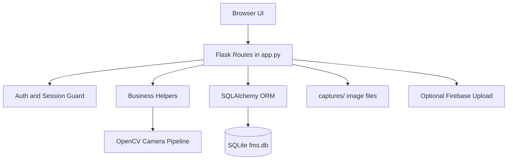

# Farm Worker Management System (FMS) - Comprehensive Technical Documentation

## 1. Executive Overview

The Farm Worker Management System (FMS) is a Flask web application for farm operations management with integrated attendance capture, admin workflows, CCTV/biometric modules, payroll records, and cloud-sync configuration.

Primary capabilities:
- Admin and worker login modes on a single entry page
- Worker attendance logging with camera-assisted verification
- Snapshot capture for attendance events (check-in/check-out)
- Admin dashboards for workers, users, attendance, audit logs, settings, CCTV, biometric, payroll, and cloud sync
- Generic table browsing for operational datasets

Primary stack:
- Python 3.11 runtime (Docker image)
- Flask 3 + Flask-SQLAlchemy
- SQLite (`fms.db`)
- OpenCV for camera streaming and detection overlays
- Jinja2 templates + static CSS/JS assets

---

## 2. Full Repository Tree (Project Scope)

```text
fms/
  .dockerignore
  .gitignore
  Dockerfile
  README.md
  app.py
  database.py
  docker-compose.yml
  fms.db
  models.py
  requirements.txt
  captures/
  docs/
    manual.md
  static/
    css/
      admin.css
      attendance.css
      dashboard.css
      datatables.css
      login.css
      manual.css
      settings.css
      workers.css
    js/
      admin-layout.js
      attendance.js
      audit-log-page.js
      biometric-page.js
      cctv-page.js
      cloud-sync-page.js
      components.js
      edit-modals.js
      login.js
      payroll-page.js
      table-records-page.js
      users-page.js
      workers.js
  templates/
    _admin_sidebar.html
    _flash_messages.html
    attendance.html
    audit_log.html
    base_admin.html
    biometric.html
    cctv.html
    cloud_sync.html
    dashboard.html
    login.html
    manual.html
    payroll.html
    settings.html
    table_records.html
    tables_hub.html
    users.html
    workers.html
```

Inventory notes:
- Tree intentionally excludes generated/infrastructure internals: `.git/`, `.venv/`, `__pycache__/`.
- `captures/` is runtime storage for local JPEG snapshots.
- `fms.db` is the live SQLite database file used by default.

---

## 3. Runtime and Application Lifecycle

## 3.1 Entry Point

`app.py` creates the application through `create_app()` and exposes `app` at module level. It runs with:
- Host: `0.0.0.0`
- Port: `6000`
- Debug: `True` when executed as `__main__`

## 3.2 Startup Sequence (`create_app`)

1. Instantiate Flask app.
2. Configure:
   - `SECRET_KEY` from `os.urandom(32)`
   - `SQLALCHEMY_DATABASE_URI` as local SQLite path to `fms.db`
   - `SQLALCHEMY_TRACK_MODIFICATIONS = False`
3. Bind SQLAlchemy (`db.init_app`).
4. Inside app context:
   - `db.create_all()`
   - `_seed_defaults()`
5. Ensure `captures/` exists (`os.makedirs(..., exist_ok=True)`).
6. Register all routes via `_register_routes(app)`.

## 3.3 Default Seeding Behavior

`_seed_defaults()` ensures:
- Admin user:
  - username: `admin`
  - name: `System Administrator`
  - email: `admin@example.com`
  - phone: `0000000000`
  - password: `admin`
- Core settings rows (if missing):
  - `org_name`
  - `camera_index`
  - `camera_sources`
  - `firebase_api_key`
  - `firebase_bucket`
  - `firebase_project_id`
- Calls `_ensure_default_cctv_entries()` to guarantee baseline CCTV rows.

## 3.4 CCTV Baseline Rows

`_ensure_default_cctv_entries()`:
- Creates a built-in feed (`builtin://<camera_index>`) if missing.
- Ensures one marker `CCTVRecording` row exists per built-in feed:
  - path: `default://builtin-camera-<camera_index>`
  - zero-size marker metadata row

---

## 4. Security and Authentication Model

## 4.1 Session Guards

`admin_required` decorator checks `session['admin_logged_in']`.
- If missing: redirects to `/` with warning flash.
- Protects all admin dashboards/configuration routes.

## 4.2 Login Modes

Route `/` (GET/POST) supports:
- `mode = admin`
  - validates username/password against `User`
  - sets session keys
- `mode = worker`
  - validates active worker (`worker_id`, PIN)
  - handles attendance IN/OUT operation

## 4.3 Password and PIN Handling

- User passwords: Werkzeug hash (`set_password` / `check_password`)
- Worker PINs: Werkzeug hash + SHA-256 fingerprint (`pin_fingerprint`) for uniqueness checks
- `reset-password` and `reset-pin` routes generate or validate new secrets

---

## 5. Camera, Face Verification, and Snapshot Pipeline

## 5.1 Camera Source Resolution

- `_get_camera_sources()` loads `camera_sources` JSON list from settings.
- Falls back to built-in camera index from `camera_index` setting.
- `_coerce_camera_source()` converts numeric strings to integer camera indexes.

## 5.2 Cross-Platform Camera Opening

`_open_camera(source)` backend strategy:
- Linux: `CAP_V4L2` for integer indexes with `/dev/video*` existence check
- macOS: `CAP_AVFOUNDATION`
- Windows: `CAP_DSHOW`
- Fallback: open without explicit backend if first attempt fails

## 5.3 Face/Eye Detection

- Uses OpenCV Haar cascades:
  - frontal face cascade
  - eye cascade
- `_detect_faces_and_eyes(frame)` returns face boxes + eye boxes per face.
- `_verify_face_on_camera()` requires repeated valid detections (`required_hits`) within timeout.

## 5.4 Attendance Capture

`_capture_photo(worker_id, require_face=False)`:
- Opens primary source, then fallback source if needed
- Reads and refreshes frames to avoid stale buffer
- Saves JPEG as `captures/<worker_id>_<timestamp>.jpg`
- Returns `(relative_path, status)` where status in:
  - `ok`
  - `camera_error`
  - `no_face` (documented return code, though face requirement path is not currently enforced)

## 5.5 Live Stream Generator

`_camera_frame_generator(source, fallback_source, overlay_faces, overlay_motion)`:
- Produces MJPEG multipart stream frames
- Supports overlays:
  - motion boxes via frame differencing
  - face/eye boxes
- On unavailable camera, yields synthetic status frame continuously

---

## 6. Attendance Workflow (Worker Mode)

Worker flow on `/` POST with `mode=worker`:
1. Validate worker ID, PIN, and active status.
2. For `log_type=IN`:
   - run face verification
   - if failed: abort with error flash
3. Capture clean snapshot frame.
4. Optionally upload snapshot to Firebase (if configured).
5. For `OUT`:
   - locate latest open attendance row (`check_out_time IS NULL`)
   - set check-out time and optional coordinates
6. For `IN`:
   - create attendance row with `verified_by_cctv` flag
7. Create `EventSnapshot` row using local path or cloud URL.
8. Commit and write audit log entry.

Coordinate normalization:
- `_normalize_coordinates` validates lat/lon with `geopy.Point` and drops invalid values.

---

## 7. Complete Route Matrix

## 7.1 Public Routes

- `GET/POST /`
  - Login page and submission handler for admin and worker
- `GET /worker-camera-stream`
  - Public preview stream with face + motion overlays
- `GET /manual`
  - Manual page

## 7.2 Session/Utility Routes

- `GET /logout`
  - Clears session and redirects to login
- `GET /captures/<path:filename>` (admin required)
  - Serves captured image files from `captures/`
- `GET /camera-stream/<int:camera_idx>` (admin required)
  - Stream endpoint for indexed configured camera source

## 7.3 Admin View Routes

- `GET /dashboard`
- `GET /workers`
- `GET /attendance`
- `GET /users`
- `GET/POST /settings`
- `GET /audit-log`
- `GET /tables-hub`
- `GET /tables-hub/<string:table_key>`
- `GET /cctv`
- `GET /biometric`
- `GET /payroll`
- `GET/POST /cloud-sync`

## 7.4 Worker Management Write Routes

- `POST /workers/add`
- `POST /workers/<int:worker_pk>/update`
- `POST /workers/<int:worker_pk>/reset-pin`
- `POST /workers/<int:worker_pk>/toggle`

## 7.5 User Management Write Routes

- `POST /users/add`
- `POST /users/<int:user_pk>/update`
- `POST /users/<int:user_pk>/reset-password`
- `POST /profile/change-password`

## 7.6 Configuration Write Routes

CCTV:
- `POST /config/cctv/settings`
- `POST /config/cctv-feeds`
- `POST /config/cctv-feeds/<int:feed_id>/update`
- `POST /config/cctv-feeds/<int:feed_id>/deactivate`

Biometric:
- `POST /config/biometric-devices`
- `POST /config/biometric-devices/<int:device_id>/update`
- `POST /config/biometric-devices/<int:device_id>/deactivate`

Payroll:
- `POST /config/payroll`
- `POST /config/payroll/<int:payroll_id>/update`
- `POST /config/payroll/<int:payroll_id>/deactivate`

---

## 8. Database Schema Reference

Defined in `models.py`.

## 8.1 Core Models

### `Setting`
- Key-value system settings table
- unique key constraint via `key`

### `User`
- Admin users and profile metadata
- fields include role, linked worker, and password hash
- methods: `set_password`, `check_password`

### `Worker`
- Worker registry and operational profile data
- includes `worker_id` (unique), `nrc_number` (unique nullable), PIN hash/fingerprint
- methods: `set_pin`, `check_pin`

### `Attendance`
- Attendance sessions with check-in/check-out times
- optional coordinates and CCTV verification boolean

### `AuditLog`
- Audit events with username, action, details, IP, timestamp

## 8.2 Operational Models

### `CCTVFeed`
- Camera definitions, RTSP/source URL, status, last heartbeat

### `CCTVRecording`
- Recording metadata with location, size, cloud upload status

### `EventSnapshot`
- Attendance snapshot linkage and file/cloud path

### `BiometricDevice`
- Device inventory with identity, connection info, status

### `BiometricTransaction`
- Biometric action records with success/match/error details

### `FaceTemplate`
- Worker face embedding and quality metadata

### `Payroll`
- Weekly worker payroll records and deduction/net values

### `OfflineSyncQueue`
- Retryable operation queue for deferred sync

### `CloudSyncMetadata`
- Per-record sync state and cloud IDs
- unique constraint on `(table_name, record_id)`

### `DailyAttendanceSummary`
- Per worker/day summary and totals
- unique constraint on `(worker_id, summary_date)`

### `HardwareHealthLog`
- Device health status telemetry

---

## 9. Business Rules and Validation Logic

## 9.1 Worker ID Generation

`_generate_worker_id()`:
- scans existing numeric worker IDs
- increments max sequence
- emits zero-padded 4-digit ID
- hard guard: sequence cannot exceed `9999`

## 9.2 Worker Add/Update Validation

- Required on add: name, phone, PIN
- PIN minimum length: 4
- PIN uniqueness enforced via fingerprint
- NRC uniqueness enforced if provided
- Enrollment date parsed from `YYYY-MM-DD`

## 9.3 User Validation

- Add requires username + name
- Username normalized to lowercase and uniqueness checked
- Random default password generated on create/reset

## 9.4 Payroll Validation

- Worker + week ending required
- Date parsing enforced
- Payment date optional but validated when provided

## 9.5 CCTV Settings Validation

- `camera_sources` must parse as JSON array when provided

---

## 10. Audit Logging Coverage

Main audited operations include:
- admin login/logout
- attendance verification failures and attendance writes
- worker add/update/toggle/reset-pin
- user add/update/password reset/change
- settings save
- cloud sync settings save
- CCTV/biometric/payroll config add/update/deactivate

Logging method:
- `_log_audit(action, details)`
- resilient to context or DB failures (rollback on exception)

---

## 11. Template and Frontend Asset Mapping

## 11.1 Template Files

Shell and shared partials:
- `templates/base_admin.html`
- `templates/_admin_sidebar.html`
- `templates/_flash_messages.html`

Feature pages:
- `templates/login.html`
- `templates/dashboard.html`
- `templates/workers.html`
- `templates/attendance.html`
- `templates/users.html`
- `templates/settings.html`
- `templates/audit_log.html`
- `templates/tables_hub.html`
- `templates/table_records.html`
- `templates/cctv.html`
- `templates/biometric.html`
- `templates/payroll.html`
- `templates/cloud_sync.html`
- `templates/manual.html`

## 11.2 JavaScript Assets

Shared behaviors:
- `static/js/components.js`
- `static/js/edit-modals.js`
- `static/js/admin-layout.js`

Page scripts:
- `static/js/login.js`
- `static/js/workers.js`
- `static/js/attendance.js`
- `static/js/users-page.js`
- `static/js/audit-log-page.js`
- `static/js/cctv-page.js`
- `static/js/biometric-page.js`
- `static/js/payroll-page.js`
- `static/js/cloud-sync-page.js`
- `static/js/table-records-page.js`

## 11.3 CSS Assets

- `static/css/admin.css`
- `static/css/login.css`
- `static/css/dashboard.css`
- `static/css/workers.css`
- `static/css/attendance.css`
- `static/css/settings.css`
- `static/css/manual.css`
- `static/css/datatables.css`

---

## 12. Deployment and Containerization

## 12.1 Dockerfile Behavior

Base image:
- `python:3.11-slim`

System packages installed (for OpenCV/camera/media support):
- `ffmpeg`
- `libglib2.0-0`
- `libgl1`
- `libsm6`
- `libxext6`
- `libxrender1`
- `v4l-utils`

Build/runtime flow:
1. Copy `requirements.txt`
2. Install pip dependencies
3. Copy application source
4. Ensure `/app/captures` exists
5. Expose port `6000`
6. Start via `python app.py`

## 12.2 Docker Compose

`docker-compose.yml` defines service `fms`:
- builds from local `Dockerfile`
- container name: `fms-app`
- port mapping: `6000:6000`
- bind mounts:
  - `./fms.db:/app/fms.db`
  - `./captures:/app/captures`
- restart policy: `unless-stopped`

---

## 13. Configuration Keys and Their Use

Settings table keys currently used by application logic:
- `org_name`: branding and page display label
- `camera_index`: default/fallback camera source index
- `camera_sources`: JSON list of camera source objects
- `firebase_api_key`: used during Firebase credential assembly
- `firebase_bucket`: target bucket for upload
- `firebase_project_id`: Firebase project metadata for credential initialization

---

## 14. Dependencies (requirements.txt)

- Flask>=3.0.0
- Flask-SQLAlchemy>=3.1.1
- opencv-python>=4.9.0
- Werkzeug>=3.0.0
- geopy>=2.4.1
- pandas>=2.0.0
- numpy>=2.0.0
- scikit-learn>=1.2.0
- matplotlib>=3.5.0

Note:
- Some listed data science packages are not central to the current route logic, but remain project dependencies.

---

## 15. Local Development Operations

## 15.1 Recommended Startup

```bash
python -m venv .venv
source .venv/bin/activate
pip install -r requirements.txt
python app.py
```

Access URL:
- `http://127.0.0.1:6000`

## 15.2 Default Credentials

- Username: `admin`
- Password: `admin`

Change default credentials immediately in non-local environments.

---

## 16. Documentation Sources in Repository

- Product and architecture summary: `README.md`
- End-user operations manual: `docs/manual.md`
- In-app manual route: `/manual`

---

## 17. Known Behavioral Notes

- Snapshot capture writes local files first; cloud URL replaces path only when Firebase upload succeeds.
- Attendance clock-out requires an existing open check-in row.
- Camera stream and verification perform fallback to configured `camera_index` if primary source fails.
- Dashboard and attendance views derive aggregated session stats from attendance rows plus event snapshots.

---

## 18. Quick Reference Tables

## 18.1 Core Python Modules

- `app.py`: application factory, helpers, routes, runtime entry
- `models.py`: SQLAlchemy schema definitions
- `database.py`: shared DB object initialization

## 18.2 Data and Runtime Directories

- `captures/`: captured attendance images
- `docs/`: markdown manual
- `templates/`: Jinja UI templates
- `static/css/`: stylesheets
- `static/js/`: frontend scripts

## 18.3 Persistence Artifacts

- `fms.db`: SQLite database file

---

## 19. Suggested Next Documentation Enhancements

If you want this to go even deeper, the next layer can include:
- endpoint-by-endpoint request/response payload examples
- ERD diagram for all model relationships
- role-based access matrix per route
- operational runbook for backup/restore and log retention
- test plan matrix (unit/integration/manual)
# Farm Worker Management System (FMS) - Comprehensive Project Reference

## 1. System Overview

FMS is a Flask web platform for farm workforce operations with a focus on:
- Worker identity and PIN management
- Attendance capture (IN/OUT sessions)
- Camera-assisted verification and snapshots
- CCTV feed/device management
- Biometric device records
- Payroll records
- Cloud-sync settings and queue visibility
- Admin auditability and table-level data inspection

Primary stack:
- Python 3.11+
- Flask
- Flask-SQLAlchemy
- SQLite (`fms.db`)
- OpenCV (camera stream, face/eye detection, motion overlays)
- Jinja2 templates + static CSS/JS

---

## 2. Repository Inventory (Complete)

```text
fms/
  .dockerignore
  .gitignore
  Dockerfile
  README.md
  app.py
  database.py
  docker-compose.yml
  fms.db
  models.py
  requirements.txt
  captures/
  docs/
    manual.md
  static/
    css/
      admin.css
      attendance.css
      dashboard.css
      datatables.css
      login.css
      manual.css
      settings.css
      workers.css
    js/
      admin-layout.js
      attendance.js
      audit-log-page.js
      biometric-page.js
      cctv-page.js
      cloud-sync-page.js
      components.js
      edit-modals.js
      login.js
      payroll-page.js
      table-records-page.js
      users-page.js
      workers.js
  templates/
    _admin_sidebar.html
    _flash_messages.html
    attendance.html
    audit_log.html
    base_admin.html
    biometric.html
    cctv.html
    cloud_sync.html
    dashboard.html
    login.html
    manual.html
    payroll.html
    settings.html
    table_records.html
    tables_hub.html
    users.html
    workers.html
```

Excluded internals from scan output:
- `.git/`
- `.venv/`
- `__pycache__/`

---

## 3. High-Level Architecture



Execution model:
1. `create_app()` builds app and config
2. SQLAlchemy initialized via shared `db`
3. `db.create_all()` creates schema
4. `_seed_defaults()` creates baseline admin/settings and CCTV defaults
5. `captures/` directory is ensured
6. `_register_routes(app)` binds all endpoints

---

## 4. Runtime and Deployment

### 4.1 Local Runtime
- App entry point: `app.py`
- App binds: `0.0.0.0:6000`
- Debug mode in direct run: enabled

Local run commands:

```bash
python -m venv .venv
source .venv/bin/activate
pip install -r requirements.txt
python app.py
```

### 4.2 Container Runtime
- Base image: `python:3.11-slim`
- System packages installed for OpenCV/media support:
  - `ffmpeg`, `libglib2.0-0`, `libgl1`, `libsm6`, `libxext6`, `libxrender1`, `v4l-utils`
- Exposed container port: `6000`
- Compose host mapping: `6000:6000`
- Persistent mounts:
  - `./fms.db:/app/fms.db`
  - `./captures:/app/captures`

### 4.3 Important Documentation Mismatch
- `app.py` runs on port `6000`.
- Some markdown docs still mention `5000` / `127.0.0.1:5000`.

---

## 5. Core Python Files (Purpose and Responsibilities)

### 5.1 `app.py`
Central application module:
- app factory and bootstrap
- camera and image-processing helpers
- Firebase upload helper
- authentication decorator
- full route registration
- business workflows for workers, users, attendance, CCTV, biometric, payroll, cloud sync, and table hub

### 5.2 `database.py`
Contains only shared ORM instance:
- `db = SQLAlchemy()`

### 5.3 `models.py`
Defines all SQLAlchemy models and constraints. Includes credential helper methods:
- `User.set_password`, `User.check_password`
- `Worker.set_pin`, `Worker.check_pin`

---

## 6. Configuration and Seeded Defaults

At startup (`_seed_defaults`):
- Creates default admin user if missing:
  - username: `admin`
  - password: `admin`
- Creates baseline `settings` keys if missing:
  - `org_name = FMS Farm`
  - `camera_index = 0`
  - `camera_sources = ""`
  - `firebase_api_key = ""`
  - `firebase_bucket = ""`
  - `firebase_project_id = ""`
- Ensures default CCTV feed + marker recording exists (`_ensure_default_cctv_entries`)

---

## 7. Helper Function Catalog (`app.py`)

### 7.1 Data and Utility Helpers
- `_get_setting(key, default)`
- `_generate_password(length=8)`
- `_log_audit(action, details="")`
- `_normalize_coordinates(lat_raw, lon_raw)`
- `_pin_fingerprint(pin)`
- `_is_pin_unique(pin, exclude_worker_id=None)`
- `_generate_worker_id()`

### 7.2 Camera and Detection Helpers
- `_coerce_camera_source(source_value)`
- `_get_camera_sources()`
- `_open_camera(source)`
- `_verify_face_on_camera(timeout_seconds=3.0, required_hits=2)`
- `_capture_photo(worker_id, require_face=False)`
- `_detect_faces_and_eyes(frame)`
- `_draw_detections(frame, detections)`
- `_detect_motion_regions(prev_gray, frame)`
- `_draw_motion_regions(frame, boxes)`
- `_build_camera_unavailable_frame(message)`
- `_camera_frame_generator(source, fallback_source, overlay_faces=False, overlay_motion=False)`

### 7.3 Cloud and Display Helpers
- `_upload_to_firebase(local_path)`
- `_build_attendance_sessions(rows)`

### 7.4 Security Decorator
- `admin_required(f)`

---

## 8. Authentication and Session Model

Login route: `/` (`GET`, `POST`)
- `mode=admin`:
  - validates username/password against `users`
  - sets session keys:
    - `admin_logged_in = True`
    - `admin_username = <username>`
- `mode=worker`:
  - validates worker ID + PIN for active workers
  - `IN` requires successful face+eye verification
  - captures snapshot; fails attendance if capture fails
  - writes attendance and `event_snapshots`

Logout route: `/logout`
- logs audit event
- clears session

---

## 9. Attendance Processing Pipeline

Worker `IN` flow:
1. Validate worker credentials
2. Run `_verify_face_on_camera`
3. Capture image with `_capture_photo`
4. Optional Firebase upload (`_upload_to_firebase`)
5. Create `Attendance` row with `verified_by_cctv=True/False`
6. Create `EventSnapshot` as `photo_check_in`
7. Commit and audit-log action

Worker `OUT` flow:
1. Validate worker credentials
2. Capture image
3. Find latest open attendance session (no checkout)
4. Set `check_out_time`
5. Create `EventSnapshot` as `photo_check_out`
6. Commit and audit-log action

Validation behavior:
- OUT without open IN session is rejected
- capture failure blocks write
- invalid PIN/ID rejected
- geolocation is optional, normalized via `geopy.Point`

---

## 10. Full Route Matrix

### 10.1 Public Routes
- `GET|POST /` - login handler for admin and worker
- `GET /worker-camera-stream` - MJPEG stream for worker preview
- `GET /manual` - in-app manual page

### 10.2 Authenticated Admin Routes
- `GET /captures/<path:filename>` - serve captured images
- `GET /logout` - clear session
- `GET /dashboard` - dashboard statistics and summaries
- `GET|POST /workers` - list workers; POST used only for stale-form warning redirect
- `GET /attendance` - attendance sessions and summary counts
- `POST /workers/add` - create worker
- `POST /workers/<int:worker_pk>/update` - update worker fields
- `POST /workers/<int:worker_pk>/reset-pin` - set new worker PIN
- `POST /workers/<int:worker_pk>/toggle` - active/inactive toggle
- `GET|POST /settings` - org settings page and save
- `GET /users` - list users with worker linkage options
- `POST /users/add` - add user with generated password
- `POST /users/<int:user_pk>/update` - update user profile fields
- `POST /users/<int:user_pk>/reset-password` - regenerate user password
- `POST /profile/change-password` - change current admin password
- `GET /audit-log` - audit history (latest 500)
- `GET /tables-hub` - grouped table navigation
- `GET /tables-hub/<string:table_key>` - generic table browser by registry key
- `GET /cctv` - CCTV management page
- `POST /config/cctv-feeds` - add CCTV feed
- `POST /config/cctv-feeds/<int:feed_id>/update` - update CCTV feed
- `POST /config/cctv-feeds/<int:feed_id>/deactivate` - mark feed inactive
- `POST /config/cctv/settings` - save camera settings JSON and index
- `GET /biometric` - biometric devices page
- `POST /config/biometric-devices` - add biometric device
- `POST /config/biometric-devices/<int:device_id>/update` - update device
- `POST /config/biometric-devices/<int:device_id>/deactivate` - deactivate device
- `GET /payroll` - payroll list and worker context
- `POST /config/payroll` - add payroll record
- `POST /config/payroll/<int:payroll_id>/update` - update payroll record
- `POST /config/payroll/<int:payroll_id>/deactivate` - mark payroll row inactive
- `GET|POST /cloud-sync` - cloud settings + queue/metadata visibility
- `GET /camera-stream/<int:camera_idx>` - admin MJPEG stream by configured source index

---

## 11. Database Schema Reference

### 11.1 `settings`
- PK: `id`
- Unique: `key`
- Purpose: dynamic app configuration values

### 11.2 `users`
- PK: `id`
- Unique: `username`
- FK: `linked_worker_id -> workers.id` (nullable)
- Credentials: `password_hash`

### 11.3 `audit_logs`
- PK: `id`
- Optional FK: `user_id -> users.id`
- Fields: username, action, details, ip, timestamp

### 11.4 `workers`
- PK: `id`
- Unique: `worker_id`, `nrc_number` (nullable unique), `pin_fingerprint` used for duplicate PIN checks
- Fields: profile metadata, enrollment, status, hashed PIN

### 11.5 `attendance`
- PK: `attendance_id`
- FK: `worker_id -> workers.id`
- Fields: check-in/out timestamps, lat/lon, `verified_by_cctv`

### 11.6 `cctv_feeds`
- PK: `feed_id`
- Fields: name, location, rtsp_url, status, heartbeat

### 11.7 `payroll`
- PK: `payroll_id`
- FK: `worker_id -> workers.id`
- Fields: period date, hours/rates, deductions, net, payment status/date

### 11.8 `biometric_devices`
- PK: `device_id`
- Unique: `device_serial` (nullable unique)
- Fields: connectivity and location metadata

### 11.9 `face_templates`
- PK: `face_id`
- FK: `worker_id -> workers.id`
- Fields: embedding blob, reference image path, quality, timestamps

### 11.10 `biometric_transactions`
- PK: `transaction_id`
- FK: `device_id -> biometric_devices.device_id` (nullable)
- FK: `worker_id -> workers.id` (nullable)
- Fields: type, success, score, error, timestamp

### 11.11 `cctv_recordings`
- PK: `recording_id`
- FK: `camera_id -> cctv_feeds.feed_id` (nullable)
- Fields: storage path, window, file size, cloud metadata

### 11.12 `event_snapshots`
- PK: `snapshot_id`
- FK: `attendance_id -> attendance.attendance_id`
- FK: `camera_id -> cctv_feeds.feed_id` (nullable)
- Fields: type, path/url, timestamp

### 11.13 `offline_sync_queue`
- PK: `sync_id`
- Optional FKs to device/worker
- Fields: operation payload, status, retries, error, sync timestamps

### 11.14 `cloud_sync_metadata`
- PK: `sync_id`
- Unique composite: `(table_name, record_id)`
- Fields: cloud state and sync timing

### 11.15 `daily_attendance_summary`
- PK: `summary_id`
- FK: `worker_id -> workers.id`
- Unique composite: `(worker_id, summary_date)`
- Fields: in/out times, hours, lateness/early-leave minutes, verification flag

### 11.16 `hardware_health_logs`
- PK: `log_id`
- Fields: device type/id, status, error info, response time, timestamp

---

## 12. Camera and Streaming Details

Feed source resolution:
- Parses `camera_sources` setting as JSON array
- Falls back to built-in camera index (`camera_index`) when sources missing/invalid

Cross-platform backend selection (`_open_camera`):
- Linux integer source: V4L2 with `/dev/video*` guard
- macOS: AVFoundation
- Windows: DirectShow
- fallback: generic `cv2.VideoCapture(source)`

Stream behavior:
- MJPEG frame boundary: `multipart/x-mixed-replace; boundary=frame`
- Optional overlay flags:
  - face/eye rectangles
  - motion bounding boxes
- When no camera is available, serves generated placeholder frame with guidance text

Snapshot behavior:
- Writes clean JPG to `captures/` as `<worker_id>_<UTC timestamp>.jpg`
- Attendance references local path unless Firebase upload returns public URL

---

## 13. Cloud Sync and Firebase Behavior

Settings used:
- `firebase_api_key`
- `firebase_bucket`
- `firebase_project_id`

Upload path behavior:
- Local snapshot path uploaded to bucket object under `captures/<filename>`
- If upload succeeds, `file_path` in `event_snapshots` stores public URL
- If not configured or upload fails, local path is kept

Cloud sync pages:
- Show `cloud_sync_metadata` rows
- Show `offline_sync_queue` rows
- Allow settings updates through `/cloud-sync`

---

## 14. Frontend Structure Reference

### 14.1 Templates (`templates/`)
- `base_admin.html`: main admin shell/layout
- `_admin_sidebar.html`: shared left navigation
- `_flash_messages.html`: reusable feedback alerts
- `login.html`: entry/login and worker clock-in/out form
- `dashboard.html`: admin dashboard and summaries
- `workers.html`: worker CRUD/reset/toggle interface
- `attendance.html`: session list and attendance stats
- `users.html`: user management and credential reset actions
- `settings.html`: organization/system settings
- `audit_log.html`: recent audit entries
- `cctv.html`: CCTV feed and settings controls
- `biometric.html`: biometric device listing/editing
- `payroll.html`: payroll CRUD interface
- `cloud_sync.html`: sync metadata/queue + Firebase settings
- `tables_hub.html`: grouped data-table entry page
- `table_records.html`: generic table renderer for configured model registry
- `manual.html`: in-app usage guide

### 14.2 JavaScript (`static/js/`)
- `admin-layout.js`: shared admin layout/nav interactions
- `components.js`: reusable frontend helpers/components
- `edit-modals.js`: edit modal population/submit utility logic
- `login.js`: login-page specific behaviors
- `workers.js`: worker page form/table actions
- `attendance.js`: attendance page interactions
- `users-page.js`: user-page actions/modals
- `cctv-page.js`: CCTV form/state interactions
- `biometric-page.js`: biometric page controls
- `payroll-page.js`: payroll page calculations and form handling
- `cloud-sync-page.js`: cloud sync settings/table interactions
- `audit-log-page.js`: audit log table filtering/sorting interactions
- `table-records-page.js`: generic table-records behaviors

### 14.3 CSS (`static/css/`)
- `admin.css`: shared admin styling foundation
- `dashboard.css`: dashboard page presentation
- `workers.css`: workers module styling
- `attendance.css`: attendance module styling
- `settings.css`: settings module styles
- `manual.css`: manual page typography/layout
- `login.css`: login and worker check-in UI styles
- `datatables.css`: table-focused visual adjustments

---

## 15. Dependencies (`requirements.txt`)

- Flask >= 3.0.0
- Flask-SQLAlchemy >= 3.1.1
- opencv-python >= 4.9.0
- Werkzeug >= 3.0.0
- geopy >= 2.4.1
- pandas >= 2.0.0
- numpy >= 2.0.0
- scikit-learn >= 1.2.0
- matplotlib >= 3.5.0

---

## 16. Security and Operational Notes

Observed security-sensitive implementation details:
- App secret key is generated with `os.urandom(32)` on each boot, which invalidates prior signed sessions after restart.
- Default admin credentials are seeded (`admin/admin`) if account does not exist; this is convenient for dev but high-risk in production if unchanged.
- Password and PIN values are hashed (Werkzeug helpers).

Operational notes:
- Attendance page builds sessions from latest 400 attendance rows.
- Audit page returns latest 500 audit entries.
- Several data pages cap rows at 150-300 for UI load control.
- Built-in camera fallback entries are auto-maintained.

---

## 17. Key End-to-End Workflows

### 17.1 Worker Enrollment
1. Admin opens Workers page
2. Adds worker profile + unique PIN
3. System auto-generates next 4-digit worker ID
4. Record is committed and auditable

### 17.2 Admin User Provisioning
1. Admin creates user profile
2. System auto-generates temporary password
3. Admin can later reset password or user can change own password

### 17.3 Attendance Session Lifecycle
1. Worker clocks in with ID/PIN
2. Face/eye checks pass
3. Snapshot saved/uploaded
4. Attendance row created (open session)
5. Worker clocks out later
6. Existing open row updated with checkout time and final snapshot

---

## 18. Known Gaps and Improvement Opportunities

- Documentation consistency: unify port references (currently mixed 5000 vs 6000 in docs).
- Secrets handling: avoid storing service credentials in generic settings fields without dedicated secure secret management.
- Production hardening: set stable `SECRET_KEY` through environment variable.
- Attendance scalability: `_build_attendance_sessions` performs per-row lookups and snapshot queries; could be optimized with joins/eager loading for larger datasets.

---

## 19. Quick Navigation Index

Backend:
- `app.py`
- `models.py`
- `database.py`

Infra:
- `Dockerfile`
- `docker-compose.yml`
- `requirements.txt`

Docs:
- `README.md`
- `docs/manual.md`
- `FMS_PROJECT_OVERVIEW.md`

UI:
- `templates/`
- `static/js/`
- `static/css/`

Data:
- `fms.db`
- `captures/`
