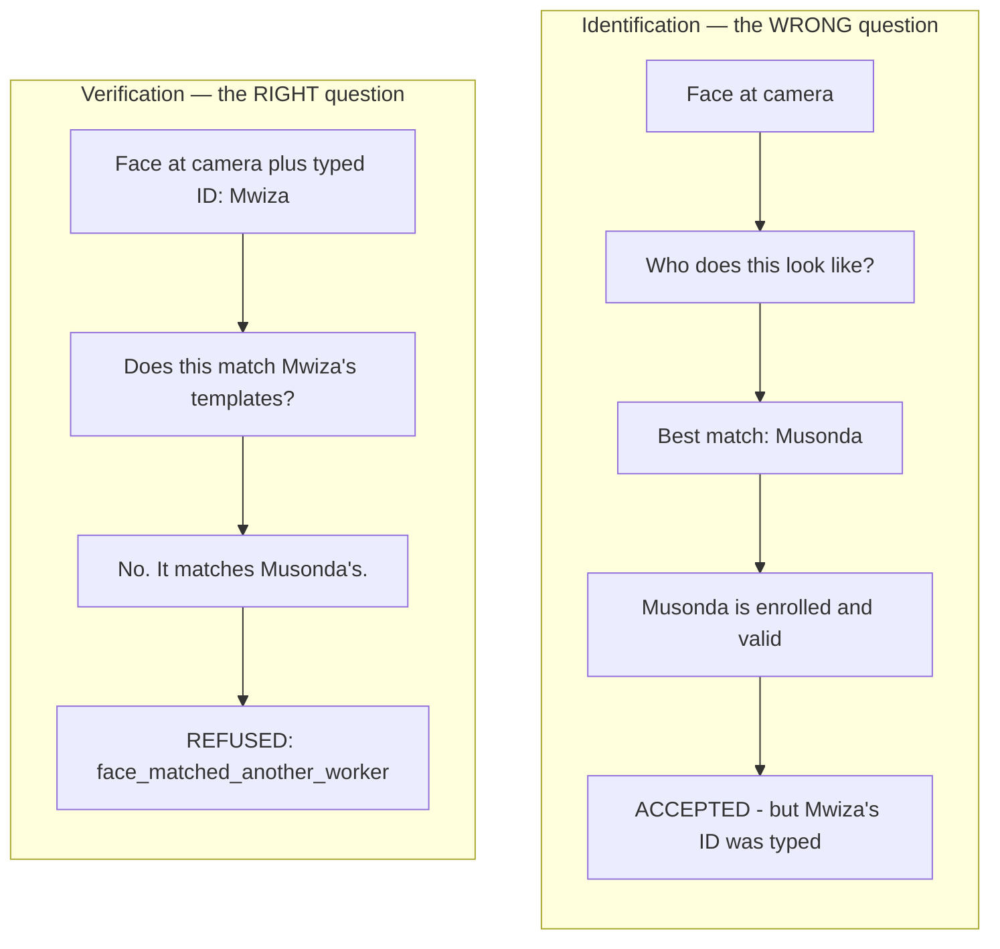
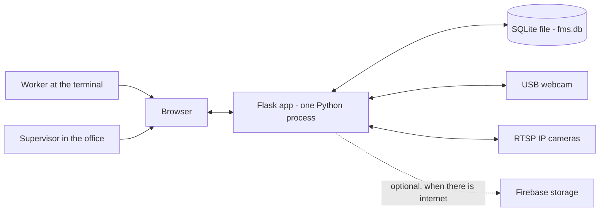

# 01 — Start Here

← [Wiki index](README.md) · Next: [02 — The Big Picture](02-the-big-picture.md)

---

## What this system is for

A commercial farm employs a few hundred people. Every morning they arrive and
someone writes their names in a paper register. At the end of the fortnight a
clerk counts the register, multiplies by an hourly rate, subtracts deductions,
and pays everybody.

Two things go wrong with that, and they are not small.

**Nobody can prove who signed.** A mark in a register records that a mark was
made. It does not record who made it. So one worker can sign in for an absent
colleague — the industry calls this *buddy punching* — and a name can stay on
the register after the person has left, or be added for a person who never
existed at all — a *ghost worker*. Both cost the farm real money every month,
and neither leaves any evidence.

**The register is copied by hand.** Hundreds of rows get transcribed into a wage
sheet. Copying introduces errors in proportion to the number of rows, and it is
also the point at which numbers can be quietly adjusted.

This system replaces that process. A worker types their ID and PIN, a camera
looks at them, and the attendance record is created **only if the face at the
camera matches the face enrolled for that ID**. Pay is then computed from those
records rather than copied.

## The one idea everything turns on

If you remember one thing from this wiki, make it this:

> **The system asks "is this the worker whose ID was typed?" — not "who is
> this?"**

Those sound like the same question. They are not, and the difference is the
entire point of the project.

A system that asks *who is this?* looks at the face, finds the best match among
everyone enrolled, and records attendance for whoever it found. If Musonda types
Mwiza's ID and stands at the camera, such a system recognises Musonda, finds a
valid enrolled worker, and happily records attendance — for the wrong person.
That is exactly the fraud the paper register already allows.

Our system compares the face **only against the templates enrolled for the ID
that was typed**. If it recognises the face but attributes it to a different
worker, it refuses, with a specific reason: `face_matched_another_worker`.



> **Analogy: the bouncer and the guest list.**
>
> Imagine a doorman at a private party. There are two ways he could do his job.
>
> The **wrong** way: you walk up, he looks at your face, decides "yes, I
> recognise you from somewhere", and lets you in. He has confirmed you are *a*
> person he knows — not that you are the person whose name you gave.
>
> The **right** way: you say "I'm Mwiza Tembo". He finds *Mwiza Tembo* on the
> list, looks at the photo next to that one name, and compares it to your face.
> If it isn't you, you don't get in — even if he recognises you perfectly well as
> somebody else who is also on the list.
>
> Our system is the second doorman. That is the whole trick.

**Reading the diagram above:** the top half shows the wrong doorman — face goes
in, "best guess" comes out, and the wrong person gets recorded. The bottom half
shows ours: the typed ID and the face are checked *against each other*, and a
mismatch is refused with a reason that names exactly what went wrong.

You will find this implemented in
[`face_engine.verify_worker()`](modules/face_engine.md#verify_worker), and it is
the reason that function takes a `worker_pk` argument — the ID being claimed —
at all.

## The shape of the thing

It is a **Flask web application**. Not a microservice mesh, not a
single-page app with a separate API backend — one Python process that renders
HTML pages and talks to a SQLite file on the same machine.

That is a deliberate choice, not a limitation of ambition. The target machine is
a mini PC or a Raspberry Pi sitting in a farm office in rural Zambia, where the
power is intermittent and the internet may not exist at all. Every architectural
decision in this project falls out of that one constraint. See
[07 — Design Decisions](07-design-decisions.md) once you have the shape of the
code in your head.



**Reading this diagram:** everything with a solid arrow is required and lives in
the farm office. Two kinds of people use a browser — a worker at the clock-in
terminal and a supervisor at a desk — and both talk to **one** Python program.
That program talks to a database (which is just a file on the same machine) and
to the cameras. The **dotted** arrow is the only thing that needs the internet,
and it is optional: cut that line and everything else still works.

> **Analogy: a shop till, not a banking system.** A supermarket till does not
> phone head office to record a sale — it records it locally and syncs later if
> it can. Same idea here. The farm office machine is self-sufficient, and the
> cloud is a nice-to-have.

## What you need to know already

You will be fine if you know what an HTTP request is, what a database table is,
and roughly what Python looks like. You do **not** need to know Flask,
SQLAlchemy, or anything about computer vision — those are explained where they
come up.

Two pieces of vocabulary used constantly from here on:

- **A punch** — one clock-in or one clock-out. Borrowed from punch-card time
  clocks. `record_punch()` handles both.
- **A template** — the numerical description of an enrolled face. Not a
  photograph. See [05 — Face Recognition Explained](05-face-recognition-explained.md).

## Get it running before you read further

Reading about this is much less useful than having it open in a browser. Full
instructions are in [INSTALL.md](../INSTALL.md); the short version:

```bash
python -m venv .venv
source .venv/bin/activate          # Windows: .venv\Scripts\activate
pip install -r requirements.txt
python tools/seed_demo.py          # 8 fictional workers, 2 weeks of attendance
python app.py
```

Open <http://localhost:8010>, sign in as `admin` / `admin`, and set a password
when it asks. Click through Dashboard, Workers, Attendance, Payroll, CCTV and
Settings. Ten minutes of that will make the next page far easier to follow.

This is what a successful clock-in looks like — the message names the worker, the
time, **and how confident the face match was**:


*Every name, code and figure in the screenshots throughout this wiki is invented
demonstration data. The face thumbnails are deliberately obscured.*

> **If the Biometric page says `Recognizer: correlation-fallback`**, your OpenCV
> install is wrong and face matching is running on a much weaker fallback. Fix
> it before going further — see [INSTALL.md](../INSTALL.md#two-dependency-traps-worth-knowing-about).

## How the code is laid out

Seventeen Python modules at the project root. There is no `src/` directory and no
package nesting — at this size a folder hierarchy would add ceremony without
adding clarity.

```
app.py                  Web routes and the application factory
models.py               The database schema
migrations.py           Automatic schema upgrades
database.py             The shared SQLAlchemy object
paths.py                Where files live on disk

face_engine.py          Face enrolment and matching
attendance_service.py   The clock-in/clock-out transaction
cctv_engine.py          Cameras, streaming, clips
payroll_engine.py       Summaries and pay
barcode_engine.py       Worker identity cards: the value, the barcode, the lookup
reports_engine.py       The figures behind the Analytics page
geofence.py             Distance from the farm
security.py             Roles and permissions
sync_engine.py          Cloud upload queue
exports.py              CSV files
api.py                  The JSON API
portal.py               The worker self-service portal at /me

templates/              HTML
static/css/, static/js/ Styles and browser scripts
tests/                  206 tests
tools/                  Scripts: demo data, benchmarks, experiments
```

The rule the layout follows: **one module per concern, and the concern is named
in the filename.** If you want to know how pay is calculated, you do not need to
search — it is in `payroll_engine.py`.

---

Next: [02 — The Big Picture](02-the-big-picture.md)
