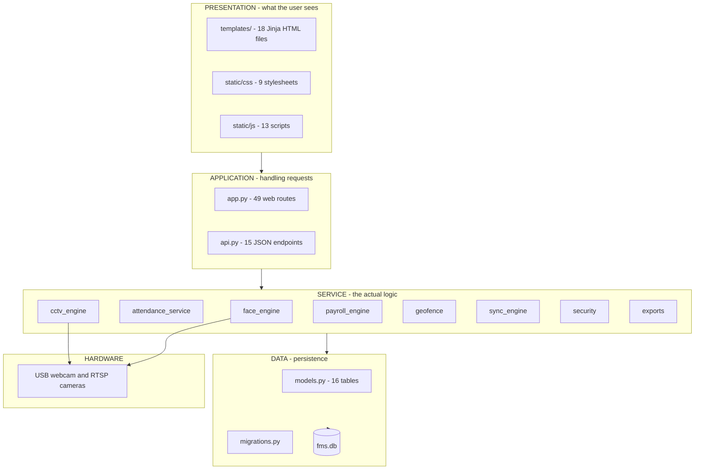
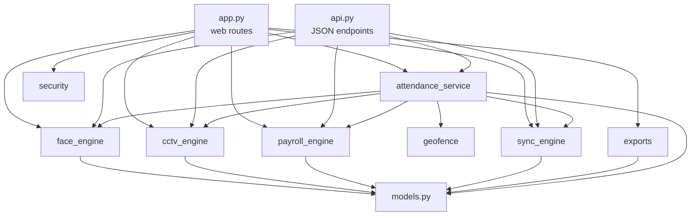
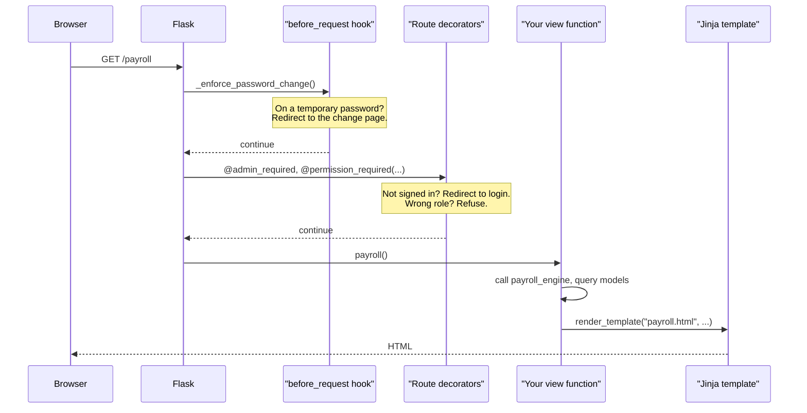
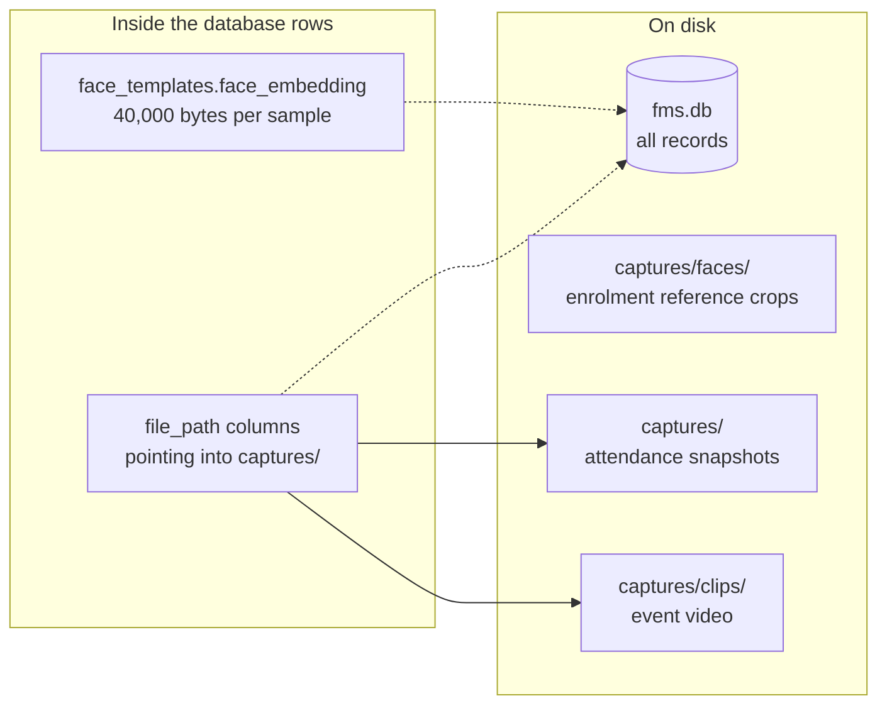

# 02 — The Big Picture

← [01 — Start Here](01-start-here.md) · [Wiki index](README.md) · Next: [03 — Follow a Clock-In](03-follow-a-clock-in.md)

---

## Four layers

The code is arranged in four layers. Each layer only talks to the one below it.

Two properties of that arrangement matter, and both were chosen deliberately.

**Only two modules touch the camera.** `cctv_engine` opens it; `face_engine`
reads pixels it is handed. Nothing else in the codebase knows a camera exists.
Swap the webcam for a different device and exactly one file changes.

**The service layer's core computations are pure.** `compute_pay()` takes hours
and a rate and returns money. It does not read the database, does not look at
the current request, does not know Flask exists. That is why the test suite can
drive it through hundreds of edge cases in milliseconds. Whenever you add logic,
push it down into a function shaped like that if you possibly can.

## What each service module does

| Module | Responsibility | The one function to read first |
| --- | --- | --- |
| [`face_engine`](modules/face_engine.md) | Turn camera frames into an identity decision | `verify_worker()` |
| [`attendance_service`](modules/attendance_service.md) | Run the whole clock-in transaction in the right order | `record_punch()` |
| [`cctv_engine`](modules/cctv_engine.md) | Open cameras, stream them, record clips, check health | `grab_frames()` |
| [`payroll_engine`](modules/payroll_engine.md) | Turn attendance rows into hours, and hours into money | `compute_pay()` |
| [`geofence`](modules/geofence.md) | How far is this from the farm? | `evaluate()` |
| [`security`](modules/security.md) | May this user do this thing? | `permission_required()` |
| [`sync_engine`](modules/sync_engine.md) | Upload to the cloud, or queue it for later | `upload_or_queue()` |
| [`exports`](modules/exports.md) | Turn tables into CSV | `EXPORTS` |

## Who calls whom

This is the dependency graph. Notice that it flows one way — there are no cycles
between service modules, which is what keeps them independently testable.

The important edge is `app.py → attendance_service → everything else`. The
routes do not orchestrate the clock-in themselves; they hand it to one service
function. [03 — Follow a Clock-In](03-follow-a-clock-in.md) explains why that
consolidation mattered.

## How a request is actually served

Flask is a small framework, and it helps to know the four things it does with an
incoming request before your code runs.

**1. The application factory.** `create_app()` in `app.py` builds the Flask
object: reads config from environment variables, connects the database, runs
migrations, seeds defaults, registers the API blueprint, then registers the 49
routes. It runs once at start-up. The module ends with `app = create_app()`.

**2. The `before_request` hook.** One hook, `_enforce_password_change()`. If the
signed-in user is still on a temporary password, every request is redirected to
the change-password page except the handful needed to actually change it. A hook
rather than a check in each route, because a route added next year cannot forget
to apply a hook.

**3. Route decorators.** `@admin_required` means signed in. `@permission_required(...)`
means signed in *and* holding a named permission. See
[06 — Security and Roles](06-security-and-roles.md).

**4. The view function, then a template.** The view gathers data and calls
`render_template()`. Templates contain no business logic — they ask for a value
and display it.

## Where things are stored

The rule: **the database holds records and templates; the filesystem holds
images and video; rows point at files by relative path.** Relative, not
absolute, so moving the project or running it in a container does not break
every stored reference. `paths.py` is the single place those locations are
defined.

## What you can safely ignore at first

- `Workers.sql` — a generated snapshot of the schema, produced by
  `tools/export_schema.py`. `models.py` is the source of truth; this file is a
  convenience for anyone who wants to look at the schema in a SQL client.
- `BiometricDevice` in `models.py` — a table for a fingerprint scanner that was
  never bought. Nothing writes to it. It is there so a scanner could be added
  later without a schema change.
- `Worker.fingerprint_template` — same story, at the column level.
- The `correlation fallback` branch in `face_engine._predict()` — only runs when
  OpenCV is installed wrongly. If your install is correct you will never hit it.

---

Next: [03 — Follow a Clock-In](03-follow-a-clock-in.md) — the single most useful
page in this wiki.
