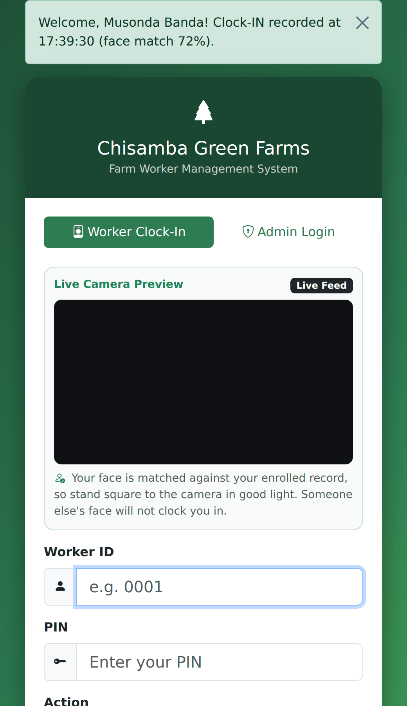
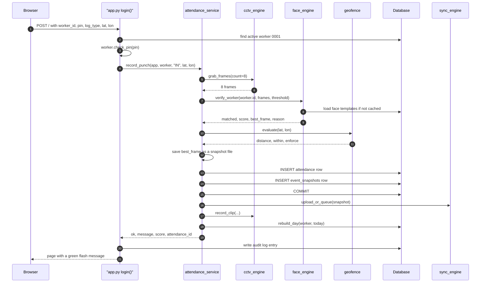
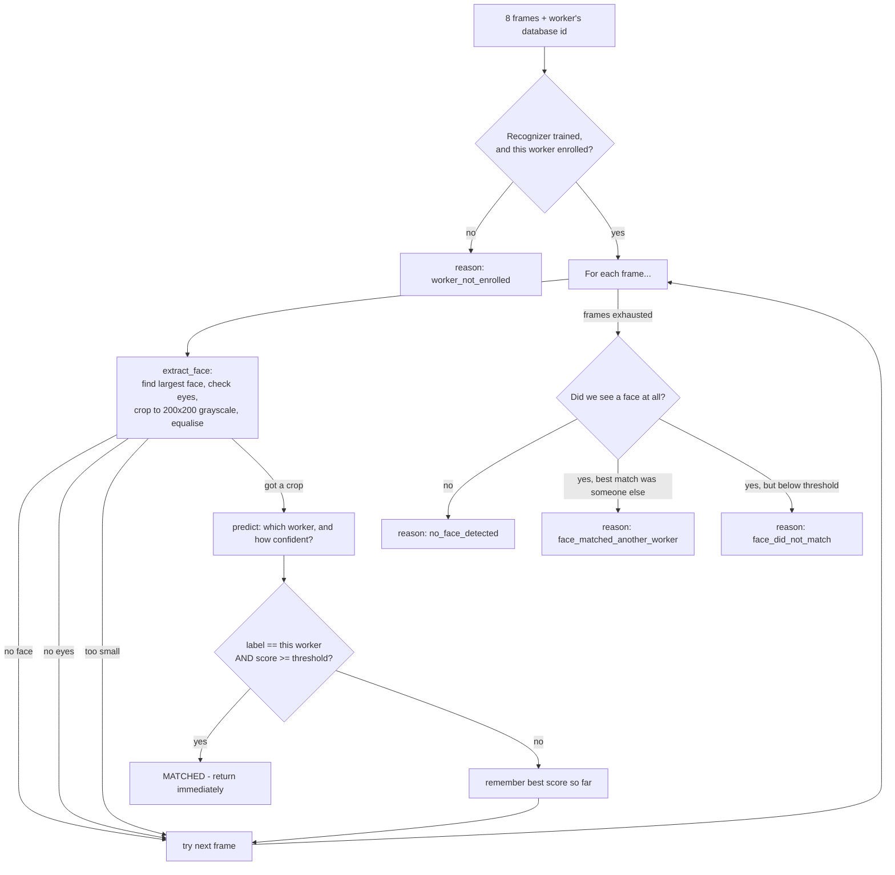
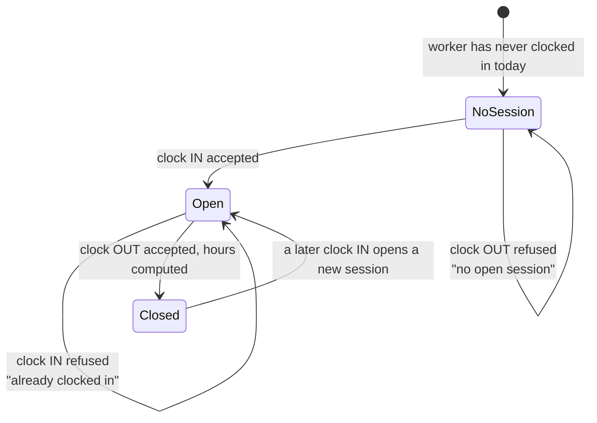
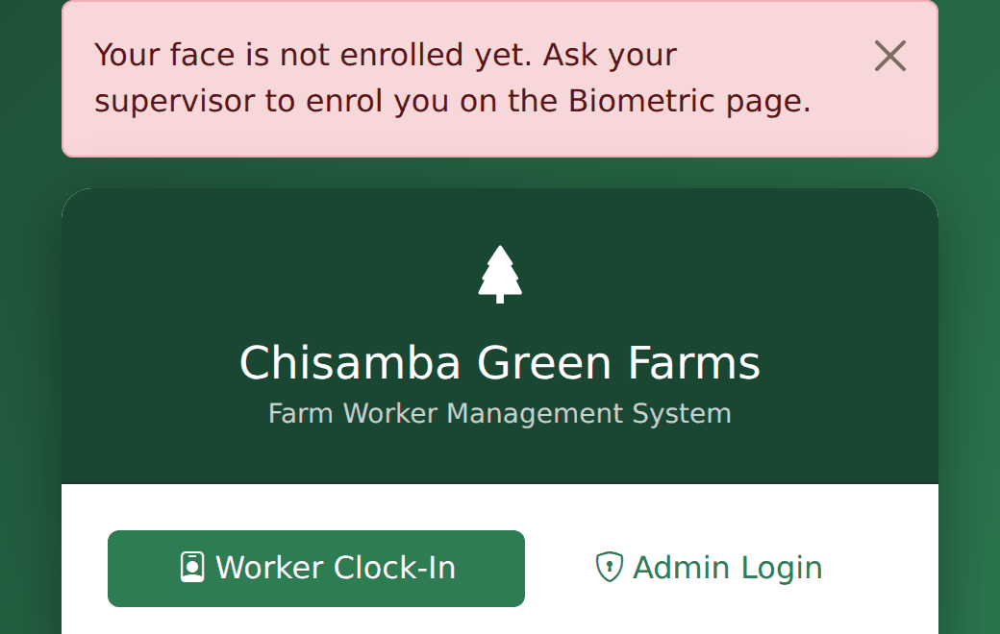
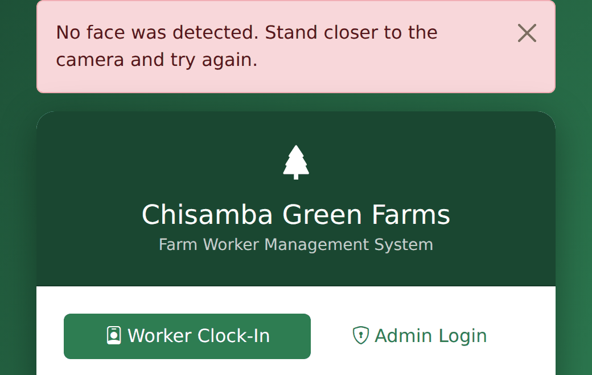

# 03 — Follow a Clock-In

← [02 — The Big Picture](02-the-big-picture.md) · [Wiki index](README.md) · Next: [04 — The Database](04-the-database.md)

---

This is the transaction the whole system exists to perform. If you understand
this page you understand the project; almost everything else is supporting
machinery.

We are going to follow one clock-in from the moment a worker presses a button to
the moment the row is committed, naming every file and function on the way.

## The scene

Musonda arrives for the morning shift. At the terminal — a browser on the farm
office machine, open at the home page — he types worker ID `0001` and PIN
`1000`, chooses **Clock In**, and presses the button. He stands square to the
camera. About a third of a second later the screen says:

> *Welcome, Musonda Banda! Clock-IN recorded at 07:12:30 (face match 72%).*



Here is everything that happened in that third of a second.

## The whole path at a glance



**Reading this diagram:** each vertical line is one part of the system, and time
runs **downwards**. Every numbered arrow is one part asking another to do
something; dotted arrows are answers coming back. Read it top to bottom like a
transcript.

The one-sentence version: *the browser hands the request to a route, the route
hands the whole job to one service function, and that function talks to the
camera, the face matcher, the geofence and the database in a fixed order — then
does three tidy-up jobs afterwards that are allowed to fail.*

Do not worry about the details yet. Now step by step.

---

## Step 1 — The form arrives at `app.py`

**Where:** `app.py`, the `login()` view, routed at `/`.

The home page is a single route serving two different jobs. It has a `mode`
field: `admin` signs a supervisor into the dashboard, `worker` records a punch.
The worker path is the one we are following.

```python
elif mode == "worker":
    worker_code = request.form.get("worker_id", "").strip().upper()
    pin = request.form.get("pin", "").strip()
    log_type = request.form.get("log_type", "IN")
    lat, lon = geofence.normalize_coordinates(
        request.form.get("latitude"), request.form.get("longitude")
    )
```

The latitude and longitude come from the browser's geolocation API, filled in by
JavaScript before the form is submitted. They may be absent — the browser can
refuse, or the machine may have no location source — which is why
`normalize_coordinates()` returns `None` rather than raising.

> **Worth noticing:** a worker never gets a session. There is no
> `session["worker_logged_in"]`. A worker is not a user of the dashboard; they
> are the *subject* of a transaction. Only supervisors and administrators sign
> in. This is why the codebase has both a `workers` table and a separate `users`
> table — see [04 — The Database](04-the-database.md).

## Step 2 — Credentials, and only credentials

```python
worker = (Worker.query.filter_by(worker_id=worker_code)
          .filter(Worker.status == "active").first())
if not worker or not worker.check_pin(pin):
    flash("Worker ID or PIN is incorrect.", "danger")
    return render_template("login.html", ...)
```

Three things are being checked: the worker code exists, the worker is `active`,
and the PIN matches. `check_pin()` compares against a Werkzeug hash — the PIN is
never stored in readable form.

The failure message is deliberately vague. "Worker ID or PIN is incorrect" does
not reveal *which* was wrong, so the form cannot be used to discover valid
worker codes.

**Note what has not happened yet.** The PIN alone has proved nothing about who
is standing there. Anybody who knows Musonda's ID and PIN has got this far. The
identity check is the next step, and it is the one that matters.

## Step 3 — Into the service layer

```python
outcome = record_punch(app, worker, log_type, lat, lon)
```

One call. Everything from here is `attendance_service.record_punch()`, and that
consolidation was a deliberate fix. In an earlier version some of these steps
lived in the web route and some in the API handler, and the two drifted apart —
a clock-in through the browser applied a check that a clock-in through the API
did not. Now both call this one function, so both cannot disagree, and the tests
exercise a single code path.

The first line of the function is a small piece of defensive coding worth
seeing:

```python
log_type = "OUT" if str(log_type).upper() == "OUT" else "IN"
```

Anything that is not an explicit `OUT` becomes `IN`. A malformed request can
therefore never *silently close* somebody's open session — the worst it can do
is attempt a clock-in, which the state rules will refuse if one is already open.

## Step 4 — Open the camera once, take eight frames

```python
if frames is None:
    frames, capture_status = cctv_engine.grab_frames(count=8)
```

Eight frames from a **single** camera opening. This is one of the most important
performance decisions in the codebase and it is invisible unless you know the
history.

The first version opened the camera twice: once to grab frames for matching, and
again to take the snapshot to store. On a machine with one webcam, the second
open frequently failed or returned a stale frame, because the first had not
fully released the device. Verification failed intermittently and the cause was
maddening to find.

Now: one opening, eight frames, and those same eight frames are used for the
identity match, for the stored snapshot, and as the anchor for the video clip.
The camera is the slow part of the transaction — a face match takes about 3
milliseconds while the whole punch takes about 296 — so opening it once is also
most of why the transaction is fast.

If the camera fails, the failure is recorded (in `hardware_health_logs` and in
`biometric_transactions`) and the punch is refused. It is not silently skipped.

## Step 5 — The identity check

```python
verification = face_engine.verify_worker(
    worker.id, frames, threshold=threshold, require_eyes=require_eyes
)
```

This is the heart of it. [05 — Face Recognition Explained](05-face-recognition-explained.md)
covers the algorithm; here is the control flow.



**Reading this diagram:** start at the top left. Diamonds are questions, and each
one has a way out to the left labelled with a refusal reason. The loop in the
middle is the system trying each of the eight photos in turn — as soon as one
photo matches well enough, it stops and accepts. If it runs out of photos without
a match, it drops to the bottom and works out *which* refusal reason applies from
what it saw along the way.

> **Analogy: checking a signature against a bank card.** You have eight
> photocopies of the signature, some smudged. You compare them one at a time, and
> the first clear match ends the job. If none matches, the reason matters: was
> the page blank (no face detected)? Was it somebody else's signature entirely
> (matched another worker)? Or was it the right person but too smudged to be sure
> (didn't match)? Those three call for three different responses.

Three details that repay attention:

**It returns on the first good frame.** As soon as one frame matches above the
threshold, the function returns. The other frames are not examined. This is why
a clean capture is fast and a difficult one takes slightly longer.

**It keeps the best frame it saw.** `result["best_frame"]` tracks the frame that
produced the highest score, and that is the frame stored as the snapshot. The
retained evidence is therefore the clearest view of the person, not an arbitrary
one.

**The refusal reason is worked out at the end, from what was observed.** Not a
generic failure — the function distinguishes *no face was visible*, *a face was
visible but the eyes were not*, *a face matched but scored too low*, and *a face
matched a different worker*. Those four call for four different responses from
the operator, and telling them apart is what makes the system usable by a
supervisor rather than a technician.

If verification fails and face verification is required, the attempt is written
to `biometric_transactions` **with its reason**, and the punch is refused. Note
that refused attempts are recorded, not just successful ones — that table is the
evidence base for measuring accuracy later.

## Step 6 — Location

```python
fence = geofence.evaluate(lat, lon)
if fence["enforce"] and fence["configured"]:
    ...
```

The distance from the farm centre is computed on every punch and stored on the
attendance row. Whether it can *refuse* the punch is a separate setting, and it
is **off by default**.

That split is deliberate and it is one of the more interesting decisions in the
project. A coordinate reported by a browser is a claim made by software the user
controls; it corroborates a biometrically verified record but cannot replace
one. Practically, a farm that switched enforcement on before seeing real
readings would refuse legitimate workers on day one, because rural position
fixes are often derived from a network estimate and can be wrong by hundreds of
metres. Record first, understand the distribution, then decide whether to
enforce. See [07 — Design Decisions](07-design-decisions.md).

## Step 7 — Save the snapshot *before* writing the row

```python
relative_path, snapshot_status = save_snapshot_frame(
    verification["best_frame"], worker.worker_id
)
if snapshot_status != "ok" or not relative_path:
    result.update({"code": "capture_failed", ...})
    return result
```

The image is written to disk **before** the attendance row is created, and if
writing fails the punch is refused.

The ordering is the point. It guarantees that an attendance record can never
exist without the evidence that produced it. The alternative ordering — write
the row, then try to save the image — would occasionally produce records with
nothing behind them, and those are exactly the records a dispute would turn on.

## Step 8 — The attendance row, and the state rules

Now the branch between clocking in and clocking out.



**Reading this diagram:** each box is a state a worker can be in today, and each
arrow is an event that moves them. The important part is what is **missing**:
there is no arrow that gets you from *Open* to *Open* by clocking in again, and
none from *NoSession* to *Closed*. Those changes are impossible by design.

> **Analogy: a car park barrier.** You cannot take a second ticket while you
> still have one, and you cannot pay to leave if you never came in. The barrier
> enforces that; a paper visitor book does not.

**Clocking out** looks for the most recent row with no `check_out_time`. If
there isn't one, the punch is refused with `no_open_session` — you cannot clock
out of a shift you never started.

**Clocking in** looks for *any* row with no `check_out_time`. If one exists, the
punch is refused with `already_clocked_in` — no double clock-ins, so a worker
can never accumulate two overlapping sessions on one day.

Both of those are impossible to enforce on paper, and both are asserted by tests
in `tests/test_attendance.py`.

The new row carries the evidence alongside the times:

```python
row = Attendance(
    worker_id=worker.id,
    check_in_time=now,
    latitude=lat, longitude=lon,
    verified_by_face=bool(verification["matched"]),
    check_in_match_score=verification["score"],
    within_geofence=fence["within"],
    distance_from_farm_m=fence["distance_m"],
)
```

Then an `EventSnapshot` row links the saved image file to this attendance row,
and the transaction commits.

Here is what that row actually looks like on screen. Each line carries the
photo taken at the moment, the confidence of the match, and how far from the farm
the punch was made:


> **This is the payoff of the whole system.** Compare the two records:
>
> | Paper register | This row |
> | --- | --- |
> | A name and a mark | Worker id, timestamps, computed hours |
> | — | The photograph taken at that moment |
> | — | The confidence with which the face matched: 72% |
> | — | Distance from the farm: 340 m |
> | — | A short video clip of the moment |
> | — | An audit entry naming who recorded it |
>
> A dispute three weeks later is settled by looking at material captured at the
> time, rather than by weighing two people's recollections.

## Step 9 — The three things that happen after the commit

These run *after* the database transaction is committed, and that is deliberate:
none of them may be able to prevent a valid attendance record from existing.

**Cloud upload, or the queue.** `sync_engine.upload_or_queue()` tries to send
the snapshot to Firebase. No internet, or no configuration? It goes into the
`offline_sync_queue` table and is retried later. A table rather than an in-memory
list, because the deployment context assumes the power will fail — a queue in
memory would not survive it.

**The event clip.** `cctv_engine.record_clip()` writes a few seconds of video.
Notice how it is called:

```python
try:
    cctv_engine.record_clip(...)
except Exception:
    pass
```

A bare `except: pass` is normally a code smell. Here it is the correct
behaviour, and this is the reasoning: the attendance record is already committed
and the wage depends on it. A failure of the video recorder — a camera unplugged
between the snapshot and the clip, a full disk — must not turn a valid,
already-committed attendance record into an error the worker sees. The clip is
corroborating extra, not the record itself.

**The daily summary.** `payroll_engine.rebuild_day()` recomputes that worker's
totals for the day from their sessions. *Rebuild*, not increment: it throws the
old summary away and recalculates from the attendance rows. Slower, and worth
it — if a session is later corrected, the summary corrects itself. An
incrementing counter would stay wrong forever.

## Step 10 — Back in the route: flash and audit

```python
flash(outcome["message"], outcome["category"])
if outcome["ok"]:
    _log_audit("attendance.recorded", ...)
else:
    _log_audit("attendance.rejected", ...)
```

**Both outcomes are audited.** A refused clock-in is as interesting as an
accepted one, arguably more so, and the audit trail records the reason.

The message shown to Musonda includes the match score:

> *Welcome, Musonda Banda! Clock-IN recorded at 07:12:30 (face match 72%).*

Showing the score is a deliberate transparency measure. A supervisor who sees
scores in the seventies and eighties every day, and then starts seeing forties,
has been told something useful about a deteriorating enrolment or a camera that
has been knocked out of position. "Success" alone would have withheld that.

---

## The refusal paths, all together

Nine ways this transaction can end without an attendance record. Each has its
own code and its own message.

Two of them as the worker actually sees them:





Notice that each message says **what to do next**, not just that something
failed. That is a deliberate design rule, covered in
[07 — Design Decisions](07-design-decisions.md#10-distinct-refusal-reasons).

| Code | What happened | What the operator should do |
| --- | --- | --- |
| *(credentials)* | Wrong worker ID or PIN | Re-enter; check the worker is active |
| `camera_error` | No frames could be captured | Check the camera is connected and not in use elsewhere |
| `no_face_detected` | No face found in any frame | Reposition the worker, check for obstruction |
| `eyes_not_visible` | Face found, eyes not | Remove hat, reduce glare, look up |
| `worker_not_enrolled` | No templates for this worker | Enrol them on the Biometric page |
| `face_did_not_match` | Matched below the threshold | Retry; if persistent, re-enrol |
| `face_matched_another_worker` | The face belongs to a different worker | **This is the fraud case.** Use the correct ID |
| `location_missing` / `outside_geofence` | Enforcement on, position missing or too far | Check the position and the radius setting |
| `already_clocked_in` / `no_open_session` | State rule violated | Clock out before clocking in, and vice versa |

Every one of these is written to `biometric_transactions` or the audit log, so
nothing fails invisibly.

---

Next: [04 — The Database](04-the-database.md)
