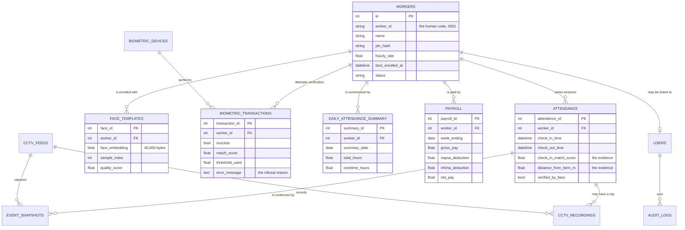
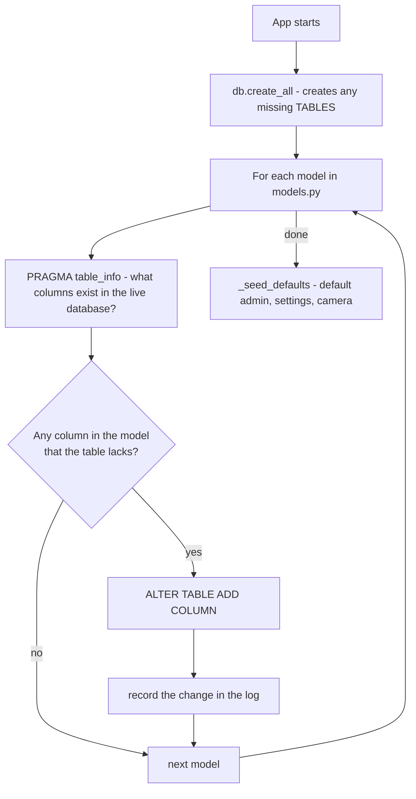

# 04 — The Database

← [03 — Follow a Clock-In](03-follow-a-clock-in.md) · [Wiki index](README.md) · Next: [05 — Face Recognition Explained](05-face-recognition-explained.md)

---

## One file, sixteen tables

The whole database is a single file, `fms.db`, in SQLite. There is no database
server to install, configure, back up separately or keep running. To take a
backup you copy one file.

That is unusual for a system that handles payroll, and it is the right choice
here. The machine is a mini PC in a farm office where the power fails without
warning. A database server would be one more thing to recover after each outage;
a file is either there or it isn't.

Every table is defined in **`models.py`**, and that file is the single source of
truth. `Workers.sql` is generated *from* it by `tools/export_schema.py` for
anyone who wants to browse the schema in a SQL client — never edit that file
expecting anything to change.

## The map



## The tables, grouped by what they are for

### The core five

| Table | What one row is | Notes |
| --- | --- | --- |
| `workers` | A farm worker | `id` is the internal key; `worker_id` (`"0001"`) is what humans type. Never confuse them |
| `users` | A dashboard account | Separate from workers on purpose — see below |
| `settings` | One configuration value | Key and value text pairs. The threshold, the rates, the radius all live here |
| `attendance` | One work session | Clock-in, clock-out, and the evidence for both |
| `audit_logs` | One administrative action | Append-only. Who did what, when |

> **Why `workers` and `users` are different tables.** A worker is somebody the
> system keeps records *about*. A user is somebody who signs into the dashboard.
> They are different populations with different needs — a worker has an hourly
> rate and a face template, a user has a role and a password. Most workers will
> never have an account. The `users.linked_worker_id` column exists for the
> occasional person who is both, such as a supervisor who also clocks in.

### The biometric three

| Table | What one row is | Notes |
| --- | --- | --- |
| `face_templates` | One enrolled face sample | The `face_embedding` blob is exactly 40,000 bytes: a 200×200 grayscale image |
| `biometric_transactions` | One verification attempt | **Including the failures.** This is the accuracy evidence base |
| `biometric_devices` | A capture device | Unused today — reserved for a fingerprint scanner |

`biometric_transactions` deserves emphasis. Every attempt is written here,
accepted or refused, with the score, the threshold in force, and the reason. A
system that recorded only successes could never answer "how often does this
refuse genuine workers, and why?" — and that question is the whole basis for
choosing a threshold.

### The surveillance three

| Table | What one row is |
| --- | --- |
| `cctv_feeds` | A configured camera: a device index or an RTSP address |
| `cctv_recordings` | One video clip, linked to the event that triggered it |
| `event_snapshots` | One still image, linked to its attendance row |

### Payroll and analytics

| Table | What one row is | Notes |
| --- | --- | --- |
| `daily_attendance_summary` | One worker, one day | **Derived.** Rebuilt from `attendance`, never edited directly |
| `payroll` | One worker, one week | Keeps every component, not just the net figure |

`daily_attendance_summary` is a derived table — everything in it can be
recomputed from `attendance`. It exists because payroll for two hundred workers
would otherwise re-scan every session row every time. It is always *rebuilt*
rather than incremented, so a corrected session produces a corrected summary.

`payroll` stores hours, overtime, rate, gross, each deduction and net — not just
`net_pay`. A worker who queries a payment can be shown how it was derived,
which a single number could not support.

### Operations

| Table | What one row is |
| --- | --- |
| `offline_sync_queue` | Something waiting to be uploaded, with attempt count and last error |
| `cloud_sync_metadata` | The upload state of one record |
| `hardware_health_logs` | The result of one camera probe, with a latency |

`hardware_health_logs` is a *history*, not a current state. That is the point: it
lets you tell an intermittent camera from a dead one, which is the difference
between a maintenance visit and a replacement.

## The naming trap that will catch you

Primary keys are **not** named consistently, and you will trip on this:

```python
Worker.id                    # not worker_id!
Attendance.attendance_id
FaceTemplate.face_id
Payroll.payroll_id
CCTVFeed.feed_id
```

`Worker.id` is the primary key. `Worker.worker_id` is a *different thing
entirely* — the four-digit code a human types, like `"0001"`.

So in `attendance.worker_id` (a foreign key) the value is the integer `1`,
while in `workers.worker_id` the value is the string `"0001"`. Same column name,
two different meanings.

**The habit that keeps you safe:** the codebase calls the integer key
`worker_pk` in every function signature that takes one — `verify_worker(worker_pk, ...)`,
`rebuild_day(worker_pk, day)`. When you see `worker_pk`, it is the integer.
When you see `worker_code`, it is the string. Follow that convention in
anything you add.

## How the schema upgrades itself

A student project usually deletes its database when the schema changes. That is
fine while the only data is test data, and completely unacceptable once a farm
has a year of attendance in it.

So on every start-up, `migrations.apply_migrations()` runs:



The critical property is that it is **additive only**. It adds columns. It never
drops one, never renames one, never rewrites a row. Consequences:

- An existing installation upgrades without losing data.
- A failed upgrade leaves the database readable by the previous version.
- **Renaming a column is not something the migration system can do for you.** If
  you must rename, add the new column, backfill it in code, and leave the old one
  in place. Dropping it is a manual, deliberate operation.

Running it twice is harmless — the second run finds nothing missing.

## Two protections that stop an upgrade locking you out

Both live in `_seed_defaults()` in `app.py`, and both exist because of real
incidents:

**An unrecognised role becomes the *least* privileged, not the most.**
`security.normalize_role()` maps anything it does not recognise to `viewer`. A
stray value in the database must never become an administrator by accident.

**If there is no active administrator at all, one is promoted.** An earlier
release defaulted every account to `supervisor`. When roles started being
enforced, a database written by that release would have had nobody who could
reach Settings or Users — locked out of its own configuration. So the seeding
routine checks for an active admin, and if there is none, promotes the account
named `admin`, or else the oldest account.

## Working with the database by hand

```bash
sqlite3 fms.db

.tables                                    -- list tables
.schema attendance                         -- one table's definition
SELECT COUNT(*) FROM attendance;
SELECT worker_id, check_in_time, check_in_match_score
  FROM attendance ORDER BY check_in_time DESC LIMIT 10;

-- the accuracy evidence base
SELECT error_message, COUNT(*) FROM biometric_transactions
 WHERE success = 0 GROUP BY error_message;
```

Read freely. **Write with care** — the application caches the trained face
recognizer in memory, so if you insert or delete rows in `face_templates`
directly, restart the app or the cache will be stale. See
[05 — Face Recognition Explained](05-face-recognition-explained.md#the-retraining-cache).

---

Next: [05 — Face Recognition Explained](05-face-recognition-explained.md)
