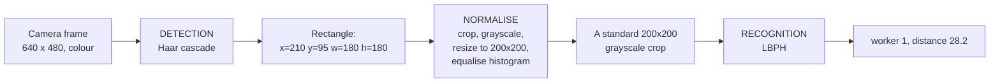
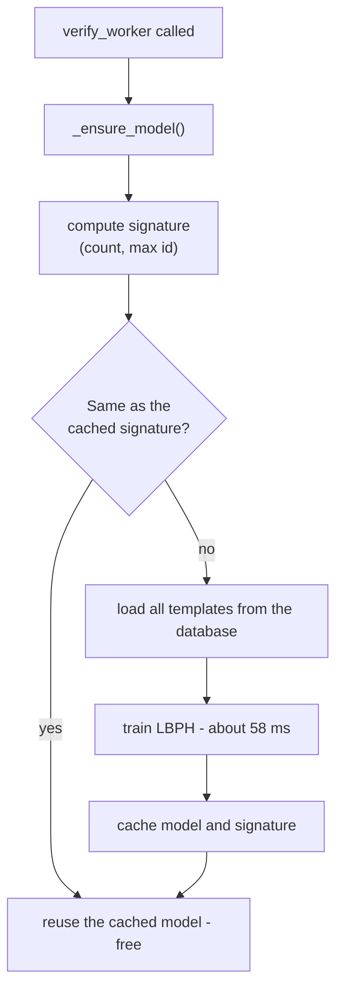

# 05 — Face Recognition Explained

← [04 — The Database](04-the-database.md) · [Wiki index](README.md) · Next: [06 — Security and Roles](06-security-and-roles.md)

---

No computer vision background is assumed. If you have never touched OpenCV, this
page is written for you.

## Detection and recognition are two different jobs

People say "face recognition" for a chain of two quite separate problems, and
this project uses a different algorithm for each.

**Detection: is there a face, and where?** Input: a photograph. Output: a
rectangle, or nothing. It does not know or care *whose* face it is. This project
uses a **Haar cascade**.

**Recognition: whose face is it?** Input: a picture that is already cropped to
one face. Output: a name and a confidence. This project uses **LBPH**.



Every stage of that pipeline is in `face_engine.py`.

## Detection: the Haar cascade

A Haar cascade is a classifier from 2001 (Viola and Jones) that is still in use
because it is extremely fast on an ordinary CPU.

The intuition: **faces have reliable light-and-dark patterns**. The eye region
is darker than the cheeks below it. The bridge of the nose is lighter than the
eye sockets either side. A Haar feature measures exactly that — sum the pixels
in a light rectangle, subtract the sum in an adjacent dark rectangle, and see if
the difference is big enough.

```
   ####****    <- the eye row is dark
   ........    <- the cheek row below is lighter
   Feature = sum(light row) - sum(dark row).  Big? Face-like.
```

One such test is nearly useless. The trick is the **cascade**: thousands of
these tests arranged in stages, and a candidate region must pass every stage.
Stage one is a couple of trivial tests that reject the vast majority of the
image instantly. Only regions that survive get the expensive stages. That is why
it can scan a whole frame in about 2 milliseconds.

The classifier itself is not code — it is a large XML file of learned
parameters, shipped inside the OpenCV package:

```python
HAAR_DIR = cv2.data.haarcascades
FACE_CASCADE = cv2.CascadeClassifier(HAAR_DIR + "haarcascade_frontalface_default.xml")
EYE_CASCADE  = cv2.CascadeClassifier(HAAR_DIR + "haarcascade_eye.xml")
```

> **This is exactly why `requirements.txt` pins OpenCV below 5.0.** OpenCV 5
> stopped shipping those XML files inside the wheel. Both cascades then fail to
> load, no face is ever detected, and every clock-in is refused. The pin is
> load-bearing.

### The eye check

After finding a face, the code runs the *eye* cascade inside that rectangle, and
by default rejects a candidate with no detectable eyes.

This was added after watching the face cascade occasionally accept a patch of
clothing or the back of someone's head. Enrolling such a region permanently
degrades that worker's templates, and the problem only shows up weeks later as
mysterious refusals. Requiring visible eyes is a cheap proxy for "a real,
front-facing, open-eyed view".

It is exposed as a setting (`face_require_eyes`) so a farm working in poor light
can relax it.

**It is not a liveness check.** A printed photograph has perfectly visible eyes.
The system has no defence against someone holding up a photo — that is an
acknowledged limitation, not an oversight.

## Normalisation: making crops comparable

```python
gray = cv2.cvtColor(frame, cv2.COLOR_BGR2GRAY)
roi  = gray[y:y+h, x:x+w]
crop = cv2.resize(roi, (200, 200), interpolation=cv2.INTER_AREA)
crop = cv2.equalizeHist(crop)
```

Four operations, each with a reason:

| Step | Why |
| --- | --- |
| **Grayscale** | Colour tells you about lighting and skin tone, not identity. Dropping it removes a variable that changes with the time of day |
| **Crop** | Everything outside the face is noise |
| **Resize to 200×200** | Every crop must be the same size to be comparable. Also fixes the storage size at exactly 40,000 bytes |
| **Equalise histogram** | This is the one that matters most — see below |

**Histogram equalisation** stretches the brightness range so the darkest pixel
becomes black and the lightest becomes white, redistributing everything in
between. A face photographed in shade and the same face in bright sun end up
looking far more alike.

```
Before:  pixels bunched dark      After:  spread across the range
         ▁▃█▇▄▁▁▁▁▁                       ▂▃▅▆█▆▅▃▂▁
```

This is why the measured scores barely move between bright and dim capture
conditions. It is doing a lot of quiet work.

## Recognition: LBPH

**LBPH** = **L**ocal **B**inary **P**atterns **H**istograms. Three ideas stacked.

### 1. The local binary pattern

Take any pixel. Compare it to its eight neighbours. Write `1` if the neighbour is
brighter than the centre, `0` if not. Read the eight bits round in a circle and
you have a number from 0 to 255 — a code describing the *texture* around that
pixel.

```
  Brightness values          Compare to centre (90)        Read clockwise
     120   85   60              1     0     0                 = 10011101
      95  [90]  55      ->      1     .     0        ->       = 157
     100  130  140              1     1     1
```

The magic property: **this code does not change when the lighting changes
uniformly.** Add 30 to every pixel and the neighbours are all still brighter or
darker in exactly the same pattern. The code is identical. That is why a
texture-based method copes with a farm where the light at 7 a.m. and the light at
noon are nothing alike.

### 2. Histograms over a grid

Do that for every pixel and you have 40,000 codes — too many to compare
directly, and it throws away *where* each pattern was.

So the crop is divided into a grid (this project uses 8 × 8 = 64 cells), and
within each cell you count how many times each code appeared. That count is a
histogram. Concatenate all 64 histograms and you have the face's signature.


The grid is what preserves geometry: the histogram from the eye region is
compared with the eye region, not with the chin.

### 3. Compare by distance

To recognise a new face, compute its signature and compare it to every stored
one. The closest wins. **The output is a distance, where smaller is better and 0
means identical.**

```python
model = cv2.face.LBPHFaceRecognizer_create(radius=1, neighbors=8, grid_x=8, grid_y=8)
model.train(crops, np.array(labels, dtype=np.int32))
label, distance = model.predict(crop)
```

`radius=1, neighbors=8` is the 3×3 neighbourhood described above. `grid_x=8,
grid_y=8` is the 64-cell grid.

## From distance to a percentage

A distance is a terrible thing to show a farm supervisor. Lower is better is
backwards from every other progress indicator they have ever seen, and the
number has no natural ceiling.

So the code maps it:

```python
return int(label), max(0.0, 100.0 - float(distance))
```

A distance of 28 becomes **72% confident**. Now higher is better, the threshold
reads the intuitive way round (`score >= threshold` means accept), and the
number on screen behaves the way people expect.

This mapping changes no decision — it is monotonic, so any threshold in
distance-space has an exact equivalent in percentage-space. It exists purely so
that a human can reason about the number.

### The threshold

Default: **35**. It was not guessed. It comes from an experiment
(`tools/accuracy_experiment.py`) that swept the threshold across its whole range
and measured both error rates at every step:

| Threshold | False rejections (genuine turned away) | False acceptances (impostor let in) |
| --- | --- | --- |
| 10 – 50 | 0% | 0% |
| 55 and above | 10% | 0% |

Any value from 10 to 50 was defensible on that data. 35 sits toward the
permissive end **on purpose**, and the reasoning is about consequences rather
than statistics:

> A false rejection turns away a worker who is genuinely present, and if it
> keeps happening they may go unpaid for a day they worked — invisibly. A false
> acceptance writes a record that the snapshot, the score and the audit trail
> all expose to later review. Where both error rates are equal, choose the
> failure that leaves evidence.

Because it is a setting rather than a constant, a farm that measures its own
population can move it without a code change.

## Enrolment: what is actually stored

```python
def _encode(crop) -> bytes:
    return crop.tobytes()          # exactly 40,000 bytes
```

The raw 200×200 grayscale pixels. No PNG header, no JSON — a fixed-size blob, so
decoding needs no metadata and a wrong-sized blob is detectably corrupt.

Three or more samples per worker, captured at slightly different angles. Three is
enough; variety across the samples matters far more than quantity.

> **An important distinction to get right.** Storing this rather than a
> photograph is genuine **data minimisation** — the original image cannot be
> read back out of a texture histogram. It is **not anonymisation**. The
> template identifies the individual, it is biometric personal data, and under
> Zambia's Data Protection Act No. 3 of 2021 it carries the full set of
> obligations. Do not let anyone tell you otherwise in a design discussion.

## The retraining cache

Training the recognizer over every stored template takes about 58 ms. Doing that
on every clock-in would be waste, since the templates rarely change.

So the trained model is cached in a module-level variable, keyed by a cheap
fingerprint of the template table:

```python
def _signature() -> tuple:
    count, max_id = db.session.query(
        db.func.count(FaceTemplate.face_id), db.func.max(FaceTemplate.face_id)
    ).one()
    return int(count or 0), int(max_id or 0)
```

`(row count, highest id)`. Enrolling a sample takes `(24, 24)` to `(25, 25)`, so
the next verification retrains. Deleting one changes the count. A hundred
clock-ins in between all reuse the cached model.



**Two consequences you need to know:**

1. If you insert or delete `face_templates` rows **outside the app** (in
   `sqlite3`, say), the count changes and the cache invalidates itself
   correctly. But if you *modify a blob in place*, the signature does not
   change and the cache goes stale. Call `face_engine.invalidate()` or restart.
2. The cache is per-process and guarded by an `RLock`. It is not shared between
   worker processes, which is one reason this app runs single-process.

## The fallback you should never see

If `cv2.face` is missing, `_predict()` falls back to comparing the probe against
every stored sample by normalised cross-correlation, then maps the result onto
the same 0–100 scale so one threshold setting works for both.

It exists so the application still *runs* on a broken install — not so it can be
relied on. It is slower as the roster grows and much less discriminating. The
Biometric page reports `Recognizer: correlation-fallback` when this is active,
and `/api/v1/health` returns `"contrib_available": false`. Treat either as a
build error, not a mode of operation.

## What this design does not do

Stated plainly, because these are the questions people ask:

- **No liveness detection.** A printed photograph passes the eye check.
- **Not state-of-the-art accuracy.** Modern deep-learning embeddings (FaceNet,
  ArcFace) are substantially more accurate on hard, unconstrained images. They
  also need an accelerator or seconds per frame on a Raspberry Pi. The trade was
  made deliberately: this task needs reliable attribution against a *claimed*
  identity at queue speed, not the highest possible accuracy on arbitrary
  photographs.
- **No demographic fairness testing.** Face recognition error rates are known to
  differ across demographic groups by algorithm-specific amounts. That was not
  measured for this system, and it should not be claimed to be fair until it is.

---

Next: [06 — Security and Roles](06-security-and-roles.md)
