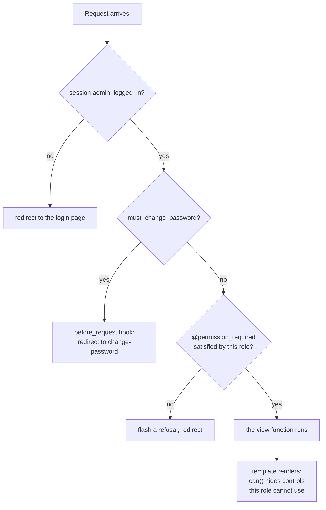

# 06 — Security and Roles

← [05 — Face Recognition Explained](05-face-recognition-explained.md) · [Wiki index](README.md) · Next: [07 — Design Decisions](07-design-decisions.md)

---

## Two populations, two mechanisms

The system authenticates two entirely different kinds of person, and confusing
them is the fastest way to write a security bug here.

| | **Workers** | **Users** |
| --- | --- | --- |
| Who | People who clock in | Supervisors, administrators, office staff |
| Table | `workers` | `users` |
| Credential | 4-digit PIN + **their face** | Username + password |
| Gets a session? | **No** | Yes |
| Can reach the dashboard? | Never | Yes, subject to their role |
| Verified by | `record_punch()` | `login()` and `@admin_required` |

A worker is the *subject* of a transaction, not a user of the system. There is
no `session["worker_logged_in"]` anywhere, and there should never be one.

## Passwords and PINs

Both use Werkzeug's `generate_password_hash` / `check_password_hash`, which
defaults to **scrypt** — deliberately memory-hard, so attacking it with parallel
hardware is expensive.

```python
class Worker(db.Model):
    def set_pin(self, pin):   self.pin_hash = generate_password_hash(pin)
    def check_pin(self, pin): return check_password_hash(self.pin_hash, pin)
```

Nothing readable is stored. A forgotten PIN is *reset*, never *retrieved* — a
route exists for resetting, none exists for reading.

### The odd one out: `pin_fingerprint`

```python
pin_fingerprint = db.Column(db.String(64), nullable=True)
```

A SHA-256 of the PIN, used for one thing only: enforcing that no two workers
share a PIN. A hash comparison can answer "does anyone else already use this
one?", which a per-row salted scrypt hash cannot without checking every worker.

**Despite the name, this has nothing to do with fingerprints.** The biometric
lives in `face_templates`. The name is unfortunate; it means "a short fixed
identifier for a value", as in "file fingerprint". Do not confuse it with
`Worker.fingerprint_template`, which is the reserved-and-unused column for a
scanner that was never bought.

## Roles as sets, not ranks

Three roles. Nine permissions. Roles hold *sets* of permissions:

```python
ROLE_PERMISSIONS = {
    "admin":      {VIEW, WORKER_MANAGE, ATTENDANCE_MANAGE, PAYROLL_MANAGE,
                   CCTV_MANAGE, BIOMETRIC_MANAGE, SYNC_MANAGE,
                   USER_MANAGE, SETTINGS_MANAGE},
    "supervisor": {VIEW, WORKER_MANAGE, ATTENDANCE_MANAGE, PAYROLL_MANAGE,
                   CCTV_MANAGE, BIOMETRIC_MANAGE, SYNC_MANAGE},
    "viewer":     {VIEW},
}
```

They nest in practice — viewer ⊂ supervisor ⊂ admin — but they are written as
explicit sets rather than as numeric ranks. The reason is maintenance: when you
add a tenth permission, a set forces you to decide, for each role, whether it
belongs there. A rank comparison (`if user.level >= 2`) would silently grant it
to everyone above a line you never revisited.

| Permission | admin | supervisor | viewer |
| --- | :---: | :---: | :---: |
| View records and reports | ✓ | ✓ | ✓ |
| Manage workers | ✓ | ✓ | |
| Enrol and clear faces | ✓ | ✓ | |
| Record and correct attendance | ✓ | ✓ | |
| Generate payroll | ✓ | ✓ | |
| Configure cameras | ✓ | ✓ | |
| Manage biometric devices | ✓ | ✓ | |
| Operate cloud sync | ✓ | ✓ | |
| **Manage user accounts** | ✓ | | |
| **Edit settings and statutory rates** | ✓ | | |

The two admin-only rows are the ones that change the system's own rules, and
that boundary is the whole design:

- A supervisor who could edit **Settings** could set the match threshold to 0 and
  make verification meaningless.
- A supervisor who could manage **Users** could create an administrator account
  for themselves.

Both are removed by putting those two behind `admin`. Tests in
`tests/test_security_and_api.py` assert it route by route.

## Where enforcement actually happens



Enforcement is applied in **two** places, for two different purposes, and the
distinction matters:

**The decorator on the route is the security control.**

```python
@app.route("/settings", methods=["GET", "POST"])
@permission_required(SETTINGS_MANAGE)
def settings():
    ...
```

**Hiding buttons in the template is a usability measure, not a security one.**

```jinja

  <a href="{{ url_for('settings') }}">Settings</a>

```

`can()` is registered as a Jinja global in `create_app()`, so every template can
call it. It exists so a supervisor is not shown a button that would refuse them.
**It protects nothing** — anyone can type the URL. The route decorator is what
stops them, and that is what the tests assert.

If you add a route, add the decorator. Hiding the link is not enough.

## Failing closed

```python
def normalize_role(role):
    value = (role or "").strip().lower()
    return value if value in ROLE_PERMISSIONS else "viewer"
```

An unrecognised role becomes **viewer** — the least privileged — not admin. A
typo, a stray value, a role from a future version: all of them lose privileges
rather than gain them. This is the single most important line in `security.py`.

The legitimate upgrade case is handled separately and explicitly in
`_seed_defaults()`, which promotes an account when a database has no active
administrator at all. Compare the two: automatic promotion happens once, on a
condition that is checked deliberately; automatic demotion happens always, by
default.

## Temporary passwords

An administrator creating or resetting an account issues a generated password
and sets `must_change_password = True`. Then one `before_request` hook takes
over:

```python
@app.before_request
def _enforce_password_change():
    if not session.get("admin_logged_in") or not session.get("must_change_password"):
        return None
    allowed = {"force_password_change", "change_password", "logout", "manual", "static"}
    if (request.endpoint or "") in allowed:
        return None
    return redirect(url_for("force_password_change"))
```

A hook rather than a check in every view, because **a route added next year
cannot forget to apply a hook.** The allow-list is the minimum needed to change
the password, plus logout and the public manual.

This is also what stops the shipped `admin` / `admin` from being left in place
forever.

## The audit trail

```python
def _log_audit(action, details=""):
    ...
```

Every route that changes state calls it. Each entry records the acting user, the
action, a human-readable detail, the IP address and the time.

**Written by the routes, not by database triggers** — and that is a deliberate
choice. A trigger records that a row changed. A route can record what the user
was *doing* when it changed, which is what an investigation actually needs:

```
admin  attendance.rejected  IN refused for 0003: face_matched_another_worker
admin  worker.face.enroll   Enrolled sample 3 of 3 for 0007
admin  settings.update      face_match_threshold 35 -> 45
```

Nothing in the application updates or deletes an audit row. The log is
append-only through the interface.

## Configuration hardening

| Concern | How it is handled |
| --- | --- |
| Session secret | `FMS_SECRET_KEY` from the environment; falls back to a generated key cached in `.secret_key` (mode `0600`), which is gitignored |
| Database location | `FMS_DATABASE_URI` from the environment |
| Debug mode | **Off** unless `FMS_DEBUG` is explicitly set. The Werkzeug debugger allows arbitrary code execution through the browser — on a farm network that is a remote shell |
| Upload size | `MAX_CONTENT_LENGTH` capped at 16 MB, for enrolment photo uploads |
| Stored images | Served through `@admin_required` route `/captures/<path>`, **not** as static files — they are photographs of workers |

That last row is easy to miss and important. `captures/` is deliberately not in
`static/`. If it were, every snapshot would be readable by anyone who could guess
a URL.

## The API's own authentication

`api.py` accepts **either** an `X-API-Key` header **or** an existing signed-in
browser session:

```python
if session.get("admin_logged_in"):
    return f(*args, **kwargs)
expected = _setting("api_key")
supplied = request.headers.get("X-API-Key", "")
if expected and supplied and supplied == expected:
    return f(*args, **kwargs)
return jsonify({"ok": False, "error": "unauthorised"}), 401
```

The session path lets the dashboard's own pages call these endpoints without
embedding a key in the HTML. The key path is for Postman and any future mobile
client.

Note `if expected and supplied` — if no key has been generated yet, an empty
supplied key cannot match an empty expected key. Without that guard, an
unconfigured system would accept a request with no header at all.

**The key is a single shared secret with full read access.** There are no
per-client keys and no scopes. Settings offers a regenerate button, which
invalidates the previous one. For a single-farm deployment that is a reasonable
trade; if this were ever multi-tenant it would need rethinking.

## Known limitations

Stated honestly, so nobody discovers them the hard way:

- **No liveness detection.** A printed photograph passes the eye check. This
  matters least where a supervisor initiates every clock-in and most at an
  unattended terminal.
- **No rate limiting** on PIN attempts. A 4-digit PIN has 10,000 combinations —
  but note that a correct PIN alone still cannot record attendance without the
  matching face.
- **No CSRF tokens** on the forms. Mitigated by the deployment being a local
  network with no internet exposure; it would need adding before any public
  deployment.
- **One shared API key**, as above.
- **HTTP, not HTTPS.** Fine on an isolated farm LAN; not fine anywhere else.

---

Next: [07 — Design Decisions](07-design-decisions.md)
