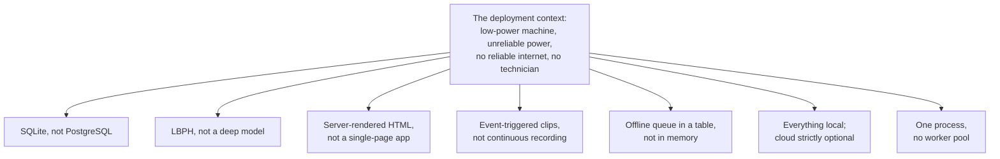

# 07 — Design Decisions

← [06 — Security and Roles](06-security-and-roles.md) · [Wiki index](README.md) · Next: [08 — Making Your First Change](08-making-your-first-change.md)

---

Every codebase has parts that look wrong until you know why they are that way.
This page is the list, so you do not "fix" something that is deliberate.

## The constraint everything descends from

> **A mini PC or a Raspberry Pi, in a farm office in rural Zambia, where the
> power fails without warning and there may be no internet at all.**

Hold that in mind and most of what follows stops looking like a compromise and
starts looking like the only sensible answer.



**Reading this diagram:** one box at the top — the situation the farm is actually
in — and everything below it is a consequence. Read each arrow as "…which is why
we chose…". None of these were preferences; they all fall out of that one box.

> **Analogy: building for a remote cabin, not a city flat.** In a city you plumb
> into the mains without thinking. At a cabin you fit a water tank, because the
> mains is not there. Someone arriving later might call the tank primitive — until
> they notice there is no mains. Every decision below is a water tank.

---

## 1. Verification, not identification

**Decision:** the system asks *"is this the worker whose ID was typed?"*, never
*"who is this?"*.

**Why:** identification would recognise a face, find *a* valid enrolled worker,
and record attendance — for the wrong person. That is precisely the buddy-punching
fraud the project exists to prevent. This is the single most important decision
in the codebase.

**Where:** `face_engine.verify_worker()` takes a `worker_pk` and returns
`WRONG_WORKER` when it recognises the face but attributes it elsewhere.

**Do not** "simplify" this to a plain identification lookup. `identify()` exists
for the API's convenience and is deliberately not on the attendance path.

---

## 2. LBPH rather than a deep-learning model

**Decision:** a 2006-vintage texture descriptor rather than FaceNet or ArcFace.

**Why:** measured cost. A complete verification decision over eight frames takes
about **296 ms** on a two-core machine with no accelerator. A deep embedding
pipeline needs either an accelerator or seconds per frame on a Raspberry Pi.

The trade is real and was made with eyes open: deep embeddings are substantially
more accurate on hard, unconstrained images. But this task is not "identify a
stranger from a crowd photo" — it is "confirm a claimed identity, in a
controlled pose, at a fixed camera, at queue speed". LBPH is sufficient for that
and runs on hardware a farm can afford.

**When to revisit:** if the deployment hardware ever includes an accelerator.

---

## 3. Record the location, but do not enforce it by default

**Decision:** distance from the farm is computed and stored on every punch.
Refusing on that basis is a setting, and it is **off**.

**Why, principled:** a coordinate reported by a browser is a claim made by
software the user controls. It can be falsified without specialist skill.
Treating it as proof of presence would assert more than the measurement
supports. It corroborates a biometrically verified record; it cannot replace one.

**Why, practical:** rural position fixes are often derived from a network
estimate and can be wrong by hundreds of metres. A farm that enabled enforcement
at a plausible-sounding radius on day one would refuse legitimate workers and
conclude the system was broken. Record first, look at the actual distribution,
*then* choose a radius.

**The general principle, worth carrying to anything you add:** *a measurement
that is recorded can be understood before it is trusted. One that is enforced
from the outset can only be discovered to be wrong by refusing something
legitimate.*

---

## 4. One camera opening per punch

**Decision:** open the camera once, grab eight frames, use those same frames for
matching, for the stored snapshot, and for the clip.

**Why:** the first version opened it twice. On a single-webcam machine the second
open often failed or returned a stale frame because the first had not fully
released the device — verification failed intermittently and the cause was very
hard to find. The camera is also the slow part: a face match is ~3 ms, the whole
punch ~296 ms.

**Where:** `attendance_service.record_punch()`, the `grab_frames(count=8)` call.

---

## 5. Snapshot before row

**Decision:** the image is written to disk *before* the attendance row is
created, and a failure to write refuses the punch.

**Why:** it guarantees an attendance record can never exist without the evidence
that produced it. Reversing the order would occasionally produce records with
nothing behind them — exactly the records a dispute would turn on.

---

## 6. Clip recording is outside the decision path

**Decision:**

```python
try:
    cctv_engine.record_clip(...)
except Exception:
    pass
```

**Why this is not the code smell it looks like:** by the time this runs, the
attendance row is already committed and somebody's wage depends on it. A camera
unplugged between the snapshot and the clip, or a full disk, must not turn a
valid committed record into an error the worker sees. The clip is corroborating
extra; the record is the record.

**The general rule:** anything after the commit is best-effort and must not be
able to fail the transaction. Anything that must not be missing goes *before*
the commit.

---

## 7. Rebuild summaries, never increment them

**Decision:** `payroll_engine.rebuild_day()` deletes and recomputes a worker's
daily summary from their attendance rows.

**Why:** incrementing is faster, and leaves the summary permanently wrong the
moment a session is corrected — and corrections happen. Rebuilding means a
corrected session always yields a corrected summary.

**The cost is measured, not assumed:** rebuilding a fortnight takes about 269 ms.
Correctness under correction costs about a quarter of a second per fortnight,
which is nothing worth having.

---

## 8. Statutory rates are settings, not constants

**Decision:** NAPSA 5%, NHIMA 1%, the standard day, the overtime multiplier, the
match threshold, the geofence radius — all rows in `settings`.

**Why:** statutory rates change by legislation, and farms differ. A farm should
not need a developer when the pension rate is revised. `payroll_engine.rates()`
reads them and `compute_pay()` takes them as an argument, which also makes the
function testable across configurations.

---

## 9. The offline queue is a table, not a list

**Decision:** pending uploads live in `offline_sync_queue` in the database.

**Why:** the deployment context assumes the power will fail. A queue in memory
dies with the process; a queue in the database is still there when the machine
comes back up. Each row carries a retry count and the last error, so a
permanently failing item is visible rather than retried forever in silence.

---

## 10. Distinct refusal reasons

**Decision:** six named reasons rather than one "verification failed".

**Why:** they call for entirely different responses, and only the operator can
tell which applies.

| Reason | What the operator does |
| --- | --- |
| `no_face_detected` | Reposition the worker; check the camera view |
| `eyes_not_visible` | Remove a hat, reduce glare |
| `worker_not_enrolled` | Go and enrol them — nothing to do with this attempt |
| `face_did_not_match` | Retry, then re-enrol if it persists |
| `face_matched_another_worker` | **Somebody is using the wrong ID** |
| `face_too_small` | Move closer |

In the measured data, four of six real refusals were capture problems, one an
enrolment gap, and one a genuine identity refusal. A bare "failed" would have
left a supervisor unable to act on any of them.

**This is what makes the system operable by a supervisor rather than a
technician**, and it is worth preserving when you add checks of your own.

---

## 11. Server-rendered HTML

**Decision:** Jinja templates, not React.

**Why:** a single-page app needs a build step, a bundle to keep in sync with the
API, and a browser new enough to run it. The farm office browser may be several
versions behind. Server-rendered pages have none of those failure modes, and
the JSON API exists separately for a future mobile client.

The MJPEG video stream follows the same reasoning: any browser renders it in an
`` tag with no plugin or client-side codec support, which cannot fail
because the browser is old.

---

## 12. Purpose limitation as a design property

**Decision:** the system implements no productivity scoring, no behavioural
analysis, no continuous recording and no movement tracking.

**Why:** the research on workplace biometrics finds that systems installed for
attendance are routinely extended into other monitoring. The defence is not a
policy promise — it is not building the capability. There is no interface
through which retained material could be repurposed into a performance ranking,
and that claim is verifiable by inspecting the 54 routes and 15 endpoints.

**The Analytics page is the closest this comes to a line, and it stays on the
right side of it deliberately.** It aggregates — cost by department, hours by
weekday, who has stopped turning up — and it names individuals only where the
finding is an *attendance* one that a supervisor has to act on. There is no
score, no ranking by output, and nothing a worker does faster or slower is
measured at all. The worker's own copy of the same figures
(`reports_engine.worker_report()`) compares them against **their own** recent
average and never against a colleague, because that is the only comparison that
is theirs to know.

**Treat this as a constraint on what you add.** A "worker productivity score"
feature would be a straightforward afternoon's work and would break the promise
the system makes to the people enrolled in it.

---

## 12b. The card default is what was asked for, not what is safest

**Decision:** the card barcode carries the worker's NRC by default, with a salted
hash and a meaningless generated number offered as alternatives.

**Why:** this one is worth reading as an example of a decision that is not
purely technical. The plain NRC is what supervisors ask for first — it is a
number they already use, and a scanned card that reads back something familiar
inspires confidence. It is also the option that puts a national identifier on a
piece of plastic that leaves the farm in somebody's pocket every evening, which
sits awkwardly beside the data-minimisation claim in decision 12.

The code therefore implements all three and prefers none, the module docstring
states the trade-off in full, and the operator manual repeats it at the point of
choosing. `card_number` is the option to pick for a real deployment, and the
documentation says so.

**Worth knowing if you change it:** the two NRC-derived options are
deterministic, so "reissuing" a card produces the same value. Only
`card_number` can actually be retired and replaced.

---

## 13. Additive-only migrations

**Decision:** `migrations.py` adds columns. It never drops or renames one.

**Why:** an existing installation must upgrade without losing a year of
attendance, and a failed upgrade must leave the database readable by the previous
version.

**The consequence for you:** you cannot rename a column through the migration
system. Add the new one, backfill in code, leave the old one. Dropping it is a
manual, deliberate operation.

---

## 14. Port 8010

**Decision:** not 5000, 6000, 8000 or 8080.

**Why:** **6000 cannot be used at all** — Chrome and Firefox refuse it outright
with `ERR_UNSAFE_PORT`, so the page never loads however well the server runs.
5000 collides with AirPlay Receiver on macOS. 8000 and 8080 are the ports every
other project grabs first. 8010 keeps out of the way.

This sounds trivial. It cost real debugging time, which is why it is written
down.

---

## Things that are *not* deliberate

Honest list — if you have time, these are worth improving:

- **`app.py` is about 1,900 lines.** All 54 routes in one file. Blueprints would
  split it sensibly — `portal.py` shows it works. Nothing depends on it being one
  file.
- **`pin_fingerprint` is badly named.** It is a uniqueness hash, nothing to do
  with fingerprints. Renaming it means an additive migration and a backfill.
- **Primary keys are inconsistently named** (`Worker.id` but
  `Attendance.attendance_id`). Historical; not worth the churn to fix now, but
  do not add to the inconsistency.
- **`BiometricDevice` and `Worker.fingerprint_template` are dead** — reserved for
  a scanner that was never bought.
- **No CSRF tokens.** Would need adding before any deployment that is not an
  isolated LAN.
- **`barcode_engine.resolve()` falls back to a full table scan** when the exact
  match fails, to cope with values stored before normalisation existed. Fine for a
  workforce in the hundreds; it would need an index at ten thousand.
- **Auto-refresh reloads the whole page.** Deliberate — see
  [modules/frontend.md](modules/frontend.md) — but a partial update would be
  kinder on a metered connection if somebody wants to do it properly.

---

Next: [08 — Making Your First Change](08-making-your-first-change.md)
