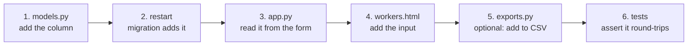

# 08 — Making Your First Change

← [07 — Design Decisions](07-design-decisions.md) · [Wiki index](README.md) · Next: [09 — Testing and Tools](09-testing-and-tools.md)

---

Six recipes for the changes you are most likely to be asked for. Each names
every file you must touch.

## Before you start

```bash
source .venv/bin/activate
pytest                    # 63 tests. Confirm they pass BEFORE you change anything
python app.py
```

If the suite is already failing, fix that first — otherwise you will not know
whether your change broke something.

**Work on a copy of the database.** `cp fms.db fms.db.backup` costs nothing.

---

## Recipe 1 — Add a field to a worker

*Say the farm wants to record each worker's shirt size for issuing uniforms.*



**Step 1 — `models.py`.** Add one line to the `Worker` class:

```python
shirt_size = db.Column(db.String(10), nullable=True)
```

Make it `nullable=True`. Existing rows have no value for it, and a `NOT NULL`
column with no default cannot be added to a table that already has rows.

**Step 2 — restart the app.** That is the whole migration. `migrations.py`
compares the model against the live table, sees the missing column, and issues
`ALTER TABLE workers ADD COLUMN shirt_size VARCHAR(10)`. It logs what it did.

**Step 3 — `app.py`.** In the `add_worker` and `update_worker` views, read it
from the form:

```python
worker.shirt_size = request.form.get("shirt_size", "").strip() or None
```

**Step 4 — `templates/workers.html`.** Add an input to the create form and the
edit modal. Copy the markup of an existing text field so the styling matches.

**Step 5 — `exports.py`** (optional). Add the header and the value to
`attendance_csv()` or wherever it belongs.

**Step 6 — `tests/test_workers.py`.** Assert it saves and comes back.

---

## Recipe 2 — Add a setting

*Say you want the number of frames captured per punch to be configurable.*

**Step 1 — `app.py`,** in `DEFAULT_SETTINGS`:

```python
"capture_frame_count": "8",
```

Every setting is a string. `settings.value` is a text column; convert at the
point of use.

**Step 2 — `templates/settings.html`.** Add the input, following an existing one.

**Step 3 — `app.py`,** in the `settings()` view's `_save_settings({...})` call:

```python
"capture_frame_count": request.form.get("capture_frame_count", "8").strip(),
```

**Validate it before saving.** Look at how the threshold is handled — it is
parsed, range-checked, and rejected with a flash message if it is not a number
between 0 and 100. A setting that reaches the database as nonsense will fail
somewhere far away, at the point of use, with a confusing error.

**Step 4 — use it.** In `attendance_service.py`:

```python
count = int(_setting("capture_frame_count", "8") or 8)
frames, capture_status = cctv_engine.grab_frames(count=count)
```

Each service module has its own small `_setting()` helper. Use the local one.

---

## Recipe 3 — Add a page

*Say you want a "Departments" page.*

**Step 1 — the route,** inside `_register_routes()` in `app.py`:

```python
@app.route("/departments")
@permission_required(WORKER_MANAGE)
def departments():
    rows = (db.session.query(Worker.department, db.func.count(Worker.id))
            .filter(Worker.status == "active")
            .group_by(Worker.department).all())
    return render_template("departments.html",
                           rows=rows,
                           org_name=_get_setting("org_name", "FMS Farm"))
```

Two things are not optional. **The permission decorator** — hiding the sidebar
link protects nothing. And **passing `org_name`**, which the base template needs
for the page title.

**Step 2 — `templates/departments.html`:**

```jinja

{{ org_name }} - Departments

  <h1 class="page-title">Departments</h1>
  <table class="table">
    <thead><tr><th>Department</th><th>Active workers</th></tr></thead>
    <tbody>
      
        <tr><td>{{ name or "Unassigned" }}</td><td>{{ count }}</td></tr>
      
    </tbody>
  </table>

```

**Step 3 — `templates/_admin_sidebar.html`.** Add the link, wrapped in a
permission check so it is hidden from those who cannot use it:

```jinja

  <li class="nav-item">
    <a class="nav-link" href="{{ url_for('departments') }}">
      <i class="bi bi-diagram-3"></i> Departments
    </a>
  </li>

```

**Step 4 — page-specific CSS,** only if you need it: `static/css/departments.css`,
pulled in through the `extra_css` block. Do not put page styles in `admin.css` —
that is the shared theme.

> **Watch the sidebar.** It is a sticky flex column whose item list scrolls
> independently. Adding items is fine. If you change its CSS, test at 1280×560
> as well as full screen — it was rebuilt once already because items were
> wrapping into a hidden second column at laptop heights.

---

## Recipe 4 — Add an API endpoint

**In `api.py`:**

```python
@api.get("/departments")
@api_key_required
def list_departments():
    rows = (db.session.query(Worker.department, db.func.count(Worker.id))
            .filter(Worker.status == "active")
            .group_by(Worker.department).all())
    return jsonify({
        "ok": True,
        "departments": [{"name": name or "Unassigned", "workers": count}
                        for name, count in rows],
    })
```

House conventions, all of which the existing endpoints follow:

- `@api_key_required` on everything except `/health`.
- Return `{"ok": True, ...}` or `{"ok": False, "error": ...}` with an HTTP status.
- Registered under `/api/v1` automatically — the blueprint carries the prefix.
- Dates as ISO strings, never Python `date` objects.
- **Never return a PIN hash, a password hash or a face template.** Look at
  `_worker_json()` for what is safe to expose.

Then add a test to `tests/test_security_and_api.py` asserting the shape *and*
that it refuses a request with no key.

---

## Recipe 5 — Add a refusal reason

*Say you want to refuse a face that is too dark to be reliable.*

This touches four places, and missing one leaves a refusal that shows the user a
generic message.

**1 — `face_engine.py`,** the constant beside its siblings:

```python
TOO_DARK = "face_too_dark"
```

**2 — `face_engine.extract_face()`,** the check itself:

```python
if crop.mean() < 40:
    return None, 0.0, TOO_DARK
```

**3 — `attendance_service.REASON_MESSAGES`,** the human sentence. Follow the
house style: **say what happened and what to do about it.**

```python
TOO_DARK: "The image was too dark. Please improve the lighting at the camera.",
```

**4 — `tests/test_face_engine.py`,** a test that feeds a dark frame and asserts
the reason.

Then check the Verification Log page displays it sensibly.

---

## Recipe 6 — Add a CSV export

**In `exports.py`,** a function returning a CSV string:

```python
def departments_csv() -> str:
    rows = (db.session.query(Worker.department, db.func.count(Worker.id))
            .group_by(Worker.department).all())
    return _csv(["department", "workers"],
                [[name or "Unassigned", count] for name, count in rows])
```

Then register it:

```python
EXPORTS = {
    ...
    "departments": ("departments.csv", departments_csv),
}
```

That is all. The route `/export/<export_key>.csv` looks the key up in `EXPORTS`,
so no new route is needed, and the Data Hub picks it up automatically.

`tests/test_security_and_api.py` already asserts that **every** entry in
`EXPORTS` produces a header row, so your new export is covered the moment you
register it.

---

## Things that will bite you

| Symptom | Cause | Fix |
| --- | --- | --- |
| Face changes have no effect | The trained recognizer is cached | `face_engine.invalidate()`, or restart |
| `NOT NULL constraint failed` after adding a column | Existing rows have no value | Make it `nullable=True` |
| A supervisor can reach your new page | You hid the link but forgot the decorator | Add `@permission_required(...)` |
| Template renders with no title | You did not pass `org_name` | Pass it to `render_template` |
| Wrong worker's records | You mixed up `Worker.id` and `Worker.worker_id` | `worker_pk` is the integer, `worker_code` is the string |
| Tests pass, the app breaks | You tested the service but not the route | Add a route test with the `client` fixture |
| Payroll ignores corrected attendance | Summaries not rebuilt | `payroll_engine.rebuild_day()`, or the button on the Attendance page |

## The checklist before you call it done

```bash
pytest                      # all 63 still pass, plus yours
python app.py               # it starts
```

- [ ] New route has a permission decorator
- [ ] New state-changing route calls `_log_audit()`
- [ ] New column is `nullable=True`
- [ ] New setting has a default in `DEFAULT_SETTINGS` and is validated on save
- [ ] New user-facing message says what to *do*, not just what failed
- [ ] No real names, phone numbers or NRC numbers in test fixtures or demo data
- [ ] Comment explains *why*, not *what* — the code already says what

That last one is the house style throughout. Read any existing module and you
will see comments that explain a decision or record a bug that was fixed, not
comments that narrate the line below them.

---

Next: [09 — Testing and Tools](09-testing-and-tools.md)
