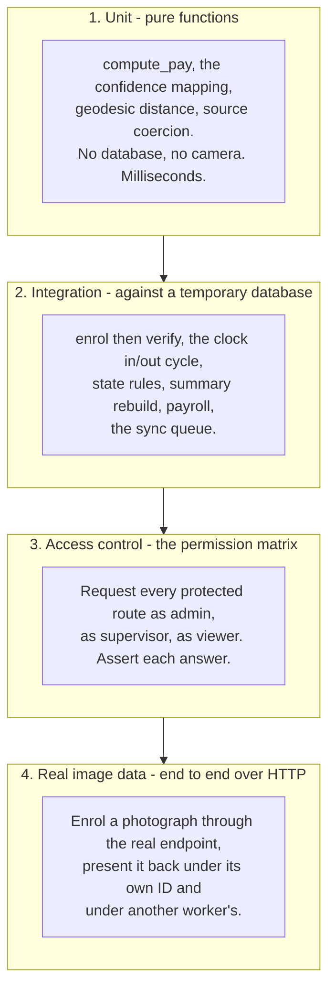
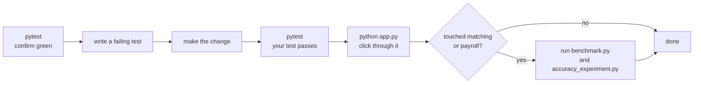

# 09 — Testing and Tools

← [08 — Making Your First Change](08-making-your-first-change.md) · [Wiki index](README.md) · Next: [10 — Glossary](10-glossary.md)

---

## Running the suite

```bash
pip install -r requirements-dev.txt
pytest
```

63 tests, about 15 seconds, seven modules.

```
tests/test_attendance.py        ...........       [ 17%]
tests/test_cctv_and_sync.py     .........         [ 31%]
tests/test_face_engine.py       .........         [ 46%]
tests/test_payroll.py           .......           [ 57%]
tests/test_real_face.py         ....              [ 63%]
tests/test_security_and_api.py  .................  [ 93%]
tests/test_workers.py           ....              [100%]

63 passed in 13.34s
```

Useful invocations:

```bash
pytest tests/test_payroll.py                    # one module
pytest -k geofence                              # anything matching a name
pytest -x                                       # stop at the first failure
pytest -v                                       # list every test name
pytest --tb=short                               # shorter tracebacks
```

## How the suite avoids touching your data

`tests/conftest.py` sets the database URI to a **temporary file** *before* `app`
is imported:

```python
_DB_FD, _DB_PATH = tempfile.mkstemp(suffix=".db", prefix="fms-test-")
os.environ["FMS_DATABASE_URI"] = f"sqlite:///{_DB_PATH}"
os.environ["FMS_SECRET_KEY"] = "test-secret-key"

import app as app_module
```

The import order is the whole trick. `create_app()` reads `FMS_DATABASE_URI` at
import time, so setting it first is what redirects the whole application at a
throwaway database. **The suite can never touch `fms.db`.**

Then each test gets a clean slate:

```python
def _reset_database():
    db.drop_all()
    db.create_all()
    app_module._seed_defaults()
    face_engine.invalidate()
```

Note `face_engine.invalidate()` — without it, the trained recognizer cached from
a previous test would survive into the next one and produce results that make no
sense.

### The fixtures

| Fixture | Gives you |
| --- | --- |
| `app_context` | A clean database inside a Flask application context |
| `client` | A Flask test client for making HTTP requests |
| `setting` | A helper for setting a configuration value |

```python
def test_a_viewer_cannot_add_a_worker(client):
    # signs in as a viewer, posts to /workers/add, asserts it is refused
```

## The four levels of testing



**Level 3 is what turns the permission matrix from a statement of intent into a
verified property.** Nineteen tests request protected routes as each role and
assert the outcome.

**Level 4 is the one that tests the actual claim of the project.** It enrols a
real photograph through the running HTTP endpoint, then presents it back twice:
under its own worker code it is accepted at 71.79% confidence; under a different
enrolled worker's code it is refused with `face_matched_another_worker`. That is
the buddy-punching case, tested end to end.

Those four tests need `scikit-image` for the sample photograph and **skip
automatically** without it, so the suite still passes on a machine that lacks it —
it just proves less. `requirements-dev.txt` installs it.

## Two defects the suite actually caught

Worth knowing, because they show what the tests are for.

**Overtime could exceed total hours.** A boundary test drove `compute_pay()`
with an unusual combination of hours and standard-day setting and produced a
payslip where overtime hours were greater than hours worked — arithmetically
impossible. No manual click-through had used that combination. The fix clamps
overtime to the hours available:

```python
overtime_hours = round(min(max(0.0, float(overtime_hours or 0.0)), total_hours), 2)
```

**A test asserted the wrong scenario.** A test presented a face while claiming a
second worker who had not been enrolled, expecting `face_matched_another_worker`,
and got `worker_not_enrolled`. The *system* was right — the claimed worker
genuinely had no template, and that is the correct reason to refuse. The *test*
was wrong, and the scenario it meant to check was the important one. It now
enrols the second worker first, so it exercises the refusal that actually
matters.

## What to write when you add a feature

Follow the shape of the module you are touching:

| You changed | Write a test that |
| --- | --- |
| A pure calculation | Drives it at the boundaries: zero, exactly the limit, over the limit, negative |
| Something touching the database | Creates rows, runs it, asserts what came back |
| A route | Requests it as each role and asserts each outcome |
| A refusal path | Constructs the failing condition and asserts the **reason code**, not just that it failed |

That last row matters. Asserting "it failed" passes even when it fails for
completely the wrong reason.

---

## The scripts in `tools/`

Four scripts. None is part of the running application.

### `tools/seed_demo.py`

```bash
python tools/seed_demo.py
```

Eight fictional workers, two weeks of attendance, daily summaries and payroll.
Worker PINs are `1000`, `1001`, `1002`… For demonstrations and screenshots.

**Everything it creates is fictional** — invented names, masked phone numbers
(`+260 97X XXX 001`), district-only addresses, no NRC numbers. That is
deliberate: demo data ends up in screenshots, and screenshots end up in reports.
Keep it that way if you extend it.

**Do not run it against a live database.**

### `tools/benchmark.py`

```bash
python tools/benchmark.py
```

Times every operation and every page over repeated trials and writes
`docs/benchmark_results.json` with mean, median, min, max and standard
deviation. Reporting the dispersion is the point — a single favourable run
should not be mistaken for typical behaviour.

Representative results on a two-core machine:

| Operation | Mean |
| --- | --- |
| Single face match | 3.32 ms |
| Face detection over one frame | 2.13 ms |
| **Complete verification over 8 frames** | **296 ms** |
| Recognizer training, all templates | 57.9 ms |
| Rebuild 14 days of summaries | 269 ms |
| Weekly payroll, all workers | 145 ms |
| Slowest page render (dashboard) | 9 ms median |

Use it as a regression check: if a change makes verification take 900 ms, this
is what tells you.

### `tools/accuracy_experiment.py`

```bash
python tools/accuracy_experiment.py
```

The face verification experiment. Enrols a subject, submits genuine samples
transformed to simulate ten capture conditions, submits impostor attempts under
the subject's claimed ID, sweeps the threshold, and writes
`docs/accuracy_results.json` with the false rejection and false acceptance rates
at every step.

**This is where the default threshold of 35 comes from.** If you change anything
in the matching path, re-run it — it is the only thing that can tell you whether
you made accuracy better or worse.

### `tools/export_schema.py`

```bash
python tools/export_schema.py
```

Regenerates `Workers.sql` from `models.py`. `models.py` is the source of truth;
the SQL file is a convenience for browsing the schema in a SQL client. Run it
after a schema change so the two do not drift.

---

## A sensible workflow



---

Next: [10 — Glossary](10-glossary.md)
