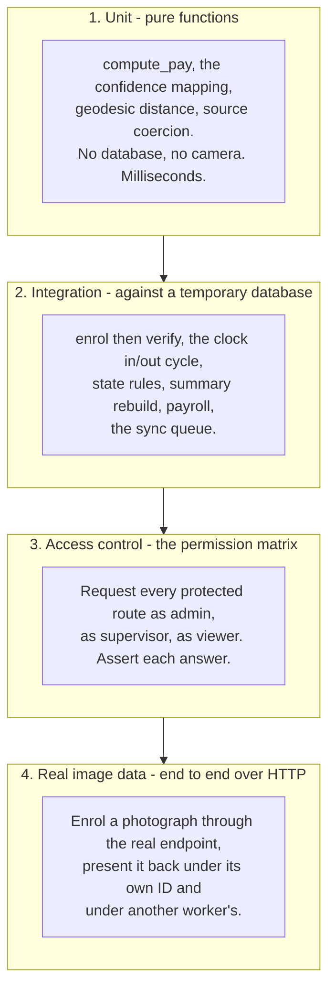
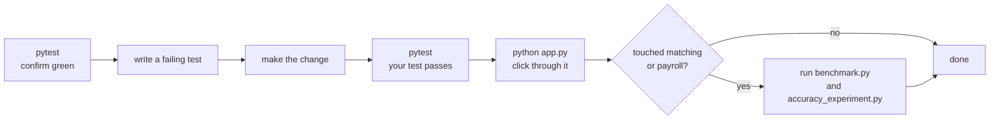

# 09 — Testing and Tools

← [08 — Making Your First Change](08-making-your-first-change.md) · [Wiki index](README.md) · Next: [10 — Glossary](10-glossary.md)

---

## Running the suite

```bash
pip install -r requirements-dev.txt
pytest
```

206 tests, about a minute, eleven modules.

```
tests/test_attendance.py        11 tests
tests/test_cards.py             54 tests
tests/test_cctv_and_sync.py      9 tests
tests/test_face_engine.py        9 tests
tests/test_pay_periods.py       21 tests
tests/test_payroll.py            7 tests
tests/test_portal.py            34 tests
tests/test_real_face.py          4 tests
tests/test_reports.py           27 tests
tests/test_security_and_api.py  19 tests
tests/test_workers.py           11 tests

206 passed
```

Useful invocations:

```bash
pytest tests/test_payroll.py                    # one module
pytest -k geofence                              # anything matching a name
pytest -x                                       # stop at the first failure
pytest -v                                       # list every test name
pytest --tb=short                               # shorter tracebacks
```

## How the suite avoids touching your data

`tests/conftest.py` sets the database URI to a **temporary file** *before* `app`
is imported:

```python
_DB_FD, _DB_PATH = tempfile.mkstemp(suffix=".db", prefix="fms-test-")
os.environ["FMS_DATABASE_URI"] = f"sqlite:///{_DB_PATH}"
os.environ["FMS_SECRET_KEY"] = "test-secret-key"

import app as app_module
```

`conftest.py` redirects the **captures directory** the same way, for the same
reason. Identity cards read a worker's enrolment photograph off disk, and the
fallback that recovers one from its filename would otherwise pick up whatever is
in the developer's own `captures/faces/` — which makes a card test pass or fail
depending on who is running it and what they last demonstrated. It cost a
confusing failure before it was fixed.

The import order is the whole trick. `create_app()` reads `FMS_DATABASE_URI` at
import time, so setting it first is what redirects the whole application at a
throwaway database. **The suite can never touch `fms.db`.**

Then each test gets a clean slate:

```python
def _reset_database():
    db.drop_all()
    db.create_all()
    app_module._seed_defaults()
    face_engine.invalidate()
```

Note `face_engine.invalidate()` — without it, the trained recognizer cached from
a previous test would survive into the next one and produce results that make no
sense.

### The fixtures

| Fixture | Gives you |
| --- | --- |
| `app_context` | A clean database inside a Flask application context |
| `client` | A Flask test client for making HTTP requests |
| `setting` | A helper for setting a configuration value |

```python
def test_a_viewer_cannot_add_a_worker(client):
    # signs in as a viewer, posts to /workers/add, asserts it is refused
```

## The four levels of testing



**Reading this diagram:** four boxes stacked from cheapest and narrowest at the
top to slowest and broadest at the bottom. Level 1 tests one function with no
database and no camera. Level 4 drives the whole system over real HTTP with a
real photograph.

> **Analogy: checking a car.** Level 1 is testing the brake pads on a bench.
> Level 2 is testing the brakes fitted to the car, on a ramp. Level 3 is checking
> that the doors lock for the people who should be locked out. Level 4 is driving
> it round the block. You want all four, and the cheap ones catch most faults.

**Level 3 is what turns the permission matrix from a statement of intent into a
verified property.** Nineteen tests request protected routes as each role and
assert the outcome.

**Level 4 is the one that tests the actual claim of the project.** It enrols a
real photograph through the running HTTP endpoint, then presents it back twice:
under its own worker code it is accepted at 71.79% confidence; under a different
enrolled worker's code it is refused with `face_matched_another_worker`. That is
the buddy-punching case, tested end to end.

Those four tests need `scikit-image` for the sample photograph and **skip
automatically** without it, so the suite still passes on a machine that lacks it —
it just proves less. `requirements-dev.txt` installs it.

## Where the newer suites sit

`test_cards.py` and `test_reports.py` were written alongside the features they
cover, and both are worth reading as examples.

`test_cards.py` (54) covers all three barcode sources, the rendering of both
symbologies, the scan-normalisation cases a real scanner produces, the refusals
`resolve()` distinguishes, the HTTP routes behind issuing, voiding and printing,
and the card photograph &mdash; including both fallbacks, and the check that one
worker's enrolment files are never offered on another's card. A group of tests
covers the two print layouts: that fold is the default, that an unrecognised
layout falls back to it, that every back names its owner, and that the duplex
rows reverse and pad so a flipped sheet still lines up.

A further group covers the **clock-in verification modes**. Every combination
round-trips — choose a mode, read it back, get the same mode — because a settings
page that showed a farm one thing while the terminal did another would be the
worst possible failure for a screen whose whole job is answering *what does this
check?* The rest of that group asserts that a weak mode really does drop the
check it says it drops, that a mangled or missing mode field is a no-op rather
than a silent downgrade, that any mode without the face check is marked weak, and
that a change of mode is named in the audit log while an unchanged save is not. Two of its route tests monkeypatch `app_module.record_punch`, because
the real route opens a camera and a test machine has none — the fixture is called
`punches` and it is the pattern to copy if you add another.

`test_reports.py` (27) drives every function in `reports_engine.py` against
constructed summaries, including the systemic-lateness check: it builds a
workforce where everybody is fifteen minutes late and asserts that the page
blames the shift-start setting rather than the workers.

## What `test_workers.py` now also covers

Beyond worker IDs and PIN uniqueness, it pins the reporting that answers *which
database is open*. Students reported that restarting the project "created a new
database"; it does not, but running it two ways opens two different files and
nothing said so. The tests assert that the path is absolute (a relative
`sqlite:///` would give a different database per working directory), that both
locations are declared and distinct, that the startup description always names
the file, that a new database says `NEW AND EMPTY`, and that it points at the
other location when a database exists there. One more asserts the demo seeder can
tell its own eight fictional workers from somebody's real data, which is what
decides whether `--force` asks before deleting.

## Two defects the suite actually caught

Worth knowing, because they show what the tests are for.

**Overtime could exceed total hours.** A boundary test drove `compute_pay()`
with an unusual combination of hours and standard-day setting and produced a
payslip where overtime hours were greater than hours worked — arithmetically
impossible. No manual click-through had used that combination. The fix clamps
overtime to the hours available:

```python
overtime_hours = round(min(max(0.0, float(overtime_hours or 0.0)), total_hours), 2)
```

**A card test depended on the developer's own demo data.** A test asserting that
an unenrolled worker gets a placeholder rather than a photograph passed on a
clean checkout and failed on a machine where the demo seeder had been run —
because the filename fallback found `enroll_0001_01.jpg` sitting in the real
captures directory and the test worker happened to be `0001`. The test was right;
the fixtures were not isolating the filesystem. `conftest.py` now redirects the
captures directory as well as the database.

**An unknown barcode source failed silently.** A card test asked what happens
when `barcode_source` holds a typo. The answer was `None` — the same answer
`card_value()` gives for "this worker has no NRC", because the source was
validated *after* the NRC was read. An operator would have gone looking for a
data problem that did not exist. The validation moved to the top of the function
and now raises.

**A test asserted the wrong scenario.** A test presented a face while claiming a
second worker who had not been enrolled, expecting `face_matched_another_worker`,
and got `worker_not_enrolled`. The *system* was right — the claimed worker
genuinely had no template, and that is the correct reason to refuse. The *test*
was wrong, and the scenario it meant to check was the important one. It now
enrols the second worker first, so it exercises the refusal that actually
matters.

## What to write when you add a feature

Follow the shape of the module you are touching:

| You changed | Write a test that |
| --- | --- |
| A pure calculation | Drives it at the boundaries: zero, exactly the limit, over the limit, negative |
| Something touching the database | Creates rows, runs it, asserts what came back |
| A route | Requests it as each role and asserts each outcome |
| A refusal path | Constructs the failing condition and asserts the **reason code**, not just that it failed |

That last row matters. Asserting "it failed" passes even when it fails for
completely the wrong reason.

---

## The scripts in `tools/`


Six scripts. None is part of the running application.

### `tools/seed_demo.py`

```bash
python tools/seed_demo.py
```

Eight fictional workers, two weeks of attendance, daily summaries and payroll.
Worker PINs are `1000`, `1001`, `1002`… For demonstrations and screenshots.

**`--force` deletes everything first.** It removes every worker and everything
hanging off them, which is fine on a demonstration database and a disaster on a
fortnight of real attendance — and the two look identical from the command line.
It therefore prints what it is about to delete and, when the workers are not the
eight fictional ones it creates, requires the operator to type `DELETE`. With no
terminal attached it refuses outright rather than guessing, since nobody is there
to agree. `--yes` skips the prompt, and is for scripts rather than habit.

**Everything it creates is fictional** — invented names, masked phone numbers
(`+260 97X XXX 001`), district-only addresses, no NRC numbers. That is
deliberate: demo data ends up in screenshots, and screenshots end up in reports.
Keep it that way if you extend it.

**Do not run it against a live database.**

### `tools/db_info.py`

```bash
python tools/db_info.py
```

Lists every FMS database in the project — size, last change, row counts, first
few workers — without starting the server.

It exists because of a specific, repeated confusion. The project can be run two
ways and each uses its own file: `fms.db` for `python app.py`, `data/fms.db`
under Docker. Enter data one way, start it the other way, and the system is
empty — and the reasonable conclusion is that the software threw the work away.
It did not; it opened the other file.

Two changes address that. `app.describe_database()` prints the path and the row
counts at every startup, and says so explicitly when the file is new, naming the
other location if a database exists there. This script answers the same question
on demand, read-only (`mode=ro`), so it is safe to run against a database a
server is holding open.

### `tools/benchmark.py`

```bash
python tools/benchmark.py
```

Times every operation and every page over repeated trials and writes
`docs/benchmark_results.json` with mean, median, min, max and standard
deviation. Reporting the dispersion is the point — a single favourable run
should not be mistaken for typical behaviour.

Representative results on a two-core machine:

| Operation | Mean |
| --- | --- |
| Single face match | 3.32 ms |
| Face detection over one frame | 2.13 ms |
| **Complete verification over 8 frames** | **296 ms** |
| Recognizer training, all templates | 57.9 ms |
| Rebuild 14 days of summaries | 269 ms |
| Weekly payroll, all workers | 145 ms |
| Slowest page render (dashboard) | 9 ms median |

Use it as a regression check: if a change makes verification take 900 ms, this
is what tells you.

### `tools/accuracy_experiment.py`

```bash
python tools/accuracy_experiment.py
```

The face verification experiment. Enrols a subject, submits genuine samples
transformed to simulate ten capture conditions, submits impostor attempts under
the subject's claimed ID, sweeps the threshold, and writes
`docs/accuracy_results.json` with the false rejection and false acceptance rates
at every step.

**This is where the default threshold of 35 comes from.** If you change anything
in the matching path, re-run it — it is the only thing that can tell you whether
you made accuracy better or worse.

### `tools/report_figures.py`

```bash
python tools/report_figures.py
```

Regenerates every figure the project report uses, into `docs/figures/`.
Structural diagrams are drawn with Graphviz, charts with matplotlib, one palette
throughout so the report's diagrams and its screenshots read as one piece of
work. Like `seed_demo.py`, anything it shows about people is fictional by
construction — see the note above about screenshots ending up in reports.

### `tools/export_schema.py`

```bash
python tools/export_schema.py
```

Regenerates `Workers.sql` from `models.py`. `models.py` is the source of truth;
the SQL file is a convenience for browsing the schema in a SQL client. Run it
after a schema change so the two do not drift.

---

## A sensible workflow

**Reading the diagram below:** it is the loop to follow for any change. Confirm
the tests pass *before* you touch anything — otherwise you will not know what you
broke. Write a test that fails for the right reason, make it pass, then click
through the real app, because a passing test is not the same as a working page.
The branch at the end only matters if you touched face matching or payroll, in
which case re-measure rather than assume.



---

Next: [10 — Glossary](10-glossary.md)
