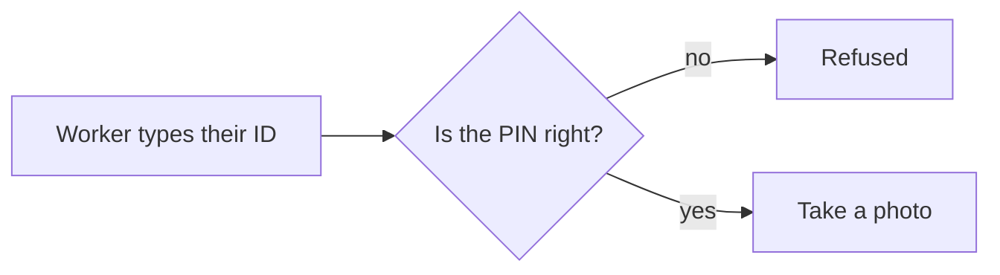
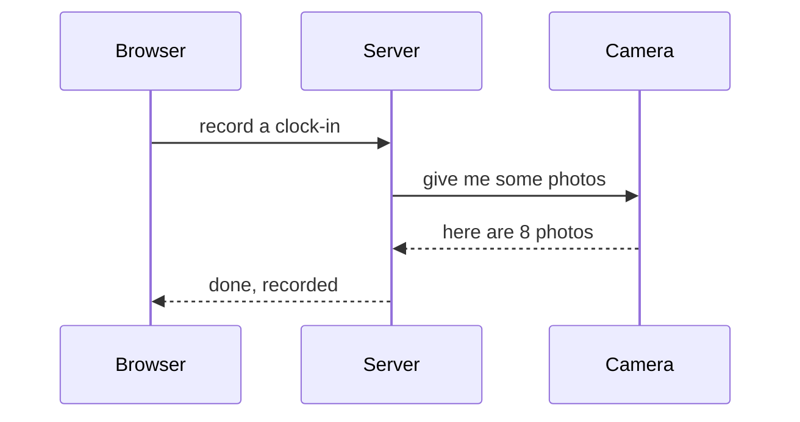
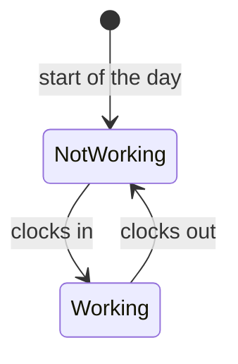
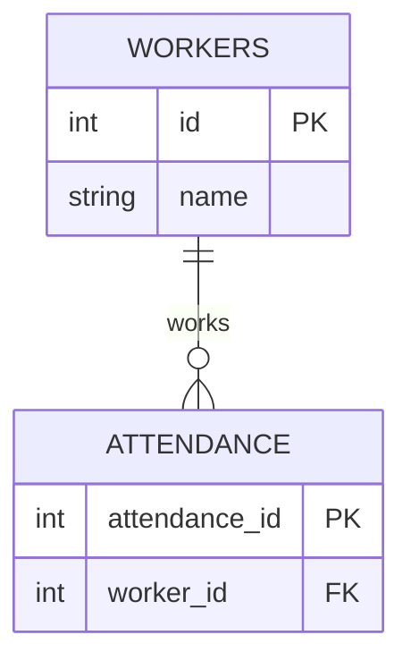

# The FMS Developer Wiki

Everything you need to understand this codebase, written for someone who knows
how software works in general but has never seen this project before.

**Never seen the project? Start at [01 — Start Here](01-start-here.md) and read
the numbered pages in order.** They are written as one continuous explanation,
about ninety minutes end to end. The module pages are reference material — go to
them when you need to change something specific.

---

## The guided tour

Read these in order. Each one assumes the ones before it.

| # | Page | What you will understand afterwards |
| --- | --- | --- |
| 01 | [Start Here](01-start-here.md) | What the system is for, the one idea the whole design turns on, and how to get it running |
| 02 | [The Big Picture](02-the-big-picture.md) | The four layers, the eight service modules, and what talks to what |
| 03 | [Follow a Clock-In](03-follow-a-clock-in.md) | Every step of the most important transaction, from button press to database row |
| 04 | [The Database](04-the-database.md) | All sixteen tables, how they relate, and how the schema upgrades itself |
| 05 | [Face Recognition Explained](05-face-recognition-explained.md) | How LBPH actually works, with no computer-vision background assumed |
| 06 | [Security and Roles](06-security-and-roles.md) | Who can do what, how it is enforced, and where the audit trail comes from |
| 07 | [Design Decisions](07-design-decisions.md) | Why the odd-looking parts are the way they are |
| 08 | [Making Your First Change](08-making-your-first-change.md) | Six worked recipes: add a field, a page, an endpoint, a setting, a refusal reason, a report |
| 09 | [Testing and Tools](09-testing-and-tools.md) | The 63 tests, what they cover, and the scripts in `tools/` |
| 10 | [Glossary](10-glossary.md) | Every term and abbreviation this project uses |

## Module reference

One page per source file. See [modules/README.md](modules/README.md) for the index.

| Module | One line |
| --- | --- |
| [app.py](modules/app.md) | The application factory and all 49 web routes |
| [models.py](modules/models.md) | The sixteen tables, defined once |
| [face_engine.py](modules/face_engine.md) | Enrolment, matching, and the refusal reasons |
| [attendance_service.py](modules/attendance_service.md) | The clock-in/clock-out transaction |
| [cctv_engine.py](modules/cctv_engine.md) | Cameras, streaming, clips, health checks |
| [payroll_engine.py](modules/payroll_engine.md) | Daily summaries and pay computation |
| [geofence.py](modules/geofence.md) | Distance from the farm |
| [security.py](modules/security.md) | Roles and permissions |
| [sync_engine.py](modules/sync_engine.md) | Cloud upload with an offline queue |
| [exports.py](modules/exports.md) | CSV generation |
| [api.py](modules/api.md) | The JSON API |
| [Front end](modules/frontend.md) | Templates, CSS and JavaScript |
| [Support modules](modules/support-modules.md) | `database.py`, `paths.py`, `migrations.py` |

## Other documentation

This wiki explains **the code**. These cover other things:

- [../README.md](../README.md) — project overview and feature summary
- [../INSTALL.md](../INSTALL.md) — installing on Windows, Linux, macOS, Docker
- [../manual.md](../manual.md) — the operator manual, for the people using the system
- [../FMS_PROJECT_OVERVIEW.md](../FMS_PROJECT_OVERVIEW.md) — the original technical overview

---

---

## How to read the diagrams

Every diagram in this wiki is followed by a plain-English explanation of what it
shows, so you never have to decode one on your own. But it helps to know that
there are only **four kinds** of diagram here, and what each is for.

### 1. Flowchart — "what happens next?"

Boxes are steps, arrows are the order they happen in, diamonds are decisions.

**Read it as:** the worker types their ID, then we ask whether the PIN is right.
If no, refused. If yes, take a photo. *Think of it as a flowchart on a whiteboard.*

### 2. Sequence diagram — "who talks to whom, and in what order?"

Each vertical line is one part of the system. Time runs **downwards**. Each
horizontal arrow is one part asking another to do something. A dotted arrow
coming back is the answer.

**Read it as:** the browser asks the server to record a clock-in; the server asks
the camera for photos; the camera hands back eight; the server tells the browser
it is done. *Think of it as a transcript of a conversation, read top to bottom.*

### 3. State diagram — "what state is something in, and how does it change?"

Each box is a state something can be in. Arrows are the events that move it from
one state to another. If there is no arrow between two boxes, that change is
**impossible** — which is usually the interesting part.

**Read it as:** a worker starts the day not working; clocking in moves them to
working; clocking out moves them back. *Think of it as a light switch: on, off,
and the flicks that change it.*

### 4. Entity relationship diagram (ERD) — "how do the database tables connect?"

Each box is a database table and the fields inside it. The lines show which
tables refer to which. The little symbols on the ends mean **how many**:

| Symbol on the line | Means |
| --- | --- |
| `||` | exactly one |
| `o{` | zero or more |
| `o|` | zero or one |

So `WORKERS ||--o{ ATTENDANCE` reads: **one** worker has **zero or more**
attendance records.

**Read it as:** one worker works zero or more sessions. `PK` means **primary
key** — the column that uniquely identifies a row, like a page number. `FK` means
**foreign key** — a column holding another table's key, which is how the two
tables are joined.

*Think of it as a family tree for your data: who is connected to whom, and how
many of each.*

---

## Where diagrams render

Diagrams are written as [Mermaid](https://mermaid.js.org/) code blocks — the
diagram is stored as **text**, and the viewer draws the picture. They render
automatically on GitHub, GitLab, in VS Code's Markdown preview
(`Ctrl+Shift+V`), and in Obsidian. In a plain text editor you will see the
diagram source instead, which is still readable — it is just a list of boxes and
arrows.

## A note on the screenshots

Every screenshot in this wiki was taken from the running system using the
**demonstration dataset** created by `tools/seed_demo.py`. Every worker name,
worker code, wage figure and photograph in them is **invented for the
demonstration**. No real person's name, photograph, telephone number or national
registration number appears anywhere in this wiki. The face thumbnails visible in
the attendance screenshots are deliberately obscured.
