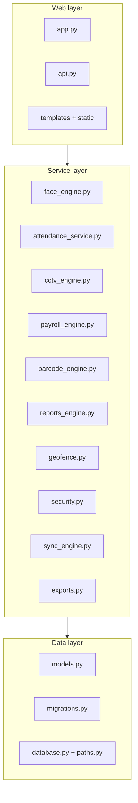

# Module Reference

← [Wiki index](../README.md)

---

Reference material: one page per source module. If you are new, read the
[guided tour](../README.md#the-guided-tour) first — these pages assume you know
the shape of the system.

## The layers, and which page covers what

**Reading this diagram:** the same three layers as the rest of the wiki, with the
actual filenames in them. Arrows point downwards only — the web layer asks the
service layer for things, the service layer asks the data layer. Nothing reaches
back up.

## Pages

| Page | Module | Lines | What it is |
| --- | --- | --- | --- |
| [app.md](app.md) | `app.py` | ~1900 | Application factory, 54 routes, seeding, helpers |
| [models.md](models.md) | `models.py` | ~520 | The sixteen tables |
| [face_engine.md](face_engine.md) | `face_engine.py` | ~400 | Detection, enrolment, matching |
| [attendance_service.md](attendance_service.md) | `attendance_service.py` | ~270 | The clock-in transaction |
| [cctv_engine.md](cctv_engine.md) | `cctv_engine.py` | ~470 | Cameras, streaming, clips, health |
| [payroll_engine.md](payroll_engine.md) | `payroll_engine.py` | ~330 | Summaries and pay |
| [barcode_engine.md](barcode_engine.md) | `barcode_engine.py` | ~270 | Card values, rendering, scan lookup |
| [reports_engine.md](reports_engine.md) | `reports_engine.py` | ~800 | The figures behind Analytics and My record |
| [geofence.md](geofence.md) | `geofence.py` | ~80 | Distance from the farm |
| [security.md](security.md) | `security.py` | ~115 | Roles and permissions |
| [sync_engine.md](sync_engine.md) | `sync_engine.py` | ~195 | Cloud upload and the offline queue |
| [exports.md](exports.md) | `exports.py` | ~175 | CSV generation |
| [api.md](api.md) | `api.py` | ~390 | The 15 JSON endpoints |
| [portal.md](portal.md) | `portal.py` | ~530 | The worker self-service portal at `/me` |
| [frontend.md](frontend.md) | `templates/`, `static/` | — | HTML, CSS, JavaScript |
| [support-modules.md](support-modules.md) | `database.py`, `paths.py`, `migrations.py` | ~100 | The small ones |

## Reading order, if you are looking for something specific

- **"How does a clock-in work?"** → [attendance_service](attendance_service.md), then [face_engine](face_engine.md)
- **"How is pay calculated?"** → [payroll_engine](payroll_engine.md)
- **"Where is this URL handled?"** → [app.md](app.md), the route tables
- **"What can a supervisor do?"** → [security](security.md)
- **"How do I store a new field?"** → [models](models.md), then [support-modules](support-modules.md) for migrations
- **"Why is the camera behaving oddly?"** → [cctv_engine](cctv_engine.md)
- **"What is printed on a worker's card?"** → [barcode_engine](barcode_engine.md)
- **"Where does that number on the Analytics page come from?"** → [reports_engine](reports_engine.md)
