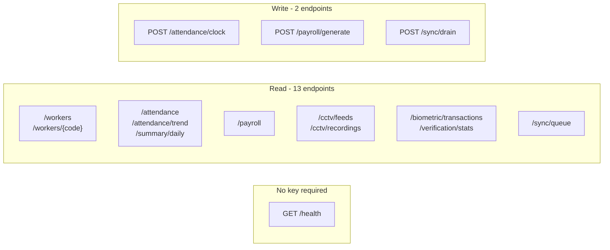

# `api.py`

← [Module index](README.md) · [Wiki index](../README.md)

**~390 lines. Fifteen JSON endpoints under `/api/v1`.**

---

## Why it exists

The proposal for this project listed backend API development as a work item, and
the first release had none — every operation was reachable only through a
rendered page. That meant nothing a mobile client could talk to, and nothing that
could be exercised with Postman.

## The version prefix

```python
api = Blueprint("api", __name__, url_prefix="/api/v1")
```

Versioned from the very first endpoint. A client shipped to a farm cannot be
updated in step with the server, so **`/api/v1` must keep working when `/api/v2`
arrives.** Adding the prefix later, once clients exist, is not possible.

## Authentication

```python
def api_key_required(f):
    @wraps(f)
    def decorated(*args, **kwargs):
        if session.get("admin_logged_in"):
            return f(*args, **kwargs)
        expected = _setting("api_key")
        supplied = request.headers.get("X-API-Key", "")
        if expected and supplied and supplied == expected:
            return f(*args, **kwargs)
        return jsonify({"ok": False, "error": "unauthorised",
                        "detail": "Send X-API-Key or use a signed-in session."}), 401
    return decorated
```

Two accepted paths:

- **A signed-in browser session** — lets the dashboard's own pages call these
  endpoints without embedding a key in the HTML.
- **An `X-API-Key` header** — for Postman and any future mobile client.

Note `if expected and supplied`. Without it, an unconfigured system where no key
has been generated would accept a request with no header at all — an empty string
matching an empty string.

Generate and regenerate the key in **Settings → API Access**.

## The endpoints



**Reading this diagram:** three groups. One endpoint needs no key at all, because
the container's own health check calls it. Thirteen only read data. Three change
something, and two of those go through exactly the same code as the web pages.

| Method | Path | Returns | Parameters |
| --- | --- | --- | --- |
| GET | `/health` | Service, engine and enrolment state | — *(open)* |
| GET | `/verification/stats` | Attempts, acceptance rate, refusal reasons | — |
| GET | `/workers` | The register with enrolment state | — |
| GET | `/workers/<worker_code>` | One worker with a summary | — |
| GET | `/attendance` | Sessions | `worker`, `from`, `to`, `limit` |
| POST | `/attendance/clock` | Records a punch | `worker_code`, `pin`, `type`, `lat`, `lon` |
| GET | `/summary/daily` | Daily summaries | `date` |
| GET | `/attendance/trend` | Trend series | `days` |
| GET | `/payroll` | Payroll rows | `week_start` |
| POST | `/payroll/generate` | Generates a week | `week_start` |
| GET | `/cctv/feeds` | Feeds and health | — |
| GET | `/cctv/recordings` | Clips | `feed`, `limit` |
| GET | `/biometric/transactions` | Verification attempts | `worker`, `outcome`, `limit` |
| GET | `/sync/queue` | Pending uploads | — |
| POST | `/sync/drain` | Retries the queue | — |

## `/health` is deliberately open

It takes no key because the **container health check** calls it — `docker ps`
reports the container unhealthy when this endpoint stops answering.

It is also the fastest way to check an install:

```bash
curl http://localhost:8010/api/v1/health
```

```json
{
  "ok": true,
  "service": "fms",
  "face_engine": {
    "algorithm": "LBPH",
    "contrib_available": true,
    "cascades_loaded": true,
    "face_size": "200x200"
  },
  "cameras": 1,
  "workers": 8,
  "open_sessions": 0
}
```

**`contrib_available: false` or `cascades_loaded: false` means the OpenCV install
is wrong** — see [INSTALL.md](../../INSTALL.md#two-dependency-traps-worth-knowing-about).

## `POST /attendance/clock` — the important one

It calls **the same `record_punch()`** as the browser path. Same verification,
same geofence check, same snapshot, same audit behaviour.

This is not a convenience — it is the point of consolidating the transaction into
one service function. A second implementation would drift, and the drift would be
a security hole: an API path that skipped the face match.

```bash
curl -X POST http://localhost:8010/api/v1/attendance/clock \
     -H "X-API-Key: $KEY" -H "Content-Type: application/json" \
     -d '{"worker_code":"0001","pin":"1000","type":"in"}'
```

## House conventions

Follow these when you add an endpoint:

| Convention | |
| --- | --- |
| `@api_key_required` | On everything except `/health` |
| `{"ok": true, ...}` / `{"ok": false, "error": ...}` | Consistent envelope |
| ISO date strings | Never a Python `date` object |
| `_parse_date()` for query dates | Never raises on bad input |
| `limit` on list endpoints | Nothing returns an unbounded result set |
| `_worker_json()` for worker shapes | One definition of what is safe to expose |

**Never expose a PIN hash, a password hash or a face template.** `_worker_json()`
is the allow-list; extend it deliberately, if at all.

## Gotchas

- **Route registration is `@api.get` / `@api.post`**, not `@app.route` — this is
  a blueprint.
- **The prefix is automatic.** Write `@api.get("/workers")`, not
  `"/api/v1/workers"`.
- **One shared key, full read access.** No scopes, no per-client keys.
  Regenerating invalidates the old one.
- **`identify()` exists but is not on the attendance path.** Do not wire it in —
  see [07 — Design Decisions](../07-design-decisions.md#1-verification-not-identification).

## Where to look next

- [attendance_service.md](attendance_service.md) — what `/attendance/clock` calls
- `tests/test_security_and_api.py` — the endpoint tests
- [08 — Making Your First Change](../08-making-your-first-change.md#recipe-4--add-an-api-endpoint)
