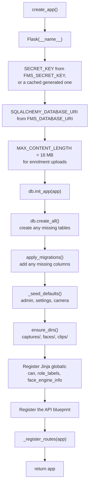
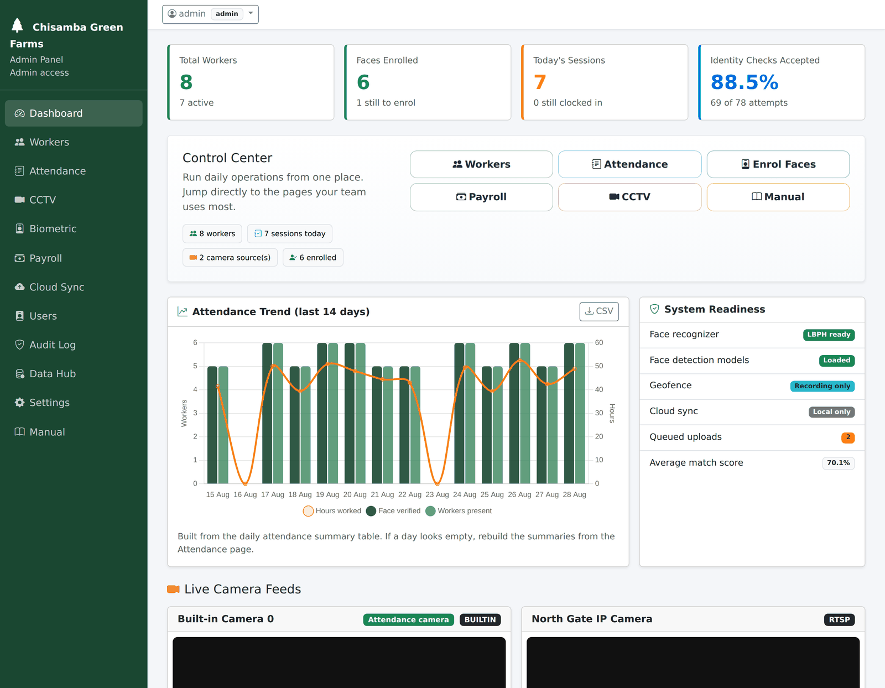

# `app.py`

← [Module index](README.md) · [Wiki index](../README.md)

**~1600 lines. The biggest file in the project, and the one you will open most.**

---

## What is in it

Four things, in this order:

1. **The application factory** — `create_app()`
2. **Seeding** — `_seed_defaults()`, `_ensure_default_cctv_entries()`
3. **Helpers** — settings, audit, worker IDs, date parsing, streaming
4. **`_register_routes(app)`** — all 54 routes, in one very long function

> **Yes, it is too long.** All 54 routes in one function is the main piece of
> technical debt in the project. Splitting into Flask blueprints — one per area —
> would be a clean improvement and nothing depends on the current shape. It is
> listed under "not deliberate" in
> [07 — Design Decisions](../07-design-decisions.md#things-that-are-not-deliberate).

## `create_app()` — the start-up sequence



**Reading this diagram:** the start-up sequence, top to bottom, run once when the
program launches. Read it as a checklist: read the settings, connect the
database, create anything missing, upgrade anything out of date, put the default
data in place, make the folders, then wire up the pages. Only after all of that
does the app start answering requests.

The module ends with `app = create_app()`, so importing `app` gives you a fully
built application — which is what `conftest.py` and the WSGI entry point both
rely on.

### `_resolve_secret_key()`

`FMS_SECRET_KEY` if set; otherwise a generated key cached in `.secret_key`
(mode `0600`, gitignored). Without a stable key every restart signs everyone out,
which is why [INSTALL.md](../../INSTALL.md) makes setting it a step.

## Seeding

`_seed_defaults()` runs on every start-up and is idempotent:

- Creates the `admin` / `admin` account if no users exist, with
  `must_change_password = True`.
- Inserts any missing row from `DEFAULT_SETTINGS`.
- Ensures a baseline camera feed exists.
- **Promotes an account if there is no active administrator** — the lockout
  protection described in [04 — The Database](../04-the-database.md#two-protections-that-stop-an-upgrade-locking-you-out).

## The helpers worth knowing

| Helper | What it does |
| --- | --- |
| `_get_setting(key, default)` | Read one settings row |
| `_save_settings(values)` | Write a batch, creating rows that do not exist |
| `_log_audit(action, details)` | **Call this from every state-changing route** |
| `_generate_password(length=8)` | Temporary passwords for new accounts |
| `_generate_worker_id()` | Next free four-digit code, skipping taken ones |
| `_pin_fingerprint(pin)` / `_is_pin_unique(...)` | PIN uniqueness |
| `_parse_date(raw, fallback)` | Query-string dates, never raises |
| `_float_or_none(raw)` | Numeric form fields, never raises |
| `_build_attendance_sessions(rows)` | Shapes attendance rows for the table view |
| `_stream_response(source, overlay)` | Wraps a frame generator as an MJPEG response |

`_parse_date` and `_float_or_none` never raise on bad input, because the input is
a query string a user can type anything into. Returning a fallback is the right
behaviour; a 500 error is not.

## The routes

### Authentication and account

| Route | Method | Notes |
| --- | --- | --- |
| `/` | GET, POST | **Two jobs**: admin sign-in *and* worker punch, on a `mode` field |
| `/logout` | GET | |
| `/profile/password-change` | GET | The forced-change page |
| `/profile/change-password` | POST | |

### Main pages

| Route | Permission | Shows |
| --- | --- | --- |
| `/dashboard` | view | Counts, verification rate, trend chart |
| `/analytics` | view | The four questions of [reports_engine](reports_engine.md), over 14/28/56/90 days |
| `/workers` | view / worker.manage | The register |
| `/attendance` | view | Sessions with snapshots, scores, distances |
| `/payroll` | view / payroll.manage | Payroll rows |
| `/cctv` | view / cctv.manage | Feeds, live view, clips |
| `/biometric` | view / biometric.manage | Enrolment centre |
| `/cloud-sync` | view / sync.manage | Queue state |
| `/audit-log` | view | The audit trail |
| `/users` | **user.manage** | Accounts — admin only |
| `/settings` | **settings.manage** | Parameters — admin only |
| `/tables-hub`, `/tables-hub/<table_key>` | view | Data hub: browse any table |
| `/manual` | *(open)* | The operator manual |

### Worker actions

`/workers/add`, `/workers/<pk>/update`, `/workers/<pk>/reset-pin`,
`/workers/<pk>/toggle`, `/workers/<pk>/face/enroll`, `/workers/<pk>/face/clear`

### Worker cards

| Route | Method | Notes |
| --- | --- | --- |
| `/workers/<pk>/card/issue` | POST | Issue, or reissue with a flag. Refuses to overwrite silently |
| `/workers/<pk>/card/void` | POST | Retire a lost card. Keeps the value, sets the status |
| `/workers/cards/issue-all` | POST | Every active worker who does not already have one |
| `/workers/cards` | GET | The printable sheet, at true card size, outside the admin shell |

All four delegate to [barcode_engine](barcode_engine.md); none of them contains
card logic of its own.

### Camera, biometric device, payroll and sync actions

`/config/cctv-feeds` and its `/update`, `/deactivate`, `/primary`, `/test`
variants; `/cctv/health-check`; `/cctv/record-now`; `/config/cctv/settings`;
`/config/biometric-devices…`; `/payroll/generate`; `/config/payroll…`;
`/cloud-sync/drain`; `/attendance/refresh-summaries`.

### Media and streaming

| Route | Notes |
| --- | --- |
| `/captures/<path:filename>` | **`@admin_required`.** Photographs of workers — deliberately not static files |
| `/worker-camera-stream` | Public preview on the clock-in page |
| `/camera-stream/<int:camera_idx>` | Signed-in stream for the CCTV page |
| `/export/<export_key>.csv` | All five exports through one route |

## The one `before_request` hook

```python
@app.before_request
def _enforce_password_change():
    if not session.get("admin_logged_in") or not session.get("must_change_password"):
        return None
    allowed = {"force_password_change", "change_password", "logout", "manual", "static"}
    if (request.endpoint or "") in allowed:
        return None
    return redirect(url_for("force_password_change"))
```

A hook rather than a per-view check, because **a route added next year cannot
forget to apply a hook.**

## The house pattern for a state-changing route

Every one of them looks like this. Follow it.

```python
@app.route("/workers/<int:worker_pk>/toggle", methods=["POST"])
@permission_required(WORKER_MANAGE)          # 1. authorise
def toggle_worker(worker_pk):
    worker = Worker.query.get_or_404(worker_pk)   # 2. fetch, 404 if absent
    worker.status = "inactive" if worker.status == "active" else "active"
    db.session.commit()                            # 3. change and commit
    _log_audit("worker.toggle",                    # 4. audit
               f"{worker.worker_id} -> {worker.status}")
    flash(f"{worker.name} is now {worker.status}.", "success")   # 5. tell the user
    return redirect(url_for("workers"))            # 6. redirect, never render
```

**Step 6 matters:** redirect after a POST rather than rendering. Otherwise a
browser refresh re-submits the form and the action happens twice.

## What it produces

Forty-nine routes, each rendering a page like this one:



## Gotchas

- **`render_template` needs `org_name`.** The base template uses it for the page
  title. Forget it and the title renders empty.
- **The route function's name is its endpoint name**, which is what `url_for()`
  takes. Renaming a function breaks every `url_for` that names it.
- **Routes are registered inside `_register_routes()`**, not at module level, so
  they close over `app`.
- **`@app.route` goes above the permission decorator**, not below.
- **Both outcomes get audited** on the attendance path — a refused punch is at
  least as interesting as an accepted one.

## Where to look next

- [03 — Follow a Clock-In](../03-follow-a-clock-in.md) — the `/` POST path in full
- [security.md](security.md) — the decorators
- [frontend.md](frontend.md) — what the templates do with all this
