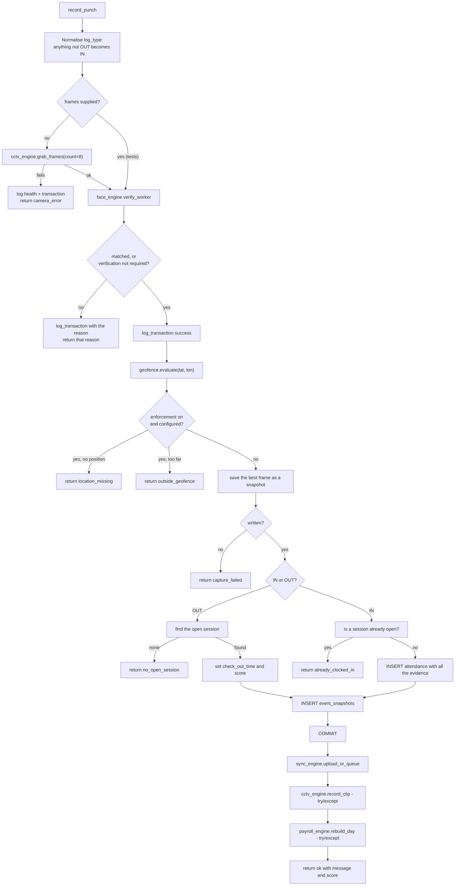
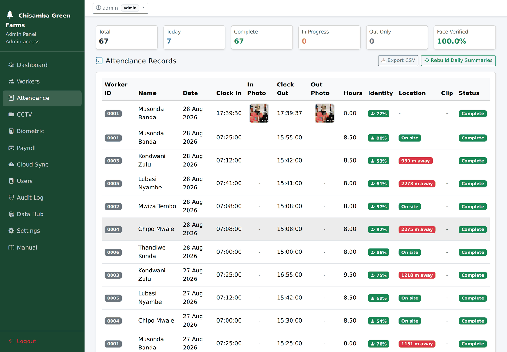

# `attendance_service.py`

← [Module index](README.md) · [Wiki index](../README.md)

**~270 lines. One public function that matters.**

Runs the whole clock-in/clock-out transaction in the right order. For the
narrative walkthrough see [03 — Follow a Clock-In](../03-follow-a-clock-in.md);
this page is the reference.

---

## What it owns

| | |
| --- | --- |
| **Owns** | The order of the punch transaction, the refusal messages, snapshot naming, transaction logging |
| **Does not own** | Face matching (`face_engine`), the camera (`cctv_engine`), pay (`payroll_engine`), HTTP |
| **Called by** | `app.py` `login()` (browser) and `api.py` `clock()` (JSON) — **both**, which is the point |

## Why this module exists at all

In an earlier version, parts of this lived in the web route and parts in the API
handler. The two **drifted**: a clock-in through the browser applied a check the
API path did not. Consolidating into one function means the two entry points
cannot disagree, and the tests exercise a single code path.

If you are ever tempted to add "just one small check" in a route instead of
here, that is the history you would be repeating.

## Small helpers

```python
def _setting(key, default=""):  ...      # read a settings row
def _flag(key, default="on"):   ...      # "on"/"true"/"1"/"yes" -> True
def match_threshold():          ...      # the threshold, clamped to 0-100
```

`match_threshold()` clamps and falls back to 35 on nonsense, so a bad settings
value cannot disable verification by making the threshold negative.

## `log_transaction(...)`

Writes one row to `biometric_transactions`: worker, type, success, score,
threshold in force, error message.

**Called for failures as well as successes**, and that is deliberate. A table of
successes only could never answer *"how often does this refuse genuine workers,
and why?"* — the question the whole threshold choice depends on.

## `REASON_MESSAGES`

Maps a machine reason to a sentence for a human:

```python
REASON_MESSAGES = {
    "no_face_detected": "No face was detected. Please stand square to the camera.",
    "eyes_not_visible": "Face found but the eyes were not visible. Remove any hat or glare.",
    ...
}
```

House style: **say what happened, then what to do about it.** "No face was
detected, please stand square to the camera" is an instruction. "Verification
failed" is an obstacle. This is the difference between a system a supervisor can
run and one that needs a technician.

## `save_snapshot_frame(frame, worker_code)`

Writes a JPEG into `captures/` with a timestamped name and returns
`(relative_path, status)`. **Relative**, so the reference survives the project
being moved or containerised.

## `record_punch(app, worker, log_type, lat, lon, frames=None)`

The one function that matters.



**Reading this diagram:** start at the top and follow the arrows down. Every
diamond is a check, and every check has an escape route to the side labelled with
the reason it refuses. A punch only becomes a record if it survives all of them.
The three boxes at the very bottom, after `COMMIT`, run **after** the record is
safely saved — they cannot undo it.

> **Analogy: a checklist before takeoff.** Each item can stop the flight, and the
> order matters: you check the engine before you check the in-flight catering. If
> catering fails you still fly. The three steps after `COMMIT` are catering.

### The ordering, and why each position matters

| # | Step | Why it is here and not elsewhere |
| --- | --- | --- |
| 1 | Camera | Everything needs the frames |
| 2 | **Identity** | The refusal the system exists to make. It must not be masked by a later check |
| 3 | Location | Only relevant to somebody who has already been identified |
| 4 | **Snapshot** | **Before** the row, so a record can never exist without its evidence |
| 5 | Attendance row | The record itself |
| 6 | Snapshot row + commit | Links image to record atomically |
| 7 | Cloud upload | After the commit — best effort |
| 8 | Clip | After the commit, in `try/except` — must not fail a committed record |
| 9 | Summary rebuild | After the commit — derived data |

**Steps 7–9 are after the commit and cannot fail the transaction.** By then the
row exists and a wage depends on it. A camera unplugged between the snapshot and
the clip must not turn a valid record into an error the worker sees.

### The `frames` parameter

```python
def record_punch(app, worker, log_type, lat, lon, frames=None):
```

`frames=None` means "open the camera yourself". Passing frames in is how the
tests exercise the whole transaction without hardware. It is a small piece of
design that makes eleven tests possible.

### The state rules

```python
# Clocking OUT: find the most recent row with no check_out_time
if not row:
    return no_open_session

# Clocking IN: refuse if ANY row has no check_out_time
if open_row:
    return already_clocked_in
```

No clock-out without a clock-in; no double clock-in. Neither is enforceable on
paper. Both are asserted in `tests/test_attendance.py`.

### The return shape

```python
{"ok": bool, "code": str, "message": str, "category": str,
 "attendance_id": int | None, "score": float | None, "threshold": float,
 "geofence": dict | None, "snapshot": str | None, "log_type": str}
```

`category` is a Bootstrap flash class (`success`, `warning`, `danger`), so the
route can flash the message without deciding anything. The route's job is
presentation and auditing; the decision was made here.

## What it produces

Every successful call to this function adds one row like these — with the photo,
the match score and the distance from the farm all attached to it:



## Gotchas

- **`log_type` is normalised defensively** — anything that is not `"OUT"`
  becomes `"IN"`, so a malformed request cannot silently close a session.
- **`verified_by_cctv` is set to `True` whenever a snapshot was stored**, which
  is a slightly odd name for "we have visual evidence".
- **The summary rebuild is wrapped in `try/except` with a rollback**, so a
  summary failure cannot poison the committed attendance transaction.

## Where to look next

- [03 — Follow a Clock-In](../03-follow-a-clock-in.md) — the narrative version
- [face_engine.md](face_engine.md) — the identity decision
- `tests/test_attendance.py` — eleven tests
