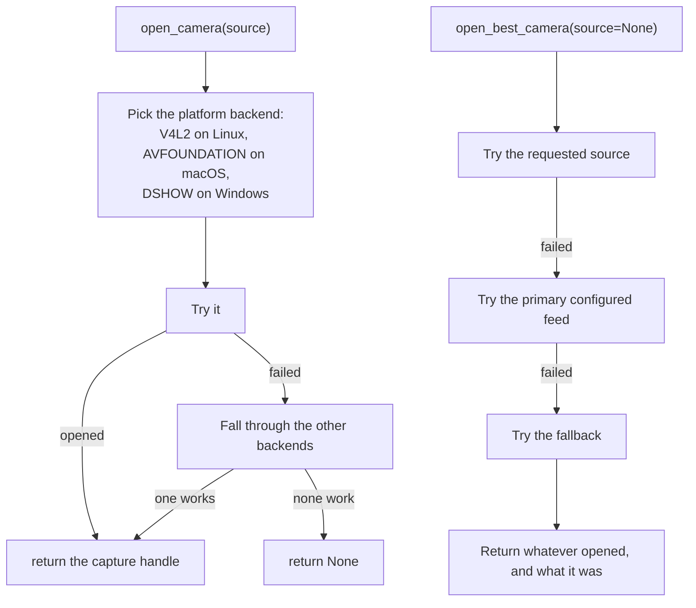

# `cctv_engine.py`

← [Module index](README.md) · [Wiki index](../README.md)

**~470 lines. Everything that touches a camera.**

---

## What it owns

| | |
| --- | --- |
| **Owns** | Resolving camera sources, opening devices, grabbing frames, MJPEG streaming, clip recording, health probes, drawing overlays |
| **Does not own** | Deciding *whose* face it is (`face_engine`), attendance logic |
| **Called by** | `attendance_service`, `app.py` (streaming and camera pages), `api.py` |

**This module and `face_engine` are the only two that touch hardware.** Swap the
camera stack and this is the file you change.

## Source resolution: `coerce_source(value)`

A configured camera can be any of these:

| Configured as | Means |
| --- | --- |
| `"0"`, `"1"` | A USB device index |
| `"/dev/video0"` | A device path |
| `"rtsp://192.168.1.50/stream"` | An IP camera |
| `"http://…/mjpg"` | An HTTP camera |
| `"builtin://0"` | The internal marker for the machine's own webcam |

All are stored as **text** in one column and coerced at the point of use: text
that parses as an integer becomes a device index, anything else is passed
through as an address.

This keeps the configuration a single field in the interface, which matters
because the farm staff configuring it should not need to know which kind of
camera they have.

## Opening a camera: `open_camera()` and `open_best_camera()`



The backend fallback exists because **identical code opened a camera on one
development machine and failed silently on another.** OpenCV offers several
capture backends and the one that works depends on the operating system. Trying
the platform-appropriate one first, then falling through, removes a whole class
of "works on my machine".

## `grab_frames(count=6, source=None, warmup=3, delay=0.06)`

The function `attendance_service` uses. Opens the camera **once**, discards
`warmup` frames, then collects `count` frames with a small delay between them.

Returns `(frames, status)` where status is `"ok"` or an error string.

**The warm-up frames are not waste.** A webcam's first frames after opening are
often dark or out of focus while auto-exposure and auto-focus settle. Enrolling
or matching on those would produce poor results for reasons nobody could see.

**Why the camera is opened once per punch:** the first version opened it twice,
once to verify and once to photograph, and on a single-webcam machine the second
open frequently failed or returned a stale frame because the first had not fully
released the device. See
[07 — Design Decisions](../07-design-decisions.md#4-one-camera-opening-per-punch).

## Streaming: `frame_generator()` and MJPEG

```python
def frame_generator(source, fallback, overlay_faces=False, overlay_motion=False):
    while True:
        ...
        yield (b"--frame\r\nContent-Type: image/jpeg\r\n\r\n" + jpeg + b"\r\n")
```

A Python generator yielding JPEG frames in `multipart/x-mixed-replace` format —
**MJPEG**. The browser renders it in a plain `` tag with no plugin, no
JavaScript player, and no codec support required.

Chosen for robustness, not efficiency. The farm office browser may be several
versions behind; a stream that needs no client-side codec cannot fail for that
reason.

When a camera cannot be opened, `build_unavailable_frame()` generates an image
with an explanatory message baked into it, so the page shows *"Camera
unavailable"* rather than a broken image icon.

### Overlays

`detect_faces_and_eyes()` and `detect_motion_regions()` find things; the
matching `draw_*` functions paint rectangles onto the frame. Motion detection is
frame differencing against the previous grayscale frame — cheap, and enough to
draw a box around something that moved.

These are **display only**. Nothing in the attendance decision depends on them.

## Clip recording: `record_clip(...)`

Writes an mp4 with `cv2.VideoWriter` (`mp4v` codec) and registers a
`CCTVRecording` row linked to the attendance event that triggered it.

**Event-triggered, never continuous.** Continuous capture from four cameras
would fill the recommended storage in days. Triggering on an administrative
event ties retained video to the number of *transactions* rather than to elapsed
time — and has the better secondary effect that everything kept is something a
supervisor would actually want to look at, navigable by transaction rather than
by scrubbing a timeline.

It takes `app` and runs inside an application context, because it writes a
database row from a code path that may not have one.

## Health: `log_health()` and `probe_feed()`

`probe_feed()` opens a feed, reads one frame, releases it, and records the
outcome with a latency into `hardware_health_logs`.

**The log is a history, not a current state.** That is what lets you tell an
intermittent camera from a dead one — the difference between a maintenance visit
and a replacement.

`log_health()` is also called from `attendance_service` when a punch fails for
lack of frames, so camera failures during real use are recorded, not just those
found by deliberate probes.

## Gotchas

- **Only one process can open a webcam at a time.** If the stream page is open
  and you try to enrol, one of them fails. This is an operating system
  constraint, not a bug in the code.
- **Docker Desktop on Windows and macOS cannot pass a USB webcam through** — the
  container runs in a Linux VM with no host USB access. Use RTSP, or a native
  install.
- **RTSP cameras need `ffmpeg`**, which is why the Dockerfile installs it.
- **`record_clip` is called inside `try/except` by `attendance_service`** on
  purpose. See [07 — Design Decisions](../07-design-decisions.md#6-clip-recording-is-outside-the-decision-path).
- **A generator holds the camera open** for as long as the browser keeps the
  stream connection. Closing the page ends it.

## Where to look next

- [attendance_service.md](attendance_service.md) — the main consumer
- [face_engine.md](face_engine.md) — what happens to the frames
- `tests/test_cctv_and_sync.py` — nine tests
