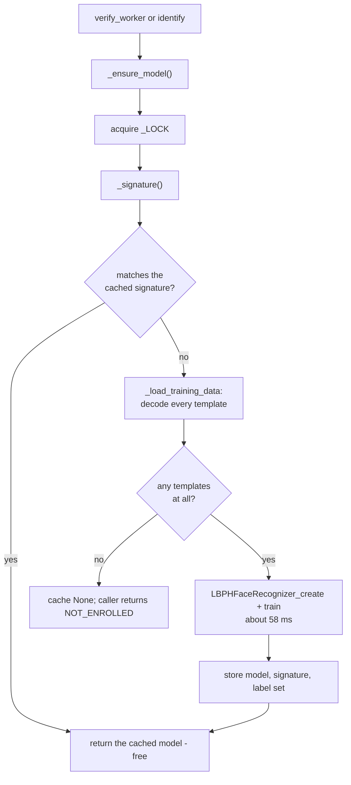
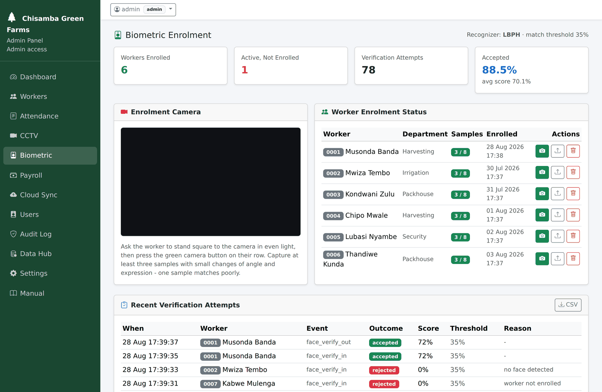

# `face_engine.py`

← [Module index](README.md) · [Wiki index](../README.md)

**~445 lines. The module the project rests on.**

Turns camera frames into an identity decision. For how the algorithm works, read
[05 — Face Recognition Explained](../05-face-recognition-explained.md) first;
this page is the code.

---

## What it owns

| | |
| --- | --- |
| **Owns** | Face detection, normalisation, template encoding, recognizer training and caching, matching, refusal reasons |
| **Does not own** | Opening the camera (`cctv_engine`), deciding what to do with the result (`attendance_service`), storing attendance |
| **Depends on** | `cv2`, `numpy`, `models.Worker`, `models.FaceTemplate` |
| **Called by** | `attendance_service`, `app.py` (enrolment routes), `api.py` |

## Module state

```python
FACE_SIZE = (200, 200)
FACE_CASCADE = cv2.CascadeClassifier(HAAR_DIR + "haarcascade_frontalface_default.xml")
EYE_CASCADE  = cv2.CascadeClassifier(HAAR_DIR + "haarcascade_eye.xml")

_LOCK = threading.RLock()
_MODEL = None
_MODEL_SIGNATURE = None
```

The cascades load once at import. The model is cached and guarded by a re-entrant
lock, because Flask serves requests on multiple threads and two simultaneous
clock-ins must not train the recognizer at the same time.

## The refusal reasons

```python
NO_FACE      = "no_face_detected"
NO_EYES      = "eyes_not_visible"
NOT_ENROLLED = "worker_not_enrolled"
NO_MATCH     = "face_did_not_match"
WRONG_WORKER = "face_matched_another_worker"
TOO_SMALL    = "face_too_small"
```

These strings travel all the way to `biometric_transactions.error_message` and to
the message the operator sees. They are part of the module's contract — changing
one changes stored data and the API's output.

## The functions

### `has_lbph()` and `engine_info()`

```python
def has_lbph() -> bool:
    return hasattr(cv2, "face") and hasattr(cv2.face, "LBPHFaceRecognizer_create")
```

Is the proper recognizer available? `engine_info()` wraps this for the Biometric
page and `/api/v1/health`, reporting the algorithm, whether the contrib build is
present, and whether the cascades loaded.

**If either reports false, the install is wrong** — see
[INSTALL.md](../../INSTALL.md#two-dependency-traps-worth-knowing-about).

### `extract_face(frame, require_eyes=True, min_size=60)`

**The single most reused function in the module.** Both enrolment and
verification go through it, which is what guarantees an enrolled template and a
probe are processed identically — if they were not, nothing would ever match.

```python
def extract_face(frame, require_eyes=True, min_size=60):
    boxes = detect_faces(frame)
    if not boxes:
        return None, 0.0, NO_FACE
    x, y, w, h = boxes[0]                       # largest face
    if w < min_size or h < min_size:
        return None, 0.0, TOO_SMALL
    gray = cv2.cvtColor(frame, cv2.COLOR_BGR2GRAY)
    roi = gray[y:y+h, x:x+w]
    if require_eyes and not detect_eyes(roi):
        return None, 0.0, NO_EYES
    crop = cv2.resize(roi, FACE_SIZE, interpolation=cv2.INTER_AREA)
    crop = cv2.equalizeHist(crop)
    return crop, sharpness(crop), ""
```

Returns `(crop, quality, reason)`. `crop` is `None` on failure and `reason` says
why. `detect_faces()` sorts by area, so `boxes[0]` is the largest — the person
standing at the camera, not somebody in the background.

`sharpness()` is the variance of the Laplacian: a standard blur measure. A sharp
image has strong local intensity changes and therefore high variance. It is
stored as `quality_score` so an operator can see which enrolled samples are good.

### `_encode()` / `_decode()`

```python
def _encode(crop) -> bytes:
    return crop.tobytes()        # always exactly 40,000 bytes
```

Raw pixels, no container format. A 200×200 `uint8` image is always 40,000 bytes,
so decoding needs no header and a wrong-sized blob is detectably corrupt —
`_decode()` returns `None` rather than producing a garbled image that would
quietly poison the recognizer.

### `enroll_frame(worker, frame, reference_dir, require_eyes=True)`

Extracts a face, stores the template, saves a human-viewable reference image to
`captures/faces/`, sets `worker.face_enrolled_at` on the first sample, and
invalidates the model cache.

### `clear_templates(worker)`

Deletes every template for a worker, clears `face_enrolled_at`, invalidates the
cache. This is how consent withdrawal is honoured.

### The retraining cache: `_signature()`, `_ensure_model()`, `invalidate()`

```python
def _signature() -> tuple:
    count, max_id = db.session.query(
        db.func.count(FaceTemplate.face_id), db.func.max(FaceTemplate.face_id)
    ).one()
    return int(count or 0), int(max_id or 0)
```

`(row count, highest id)` — two aggregate values, cheap to compute, and enough:
templates are never edited in place, only inserted and deleted, and either
changes this pair.



**Reading this diagram:** every face check starts by asking whether the stored
faces have changed since last time. Usually they have not, so the expensive
training step is skipped entirely and the saved result is reused. Only enrolling
or deleting a face forces the work to be redone.

`invalidate()` clears it by hand. Call it after any change to templates made
outside `enroll_frame` / `clear_templates` — the test suite calls it between
tests for exactly this reason.

### `_predict(model, crop)` — distance to percentage

```python
label, distance = model.predict(crop)
return int(label), max(0.0, 100.0 - float(distance))
```

LBPH returns a **distance** where lower is better. The mapping inverts it so
higher is better and `score >= threshold` reads the intuitive way round. It is
monotonic, so it changes no decision — it exists so a human can reason about the
number.

The `else` branch is the correlation fallback for a broken install. It maps
correlation onto the same 0–100 scale (0.5 → 0, 0.675 → 35, 1.0 → 100) so one
threshold setting works either way. You should never see it run.

### `verify_worker(worker_pk, frames, threshold, require_eyes)` {#verify_worker}

**The function the project rests on.** It answers the claim the worker made by
typing their ID — not "is somebody there".

```python
model, labels = _ensure_model()
if model is None or worker_pk not in labels:
    result["reason"] = NOT_ENROLLED
    return result

for frame in frames:
    crop, _quality, reason = extract_face(frame, require_eyes=require_eyes)
    if crop is None:
        if result["reason"] in (NO_FACE,):
            result["reason"] = reason
        continue
    result["face_found"] = True
    label, score = _predict(model, crop)
    if score > result["score"]:
        result["score"] = round(float(score), 2)
        result["matched_worker_pk"] = label
        result["best_frame"] = frame
    if label == worker_pk and score >= threshold:
        result.update({"matched": True, "reason": "", "best_frame": frame, ...})
        return result

if result["face_found"]:
    if result["matched_worker_pk"] not in (None, worker_pk):
        result["reason"] = WRONG_WORKER
    else:
        result["reason"] = NO_MATCH
```

Four things to take from that:

1. **The `NOT_ENROLLED` check is first.** No point examining frames for a worker
   with no templates.
2. **Two conditions must both hold to accept:** the label must be *this* worker
   **and** the score must clear the threshold. Dropping the first condition would
   turn verification into identification and reintroduce the fraud.
3. **It returns on the first good frame** and keeps the best frame seen
   otherwise, which the caller stores as the snapshot.
4. **The reason is worked out at the end, from what was observed** —
   `WRONG_WORKER` specifically when a face was recognised but attributed
   elsewhere.

Returns:

```python
{"matched": bool, "score": float, "threshold": float,
 "reason": str, "matched_worker_pk": int | None,
 "best_frame": frame, "face_found": bool}
```

### `identify(frames, threshold, require_eyes)`

One-to-many: *who is this?* Used by the JSON API only. **Deliberately not on the
attendance path** — see [07 — Design Decisions](../07-design-decisions.md#1-verification-not-identification).

### `profile_photo_for(worker)`

The photograph printed on a worker's identity card, as a path relative to the
project root, or `None`.

It is worth being clear about what this is **not**. It is not a separate profile
picture somebody uploads. It is one of the very enrolment crops the recogniser
was trained on &mdash; which is the point: a supervisor holding a card up against
a face is then looking at exactly what the system compares against. A separately
uploaded picture could drift away from the enrolled template and quietly stop
meaning anything, while still looking authoritative on a printed card.

Of a worker's samples it picks the **sharpest**. `quality_score` is the Laplacian
variance of the crop, so the highest value is the least blurred, and a blurred
face on a card helps nobody.

Two fallbacks, in order, and both exist for reasons that have actually happened:

1. A row whose `reference_image_path` points at a file that is **no longer on
   disk** is skipped rather than returned. Backups get restored without the
   `captures/` directory; trusting the row blindly would print a broken image and
   leave the operator with no idea why.
2. If no row carries a usable path, the filenames are searched by convention
   (`enroll_<worker_id>_NN.jpg`). An installation upgraded from a release that
   did not record the paths still has the files under a predictable name, and a
   card with a photograph on it is worth one directory listing to recover.

Returns `None` when there is nothing, and the templates draw a grey outline
rather than a broken image. The cure for an empty card photograph is enrolment,
not anything on the card page.

### `accuracy_snapshot()`

Reads `biometric_transactions` and returns attempts, accepted, rejected,
acceptance rate and average score for the dashboard.

## Where you see this module in the app

The Biometric page is this module's user interface — enrolment on the right, and
the outcome of every call to `verify_worker()` in the table below:



## Gotchas

- **Changing `FACE_SIZE` invalidates every stored template.** They are 40,000
  raw bytes; `_decode()` would reject them all as corrupt. Re-enrolling everyone
  would be the only recovery.
- **Templates written outside this module leave the cache stale.** Call
  `invalidate()`.
- **`require_eyes` is not liveness detection.** A printed photograph has visible
  eyes.
- **Never log a template.** It is biometric personal data.
- **`profile_photo_for()`'s convention fallback is keyed on the worker code.**
  Worker codes are generated and never reused, so this is safe &mdash; but if you
  ever add a way to reassign a code, this lookup would start handing one worker
  the other's photograph.
- **Tests must not read the real `captures/faces/`.** `tests/conftest.py` points
  `BASE_DIR` and `FACES_DIR` at a temporary tree for exactly this reason:
  otherwise a card test passes or fails depending on what the developer last
  demonstrated.

## Where to look next

- [attendance_service.md](attendance_service.md) — the caller
- [05 — Face Recognition Explained](../05-face-recognition-explained.md) — the algorithm
- [barcode_engine.md](barcode_engine.md) — the card the photograph is printed on
- `tests/test_face_engine.py` — nine tests
- `tools/accuracy_experiment.py` — where the threshold comes from
