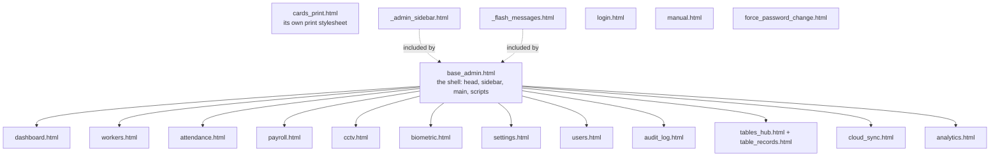

# The Front End — `templates/` and `static/`

← [Module index](README.md) · [Wiki index](../README.md)

**18 templates, 9 stylesheets, 13 scripts. Server-rendered, no build step.**

---

## The approach

Jinja templates rendered on the server. **No React, no bundler, no `npm run
build`.** Edit a template, refresh the browser, see the change.

Why: a single-page app needs a build step, a bundle kept in sync with the API,
and a browser new enough to run it. The farm office browser may be several
versions behind. Server-rendered pages have none of those failure modes, and the
[JSON API](api.md) exists separately for a future mobile client.

## Template inheritance



**Reading this diagram:** one parent template at the top holds the page furniture
— the header, the sidebar, the script tags. Every admin page inherits from it and
fills in only the middle. The two dotted boxes are fragments pasted into the
parent rather than pages of their own.

> **Analogy: headed notepaper.** The letterhead, address and footer are printed
> once. Each letter only supplies the words in the middle. Change the letterhead
> and every letter changes with it.

`cards_print.html` also stands outside the shell, and for a reason worth knowing:
it lays cards out at true bank-card size (85.6 x 54 mm) for a printer, so a
sidebar and a navigation bar would be actively in the way. It carries its own
print stylesheet.

`login.html`, `manual.html` and `force_password_change.html` stand outside the
admin shell — they are seen by people who are not signed in, or not yet allowed
past the password change.

### The blocks `base_admin.html` provides

```jinja
        <!-- the browser tab -->
    <!-- page-specific stylesheet -->
      <!-- the page itself -->
     <!-- page-specific script -->
```

A page template is:

```jinja

{{ org_name }} - Payroll

  <link rel="stylesheet" href="{{ url_for('static', filename='css/payroll.css') }}">


  ...

```

## Jinja in ninety seconds

| Syntax | Does |
| --- | --- |
| `{{ value }}` | Insert, **HTML-escaped by default** |
| `` / `` / `` | Conditional |
| `` / `` | Loop |
| `` | Inherit a layout |
| `` | Fill a hole in the parent |
| `` | Paste in a fragment |
| `{{ url_for('payroll') }}` | Build a URL from an **endpoint name** |
| `{{ value or "-" }}` | Fallback for empty values |

Escaping by default is why a worker named `O'Brien` does not break the page.

### The globals available in every template

Registered in `create_app()`:

```python
app.jinja_env.globals.update(
    can=can,                                  # permission checks
    role_labels=ROLE_LABELS,                  # human role names
    face_engine_info=face_engine.engine_info, # recognizer status
)
```

So any template can write ``. Remember this is a
**usability** measure — [security.md](security.md) explains why the route
decorator is the actual control.

## CSS

```
static/css/
  admin.css        THE SHARED THEME - colours, layout, sidebar, tables, buttons
  login.css        the sign-in and clock-in page
  dashboard.css    workers.css   attendance.css
  biometric.css    settings.css  manual.css   datatables.css
  analytics.css    portal.css
```

**`admin.css` is the theme. Everything else is page-specific.** Put shared
styling in `admin.css`; put one page's quirks in that page's file. Mixing the two
is how a theme stops being consistent.

Bootstrap 5.3 provides the grid and components; these files layer the project's
identity on top.

### The sidebar

`admin.css` contains the layout that took the most work to get right:

```css
body { display: flex; align-items: flex-start; min-height: 100vh; margin: 0; }
.sidebar { flex: 0 0 240px; position: sticky; top: 0; height: 100dvh;
           display: flex; flex-direction: column; overflow: hidden; }
.sidebar .sidebar-nav { flex: 1 1 auto; overflow-y: auto; flex-wrap: nowrap; }
.sidebar .sidebar-nav > .nav-item { flex: 0 0 auto; }
.main-content { flex: 1 1 auto; min-width: 0; padding: 2rem; }
```

Three separate faults were fixed here, and each comment in the file records one:

1. Bootstrap's `.nav` sets `flex-wrap: wrap`, which silently pushed half the menu
   into a hidden second column at laptop heights.
2. With `position: fixed` and content taller than the viewport, Logout could not
   be reached at all.
3. `overflow-x: hidden` on `body` breaks fixed positioning in WebKit.

**If you change the sidebar, test at 1280×560 as well as full screen.** That is
the size that exposed all three.

Other pieces worth knowing:

- `.chart-shell { height: 300px }` — without a fixed-height wrapper, Chart.js
  expands its canvas to fill available height and produced a chart over a
  thousand pixels tall.
- `.table td.actions-cell { white-space: nowrap }` — stops row action buttons
  stacking vertically.

## JavaScript

Thirteen small scripts, one per page, plus two shared:

```
components.js       shared helpers
admin-layout.js     sidebar behaviour
dashboard-page.js   workers.js        attendance.js
payroll-page.js     cctv-page.js      biometric-page.js
users-page.js       audit-log-page.js cloud-sync-page.js
table-records-page.js  edit-modals.js  login.js
analytics-page.js   portal-reports.js auto-refresh.js
```

Plain browser JavaScript. No framework, no build step, no bundler. Each script
is loaded only by the page that needs it, through `extra_js`.

Libraries — Bootstrap, Bootstrap Icons, **DataTables** (sorting, searching,
paging of record tables) and **Chart.js** (dashboard and analytics charts) — are
served from **`static/vendor/`**, not from a CDN. See the note below; it is about
1.1 MB and it is the difference between a farm machine that has never had a
connection rendering correctly and rendering as unstyled text.

`login.js` has the most real work to do. It requests the browser's geolocation
and fills the hidden latitude and longitude fields before the clock-in form is
submitted, and — where the farm has enabled it — drives the card scanner.

### Reading a barcode with no library

The camera scanner uses the browser's own `BarcodeDetector` API rather than a
vendored JavaScript decoder:

```javascript
if (!('BarcodeDetector' in window)) { button.remove(); return; }
const detector = new BarcodeDetector({ formats: ['code_128', 'qr_code'] });
```

Nothing to ship, nothing to keep up to date, and the decoding happens in native
code rather than in a JavaScript loop over pixels. The cost is that the API does
not exist in every browser — so the button **removes itself** rather than sitting
there doing nothing. A USB scanner needs no JavaScript at all: it presents as a
keyboard, types the value into the field and presses Enter.

### `auto-refresh.js`

Mounted by any page carrying charts. Three decisions in it are worth knowing:

- It does a **full page reload**, not a partial update. Every charted page here is
  server-rendered, so a reload is one line and cannot drift out of step with the
  server the way a hand-written DOM patch can. The cost is a flicker every few
  minutes, which is cheaper than a subtle inconsistency.
- It **pauses while the tab is hidden**, and reloads immediately on return if the
  interval already elapsed. Reloading a page nobody is looking at spends the farm
  host's CPU and, on a metered link, its data.
- The choice is stored in `localStorage` **per browser**, not per farm, with every
  read and write wrapped in `try`/`catch`. One office screen may want thirty
  seconds while a manager's laptop wants nothing at all; the farm setting supplies
  only the starting value.

## The live camera view

```html

```

That is the whole client side of video streaming. The server sends MJPEG — a
multipart stream of JPEG frames — and the browser renders it in an ordinary
``. No player, no codec support required, nothing to go wrong on an old
browser. See [cctv_engine.md](cctv_engine.md).

## Gotchas

- **`url_for` takes the endpoint name, which is the view function's name.**
  Renaming a Python function breaks every `url_for` that names it.
- **Always pass `org_name`** to `render_template` — the base template needs it.
- **`{{ }}` escapes; `| safe` does not.** Never `| safe` on anything a user typed.
- **The stream holds the camera open** while the page is open. Only one process
  can hold a webcam, so an open stream page can block enrolment.
- **Front-end libraries are vendored, and must stay that way.** They live in
  `static/vendor/` and are referenced with `url_for('static', ...)`. The project
  claims to work offline; a single `<script src="https://cdn...">` slipped into a
  template quietly breaks that claim, and it breaks it only on the machine that
  has never had a connection — which is the one machine nobody tests on. If you
  add a library, vendor it.
- **Bootstrap Icons needs its font files too.** `static/vendor/fonts/` holds the
  `.woff` and `.woff2`; the vendored stylesheet's relative paths expect them there.

## Where to look next

- [app.md](app.md) — the routes that render these
- [security.md](security.md) — why `can()` is not a security control
