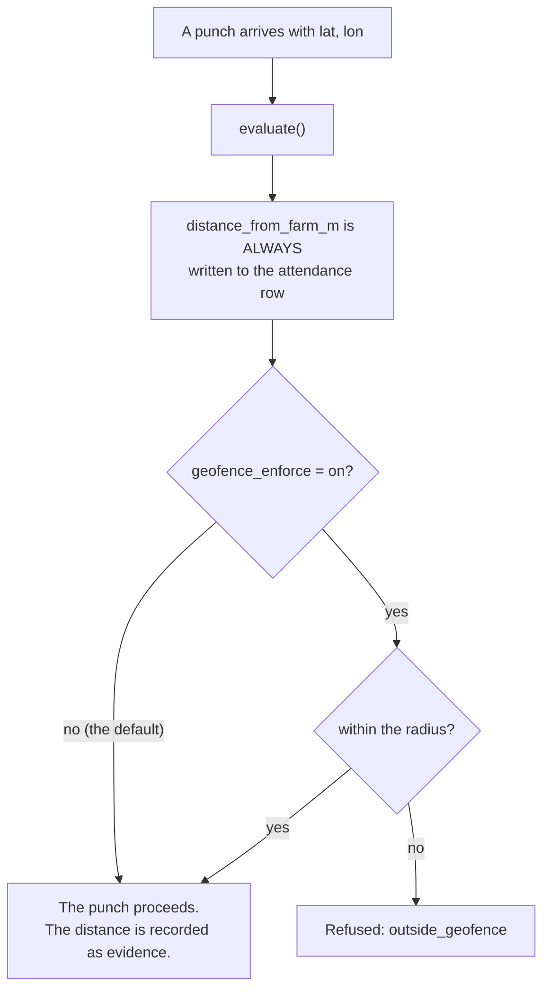

# `geofence.py`

← [Module index](README.md) · [Wiki index](../README.md)

**~80 lines. The smallest module, and one of the most interesting decisions.**

---

## What it does

Answers one question: *how far is this position from the farm, and is that
within the allowed radius?*

| | |
| --- | --- |
| **Owns** | Coordinate parsing, geodesic distance, the enforcement decision |
| **Depends on** | `geopy.distance.geodesic`, the settings table |
| **Called by** | `attendance_service.record_punch()`, `app.py` (settings validation) |

## The functions

### `normalize_coordinates(lat_raw, lon_raw)`

Takes whatever the browser sent — strings, empty strings, `None`, nonsense — and
returns `(float, float)` or `(None, None)`. Never raises.

That matters because the position comes from the browser's geolocation API,
which the user can decline and the machine may not support. A missing position
is a normal condition, not an error.

### `farm_centre()`, `radius_metres()`, `is_enforced()`

Read `farm_latitude`, `farm_longitude`, `geofence_radius_m` (default 500) and
`geofence_enforce` (default **off**) from settings.

### `evaluate(lat, lon)`

```python
{
  "configured": bool,      # has the farm set its coordinates?
  "has_position": bool,    # did the browser give us one?
  "within": bool | None,   # inside the radius? None if unknown
  "distance_m": float | None,
  "radius_m": float,
  "enforce": bool,         # may this refuse a punch?
}
```

Distance is computed with `geopy`'s **geodesic** function — on the ellipsoid,
not a flat-earth approximation — so it is correct at any latitude.

The four fields `configured`, `has_position`, `within` and `enforce` are separate
on purpose. "We don't know where they are" and "we know, and they're too far" are
different situations that deserve different messages, and only the caller can
decide what to do about either.

## The decision that makes this module interesting



**Reading this diagram:** notice the distance is written to the record *before*
the question about enforcement is even asked. That is the whole design in one
picture — measuring and refusing are two separate things, and only the first
happens by default.

**Distance is always recorded. Refusing on it is a setting, and it is off.**

Two reasons, and both are worth understanding because the principle generalises.

**Principled.** A coordinate reported by a browser is a claim made by software
the user controls. It can be falsified without specialist skill. Treating it as
proof of presence would assert more than the measurement supports. It
corroborates a biometrically verified record; it cannot replace one.

**Practical.** Rural position fixes are often derived from a network estimate
rather than satellites, and can be wrong by hundreds of metres. A farm that
enabled enforcement at a plausible-sounding radius on day one would refuse
legitimate workers and conclude the system was broken. Record for a fortnight,
look at the actual distribution, *then* choose a radius.

> **The general principle:** a measurement that is recorded can be understood
> before it is trusted. One that is enforced from the outset can only be
> discovered to be wrong by refusing something legitimate.
>
> Carry this to anything you add.

## Gotchas

- **A missing position is not a failure.** Unless enforcement is on, `lat=None`
  is perfectly normal and the punch proceeds.
- **Coordinates are decimal degrees**, e.g. `-15.4067`, `28.2871` for Lusaka.
  Not degrees-minutes-seconds. The settings page validates and rejects anything
  that will not parse.
- **This is not a movement tracker.** A distance is recorded at discrete
  attendance events. There is no location history, deliberately — see
  [07 — Design Decisions](../07-design-decisions.md#12-purpose-limitation-as-a-design-property).

## Where to look next

- [attendance_service.md](attendance_service.md) — the caller
- `tests/test_attendance.py` — four geofence tests
