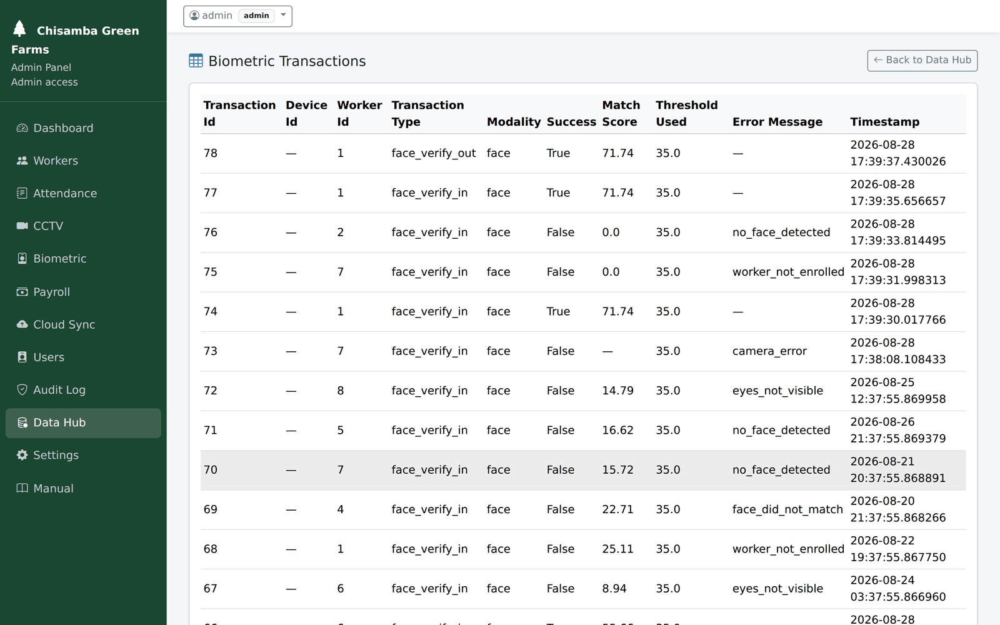

# `models.py`

← [Module index](README.md) · [Wiki index](../README.md)

**~490 lines. The single source of truth for the schema.**

For the relationships and the reasoning, read
[04 — The Database](../04-the-database.md). This page is the field reference.

---

## How a model works

Each class is one table. Each `db.Column` is one column. SQLAlchemy turns
attribute access into SQL:

```python
class Worker(db.Model):
    __tablename__ = "workers"
    id = db.Column(db.Integer, primary_key=True)
    name = db.Column(db.String(120), nullable=False)

# becomes: SELECT * FROM workers WHERE status = 'active'
Worker.query.filter_by(status="active").all()
```

**Change this file and the schema follows** — `migrations.py` adds any column
you declare on the next start-up. It is genuinely the source of truth;
`Workers.sql` is generated from it.

> **If you are new to this file:** each Python class here *is* a database table,
> and each `db.Column(...)` line *is* a column in it. You never write `CREATE
> TABLE` — you write the class, and the system builds the table to match. See
> [04 — The Database](../04-the-database.md) for the diagram of how they connect.

## The sixteen tables

### `Setting` → `settings`

| Column | Type | Notes |
| --- | --- | --- |
| `id` | Integer PK | |
| `key` | String(100) unique | e.g. `face_match_threshold` |
| `value` | Text | **Always a string.** Convert at the point of use |

Every tunable value lives here. Defaults are seeded from `DEFAULT_SETTINGS` in
`app.py`.

### `User` → `users`

Dashboard accounts. **Not workers.**

| Column | Notes |
| --- | --- |
| `username` | unique |
| `password_hash` | Werkzeug scrypt. Never readable |
| `role` | `admin` / `supervisor` / `viewer`. Normalised on read |
| `is_active` | A deactivated account cannot sign in |
| `must_change_password` | Drives the `before_request` lock |
| `linked_worker_id` | FK → `workers.id`, for the rare person who is both |
| `last_login_at` | |

### `Worker` → `workers`

| Column | Notes |
| --- | --- |
| `id` | **Integer PK.** Referred to as `worker_pk` in code |
| `worker_id` | **String** `"0001"`. The code humans type. Generated, never entered |
| `name`, `department`, `phone_number`, `address`, `emergency_contact` | |
| `nrc_number` | National ID, unique, optional |
| `pin_hash` | Werkzeug hash of the PIN |
| `pin_fingerprint` | SHA-256, used **only** for PIN uniqueness. **Nothing to do with fingerprints** |
| `fingerprint_template` | **Dead.** Reserved for a scanner that was never bought |
| `hourly_rate` | Blank falls back to the farm default |
| `payroll_period` | This worker's pay cycle. **Blank falls back to the farm default**, same convention as the rate |
| `face_enrolled_at` | Set on first sample, cleared when wiped. No samples = cannot clock in |
| `status` | `active` / `inactive` / `suspended`. Only `active` can clock in |
| `card_barcode` | The value printed on the identity card. **Unique**, nullable. Its content depends on the `barcode_source` setting — see [barcode_engine](barcode_engine.md) |
| `card_issued_at` | When the card was issued |
| `card_status` | `active` or `void`. Voiding sets this and **keeps** `card_barcode`, so attendance recorded against a lost card stays explicable |

Methods: `set_pin(pin)` and `check_pin(pin)`.

> **The naming trap.** `Worker.id` is the integer key. `Worker.worker_id` is the
> string code. So `attendance.worker_id` holds `1` while `workers.worker_id`
> holds `"0001"`. The codebase says `worker_pk` for the integer and
> `worker_code` for the string — follow that.

### `Attendance` → `attendance`

One work session, plus its evidence.

| Column | Notes |
| --- | --- |
| `attendance_id` | PK |
| `worker_id` | FK → `workers.id` |
| `check_in_time`, `check_out_time` | `check_out_time` NULL = the session is **open** |
| `check_in_match_score`, `check_out_match_score` | The confidence, 0–100 |
| `verified_by_face`, `verified_by_cctv` | |
| `latitude`, `longitude` | As reported |
| `within_geofence`, `distance_from_farm_m` | **Always recorded**, enforcement optional |

The evidence columns sit on the same row as the times, so a record cannot be
separated from what supports it.

### `FaceTemplate` → `face_templates`

| Column | Notes |
| --- | --- |
| `face_id` | PK |
| `worker_id` | FK. One worker has several |
| `face_embedding` | LargeBinary, **exactly 40,000 bytes** = a 200×200 grayscale crop |
| `algorithm` | `"LBPH"` |
| `sample_index` | 1, 2, 3… |
| `reference_image_path` | The human-viewable crop in `captures/faces/` |
| `quality_score` | Laplacian variance — a sharpness measure |

### `BiometricTransaction` → `biometric_transactions`

**Every** verification attempt, accepted or refused.

| Column | Notes |
| --- | --- |
| `worker_id` | FK, nullable |
| `transaction_type` | e.g. `face_verify_in` |
| `success` | |
| `match_score`, `threshold_used` | The threshold in force at the time |
| `error_message` | **The refusal reason.** `face_matched_another_worker`, etc. |

Storing the threshold alongside the score is what makes a historical result
interpretable after somebody changes the setting.

### `DailyAttendanceSummary` → `daily_attendance_summary`

**Derived.** Rebuilt from `attendance`; never edit it directly.

| Column | Notes |
| --- | --- |
| `worker_id`, `summary_date` | The pair identifies the row |
| `total_hours`, `overtime_hours` | Closed sessions only |
| `check_in_time`, `check_out_time` | First in, last out — `Time`, not `DateTime` |
| `sessions_count`, `late_minutes`, `early_departure_minutes` | |
| `verified_by_face`, `verified_by_cctv` | |

### `Payroll` → `payroll`

| Column | Notes |
| --- | --- |
| `worker_id`, `week_ending` | The pair identifies the row. `week_ending` now means **period** ending for every cycle — it could not be renamed, since migrations are additive only |
| `period_start`, `period_type` | What this row actually covers. Recorded on the row so a farm that switches cycles can still read old payslips |
| `total_hours`, `overtime_hours`, `hourly_rate` | |
| `overtime_pay`, `gross_pay` | |
| `napsa_rate`, `nhima_rate` | **The rates in force when it was generated** |
| `napsa_deduction`, `nhima_deduction`, `net_pay` | |
| `paid_status` | `pending` / `paid`. **A paid week is never regenerated** |
| `computed_from_attendance`, `generated_at`, `payment_date` | |

Keeping every component — and the rates used — means a payslip can be
reconstructed and checked years later, after the settings have changed.

### `CCTVFeed` → `cctv_feeds`

`camera_name`, `camera_location`, `rtsp_url` (which despite the name holds a
device index, a path *or* an address), `status`, `is_primary`, `last_heartbeat`.

The `is_primary` feed is the attendance camera.

### `CCTVRecording` → `cctv_recordings`

Clips: `camera_id`, `attendance_id`, `trigger_type`, `recording_path`, start,
end, duration, size, cloud state. The `attendance_id` link is what makes clips
navigable by transaction.

### `EventSnapshot` → `event_snapshots`

Stills: `attendance_id` (**required**), `camera_id`, `snapshot_type`
(`photo_check_in` / `photo_check_out`), `file_path`, `cloud_url`.

### `AuditLog` → `audit_logs`

`user_id`, `username`, `action`, `details`, `ip_address`, `timestamp`.
Append-only through the application. `username` is denormalised on purpose — the
log must stay readable after an account is deleted.

### `OfflineSyncQueue` → `offline_sync_queue`

`operation_type`, `payload` (JSON text), `sync_status`, `retry_count`,
`last_error`. A table, not a memory structure, so it survives a power cut.

### `CloudSyncMetadata` → `cloud_sync_metadata`

`table_name`, `record_id`, `cloud_status`, `cloud_record_id`, timestamps.

### `HardwareHealthLog` → `hardware_health_logs`

`device_type`, `device_id`, `device_label`, `status`, `error_code`,
`error_message`, `response_time_ms`, `logged_at`. A **history**, so intermittent
faults are distinguishable from permanent ones.

### `BiometricDevice` → `biometric_devices`

**Dead table.** Reserved for a fingerprint scanner that was never bought. Present
so one could be added without a schema change.

## Seeing the raw rows

The Data Hub page browses any of these tables directly — useful when you want to
check what a column actually contains rather than what you think it contains:



## Conventions to follow

| Convention | Why |
| --- | --- |
| New columns are `nullable=True` | Existing rows have no value; `NOT NULL` cannot be added to a populated table |
| Timestamps are `datetime.utcnow` | One timezone everywhere. Convert for display |
| Money and hours are `Float` | Adequate here. `Numeric` would be stricter for currency |
| File paths are **relative** | Absolute paths break on a move or in a container |
| Blobs are fixed-size raw bytes | Makes corruption detectable |
| Docstrings explain non-obvious fields | Follow the pattern in `Worker` |

## Gotchas

- **Never delete a column.** The migration system is additive only.
- **`Worker.id` vs `Worker.worker_id`** — read the trap above twice.
- **`pin_fingerprint` is not biometric.** The biometric is `FaceTemplate`.
- **Settings values are strings**, always.
- **Regenerate `Workers.sql`** after a schema change:
  `python tools/export_schema.py`.

## Where to look next

- [04 — The Database](../04-the-database.md) — relationships and migrations
- [support-modules.md](support-modules.md) — how migrations work
