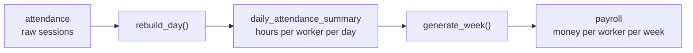
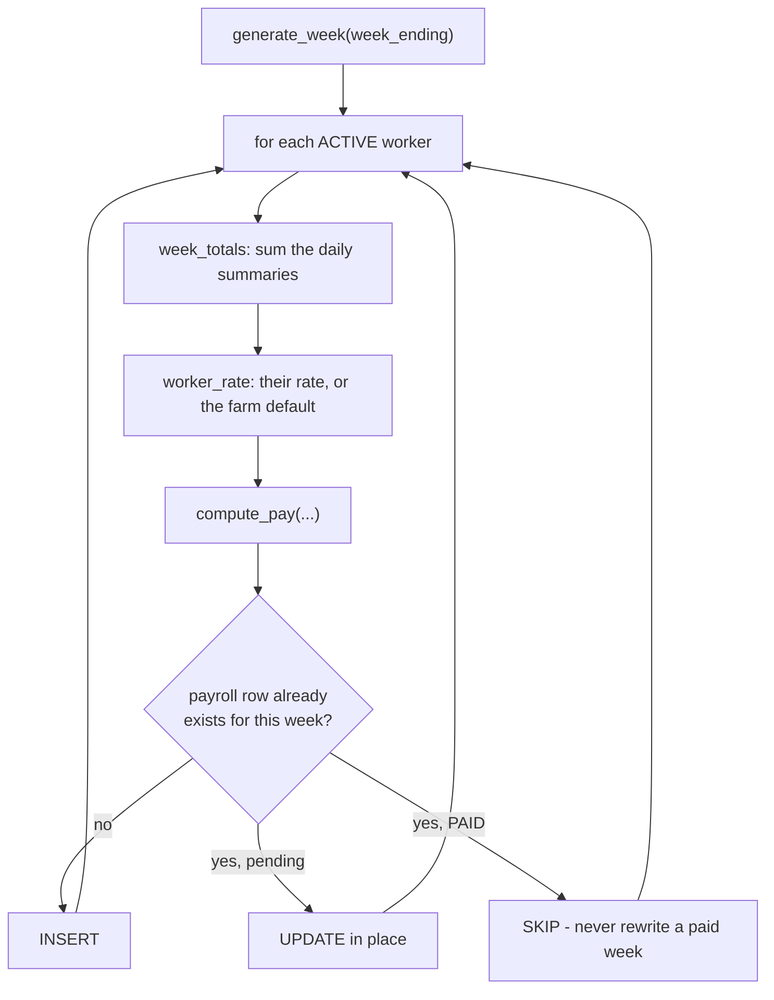

# `payroll_engine.py`

← [Module index](README.md) · [Wiki index](../README.md)

**~330 lines. Turns attendance rows into hours, and hours into money.**

---

## What it owns

| | |
| --- | --- |
| **Owns** | Daily summaries, the pay calculation, weekly generation, the trend series |
| **Does not own** | Recording attendance, displaying payslips |
| **Called by** | `attendance_service` (after each punch), `app.py`, `api.py` |

## The two-stage pipeline



**Reading this diagram:** raw clock-in and clock-out times go in on the left and
money comes out on the right, through two stages. The first turns times into
**hours per person per day**. The second turns those daily hours into **money per
person per week**.

> **Analogy: a shop's takings.** You do not add up every till receipt for the
> year in one go. You total each day, then add the days into a week. If one
> receipt turns out to be wrong, you re-total that one day — not the whole year.

Attendance rows are never read directly by payroll generation. Everything goes
through the summary table, which is what keeps weekly generation fast for two
hundred workers.

## `rates()` — configuration, not constants

```python
DEFAULTS = {"standard_day_hours": 8.0, "overtime_multiplier": 1.5,
            "napsa_rate": 0.05, "nhima_rate": 0.01, ...}

def rates() -> dict:
    # reads the settings table, falling back to DEFAULTS
```

Every rate is a settings row. Statutory rates change by legislation and farms
differ; a farm should not need a developer when the pension rate is revised.

The statutory basis, so you know what the numbers mean:

| Setting | Default | Basis |
| --- | --- | --- |
| `napsa_rate` | 0.05 | NAPSA is 10% of earnings split equally, so **5% from the employee** |
| `nhima_rate` | 0.01 | NHIMA Act No. 2 of 2018: **1% employee**, matched by 1% employer |
| `standard_day_hours` | 8 | Operating convention |
| `overtime_multiplier` | 1.5 | Operating convention |

> **Not implemented:** pay-as-you-earn income tax, the NAPSA contribution
> ceiling, terminal benefits. The ceiling in particular means a high earner would
> currently be **over-deducted**. This is the most consequential outstanding item
> in the module and it should be fixed before the system pays anyone real money.

## `rebuild_day(worker_pk, day)`

Recomputes one worker's summary for one day, **from scratch**.

```python
sessions = Attendance.query.filter(...).order_by(Attendance.check_in_time.asc()).all()

if not sessions:
    if summary:
        db.session.delete(summary)     # stale summary removed
    return None
```

What it computes: total hours from **closed** sessions only, overtime as hours
beyond the standard day, first in and last out, late minutes against the shift
start, early departure minutes, session count, and whether the day was face and
CCTV verified.

**Only closed sessions contribute hours.** Somebody currently clocked in shows
`total_hours = 0` with `sessions_count = 1`; their hours appear when they clock
out. That is correct — you cannot pay for a shift that has not ended.

**Rebuild, not increment.** Deleting and recomputing is slower (about 269 ms for
a fortnight, measured) and is the right trade: if a session is corrected later,
the summary corrects itself. An incrementing counter would stay wrong forever.

## `refresh_range(day_from, day_to, worker_pk=None)`

Rebuilds every day in a range, for one worker or all. Behind the *Rebuild Daily
Summaries* button on the Attendance page — the recovery path when sessions were
imported or edited directly.

## `week_bounds(week_ending)`

A payroll week is the **seven days ending on** `week_ending`, inclusive. One
place defines it so no caller can get the arithmetic subtly wrong.

## `compute_pay(total_hours, overtime_hours, hourly_rate, config=None)`

**The most important function in the module, and it is pure.** No database, no
request context, no Flask. Give it numbers, get numbers back.

```python
overtime_hours = round(min(max(0.0, float(overtime_hours or 0.0)), total_hours), 2)
regular_hours  = round(total_hours - overtime_hours, 2)

basic_pay    = round(regular_hours * rate, 2)
overtime_pay = round(overtime_hours * rate * config["overtime_multiplier"], 2)
gross_pay    = round(basic_pay + overtime_pay, 2)
napsa        = round(gross_pay * config["napsa_rate"], 2)
nhima        = round(gross_pay * config["nhima_rate"], 2)
net_pay      = round(gross_pay - napsa - nhima, 2)
```

The worked example from the docstring — 42 hours of which 2 overtime, at ZMW
20.00/hour:

```
regular   40 h x 20.00           = 800.00
overtime   2 h x 20.00 x 1.5     =  60.00
gross                            = 860.00
NAPSA 5%                         =  43.00
NHIMA 1%                         =   8.60
net                              = 808.40
```

**Note the clamp on line 1.** `min(overtime_hours, total_hours)` — this is the
line that fixed a real defect the test suite found, where a mistyped correction
(5 hours worked, 9 of them overtime) produced an arithmetically impossible
payslip. Purity is what made that findable: the test could drive the function
directly with absurd inputs, which no amount of clicking would have produced.

**Every step rounds to 2 decimal places** as it goes, rather than once at the
end, so the components a payslip displays always add up to the total shown.

Returns all twelve components — hours, rate, basic, overtime, gross, each rate,
each deduction, net — not just `net_pay`, so a worker who queries a payment can
be shown how it was derived.

## `generate_week(week_ending, worker_pk=None)`



**Reading this diagram:** for each active worker, add up their daily summaries
for the week, work out the pay, then decide what to do with the result. The
three-way branch at the bottom is the important part — a brand new row is
inserted, an unpaid row is updated, and **a row already marked paid is left
completely alone**.

**A paid week is never rewritten.** Once `paid_status` is `paid`, regenerating
skips that row. Payroll is a financial record; silently changing a figure
somebody has already been paid against would destroy the audit trail.
`tests/test_payroll.py` asserts this.

Only **active** workers are included.

## `worker_rate(worker)`

The worker's own `hourly_rate`, falling back to the `default_hourly_rate`
setting. So a farm can set one rate for everyone and override per person.

## `attendance_trend(days=14)`

Daily counts for the dashboard chart. Returns labels and series ready for
Chart.js — the shaping is here rather than in the template so the API can serve
the same data.

## What it produces

Each row here is one worker for one week. Note that the hours, the rate, the
gross, both deductions and the net are all stored — not just the final figure —
so a worker who queries a payment can be shown how it was reached:


## Gotchas

- **Summaries are derived.** Editing `daily_attendance_summary` by hand is
  pointless: the next `rebuild_day()` overwrites it. Correct the attendance row
  instead.
- **Correct a session, then rebuild.** The summary does not update itself when
  you edit attendance directly in the database.
- **`compute_pay` takes `config` explicitly.** Do not make it read settings
  itself — that would destroy its purity and the tests that depend on it.
- **The NAPSA ceiling is not implemented.** See the warning above.

## Where to look next

- [models.md](models.md) — `daily_attendance_summary` and `payroll`
- `tests/test_payroll.py` — seven tests, several of them boundary cases
