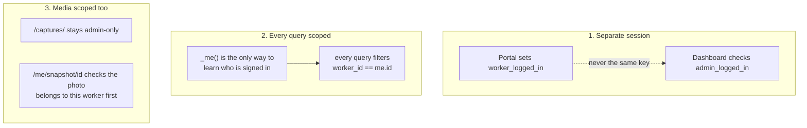
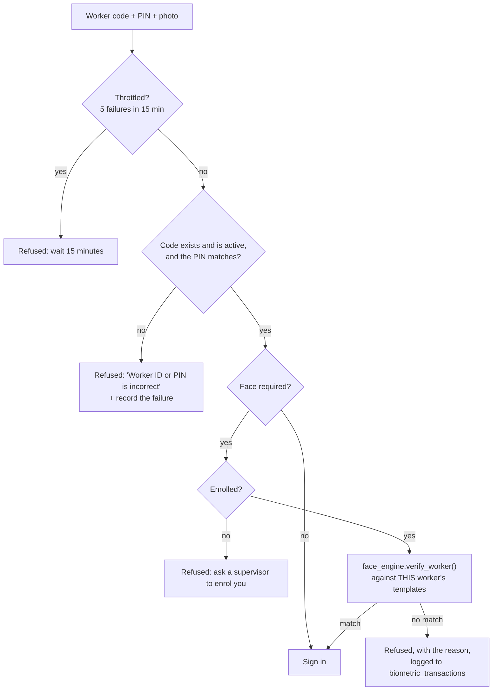

# `portal.py` — the worker self-service portal

← [Module index](README.md) · [Wiki index](../README.md)

**~460 lines. The second front door, at `/me`.**

---

## What it is for

The dashboard is for the people who *run* the farm. This is for the people who
*work* on it: a worker on their own phone, on the farm WiFi, checking what hours
they were recorded as working and what they were paid.

| | |
| --- | --- |
| **Owns** | Worker sign-in, the worker session, and three read-only views scoped to one person |
| **Does not own** | Anything that writes a record. A worker cannot change a single figure |
| **Called by** | Nothing — it is a blueprint registered directly in `create_app()` |

## The three rules

Break any one of these and a worker can read somebody else's wages. They are
written at the top of the module for the same reason.

**Reading this diagram:** three separate promises. The first keeps the two kinds
of user apart. The second keeps workers apart from each other. The third stops
the photos leaking through a back door that the page-level checks don't cover.

> **Analogy: a bank's branch versus its app.** Staff have a pass that opens the
> back office. Customers have a login that shows one account — their own. The
> customer login is not a weaker staff pass; it is a different kind of key
> entirely, and no amount of using it will open the back office.

## Sign-in: three factors

**Reading this diagram:** four gates in order, and a worker must pass all of
them. The PIN gate and the face gate are separate on purpose.

**Why the face matters here.** A four-digit PIN was designed to guard a
clock-in. It has ten thousand combinations, it gets written on lists, and it is
typed at a shared terminal in front of a queue. Putting a year of wage history
behind that alone would have been a mistake, so the same recogniser that guards
attendance guards the portal.

**The one message for two failures.** A wrong code and a wrong PIN both return
*"Worker ID or PIN is incorrect"*, so the form cannot be used to discover which
worker codes exist.

**The throttle is in memory.** Five failures in fifteen minutes locks a code out.
It is a dictionary rather than a database column: no schema change, no write on
every failed attempt. The honest limitation is that it is per-process and resets
when the app restarts — acceptable because the PIN is the weaker of two factors
here, not the only one.

## Two ways to take the photo, and why

This is the constraint most likely to catch you out.

> **Browsers only expose `getUserMedia` — the live in-page camera — in a
> *secure context*: HTTPS, or localhost.** A farm serving this over plain
> `http://192.168.1.20:8010` is neither. On that network
> `navigator.mediaDevices` is simply **undefined**, and a live preview cannot
> work at all.

So the **default** path is a plain file input carrying `capture="user"`, which
hands the job to the phone's own camera app and needs no secure context. The
live preview is offered only when the browser proves it has the API — an HTTPS
deployment, or a desktop on localhost.

`_submitted_frame()` accepts whichever arrived: an uploaded file, or a base64
data URL from the canvas.

## The pages

| Route | Shows |
| --- | --- |
| `GET /me/` | Sign-in |
| `POST /me/login` | The three-factor check above |
| `GET /me/dashboard` | Clocked in or not, this week and this month, earnings so far this pay period and what that is on course to become, the last 28 days against the 28 before, own details, last payslip, five most recent shifts |
| `GET /me/attendance` | Every shift, paginated, 15 per page, with the worker's own photo |
| `GET /me/payslips` | **Paid weeks only**, paginated |
| `GET /me/payslips/<id>` | One payslip, every component |
| `GET /me/reports` | The worker's own eight-week record: hours, days, punctuality, earnings, a chart of hours per week |
| `GET /me/card` | The worker's own identity card, printable. Returns 404 when cards are switched off |
| `GET /me/snapshot/<id>` | One attendance photo, scoped to its owner |
| `GET /me/logout` | Clears the session |

### Paid weeks only

A pending payroll row is provisional — regenerating the week can change it. A
worker shown a figure that later moves will not trust the next one either, so
the list filters on `paid_status == "paid"`, and so does the detail route. Asking
for a pending row by id returns 404 rather than a preview.

### The payslip shows every component

Hours, overtime, rate, basic, overtime pay, gross, each deduction with its rate,
and net. Basic pay is computed in the template as gross minus overtime, so the
four money rows visibly add up. That is the difference between a payslip a
worker can check and one they have to take on trust.

### What the worker's own reports deliberately leave out

`reports_engine.worker_report()` is narrower than the farm-wide functions on
purpose. A worker sees their own hours, their own punctuality and their own
earnings, and is **never** shown where they stand against a colleague. The only
comparison offered is against their own recent average, because that is the only
one that is theirs to know.

Ranking workers against each other here would turn a record-keeping system into a
performance-management one, which is exactly the drift the design set out to
avoid.

The same page carries the systemic-lateness note from
[reports_engine.md](reports_engine.md): where the farm's configured shift start
is earlier than work actually begins, the worker's page says so rather than
presenting the lateness as their fault.

### `/me/card`, and why a worker may print their own

A worker who has lost their card can print a replacement themselves rather than
walking to an office that is a distance away and open for part of the day. The
route only ever **reads**: the value comes from their own record and nothing on
this page can change it.

A voided card is shown *as voided* rather than hidden, so a worker who reported a
card lost can see that the report was acted on.

## Two settings

| Key | Default | Meaning |
| --- | --- | --- |
| `portal_enabled` | `on` | Off makes every `/me` route return 404 |
| `portal_require_face` | `on` | Off drops sign-in to code + PIN |

`portal_require_face` is deliberately **not** the same setting as
`face_verification_required`. That one governs attendance, and a farm might
switch it off to run a demonstration without a camera. If the portal shared it,
that demonstration would silently drop wage history to PIN-only access.

## Gotchas

- **Never write an `admin_*` session key here.** It is the only thing standing
  between a worker and the dashboard.
- **Never write a query in this file without a `worker_id` filter.** Use `_me()`.
- **`_me()` re-reads the worker every request** so that deactivating somebody
  takes effect at once rather than at their next sign-in.
- **`/captures/<path>` stays admin-only.** A worker's own photo goes through
  `/me/snapshot/<id>`, which joins to the attendance row and checks ownership.
- **The portal is read-only by design.** If you add a write, think hard: a
  worker editing their own hourly rate would defeat the system's whole purpose.

## Where to look next

- [security.md](security.md) — the dashboard's side of the same boundary
- [06 — Security and Roles](../06-security-and-roles.md) — the two populations
- `tests/test_portal.py` — 29 tests, most of them about what a worker *cannot* reach
