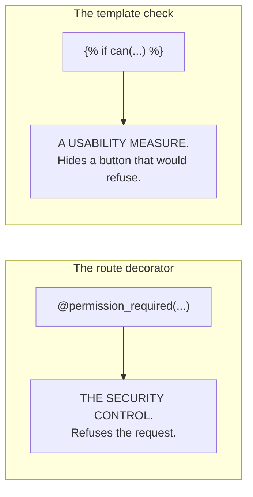

# `security.py`

← [Module index](README.md) · [Wiki index](../README.md)

**~115 lines. Who may do what.**

For the full picture including authentication and auditing, read
[06 — Security and Roles](../06-security-and-roles.md). This page is the module.

---

## The permissions

Nine named constants:

```python
VIEW              = "view"
WORKER_MANAGE     = "worker.manage"
ATTENDANCE_MANAGE = "attendance.manage"
PAYROLL_MANAGE    = "payroll.manage"
CCTV_MANAGE       = "cctv.manage"
BIOMETRIC_MANAGE  = "biometric.manage"
SYNC_MANAGE       = "sync.manage"
USER_MANAGE       = "user.manage"
SETTINGS_MANAGE   = "settings.manage"
```

Constants rather than raw strings so a typo is an `ImportError` at start-up
rather than a permission check that silently never passes.

## Roles as sets

```python
ROLE_PERMISSIONS = {
    "admin":      {VIEW, WORKER_MANAGE, ..., USER_MANAGE, SETTINGS_MANAGE},
    "supervisor": {VIEW, WORKER_MANAGE, ..., SYNC_MANAGE},
    "viewer":     {VIEW},
}
```

They nest in practice — viewer ⊂ supervisor ⊂ admin — but they are written as
**explicit sets, not numeric ranks**. When you add a tenth permission, a set
forces a decision for each role. A rank test (`if level >= 2`) would silently
grant it to everyone above a line you never revisited.

The two admin-only permissions are the ones that change the system's own rules,
and that is the whole boundary: a supervisor who could edit Settings could set
the threshold to 0; one who could manage Users could promote themselves.

## `normalize_role(role)` — the most important five lines

```python
def normalize_role(role):
    value = (role or "").strip().lower()
    return value if value in ROLE_PERMISSIONS else "viewer"
```

**Unrecognised input becomes the least privileged role, not the most.** A typo,
a `None`, a role from a future version — all of them lose privileges rather than
gain them.

```
"Admin"     -> "admin"
"manager"   -> "viewer"     (not a known role)
None        -> "viewer"
""          -> "viewer"
```

The legitimate upgrade case — a database written before roles were enforced,
which has no active administrator at all — is handled separately and explicitly
in `app._seed_defaults()`. Note the asymmetry: promotion happens once, on a
deliberately checked condition. Demotion happens always, by default.

## `permissions_for()`, `current_role()`, `can()`

```python
def can(permission) -> bool:
    return permission in permissions_for(current_role())
```

`current_role()` reads `session["admin_role"]`, set at login. `can()` is
registered as a Jinja global in `create_app()`, so templates call it directly:

```jinja

  <a href="{{ url_for('settings') }}">Settings</a>

```

## The decorators

```python
@admin_required                      # signed in (any role)
@permission_required(SETTINGS_MANAGE) # signed in AND holds the permission
```

Used above the route function:

```python
@app.route("/settings", methods=["GET", "POST"])
@permission_required(SETTINGS_MANAGE)
def settings():
    ...
```

Both redirect with a flash message rather than returning a bare 403, because the
audience is a farm supervisor who needs to be told what happened, not an API
client.

`@admin_required` is named for historical reasons — it means *signed in*, not
*is an administrator*. Do not read more into the name than it does.

## Two places, two purposes



**Hiding a control protects nothing** — anyone can type the URL. The decorator is
what enforces the rule, and it is what the nineteen tests in
`tests/test_security_and_api.py` assert, route by route, role by role.

**If you add a route, add the decorator.** Hiding the link is not enough.

## Gotchas

- **`@admin_required` means "signed in", not "is an admin".**
- **Decorator order matters.** `@app.route` goes first, then the permission
  decorator, then the function.
- **`can()` reads the session**, so it only works inside a request.
- **A role change takes effect at next sign-in**, since the role is stored in
  the session at login.

## Where to look next

- [06 — Security and Roles](../06-security-and-roles.md) — the full picture
- `tests/test_security_and_api.py` — nineteen tests
