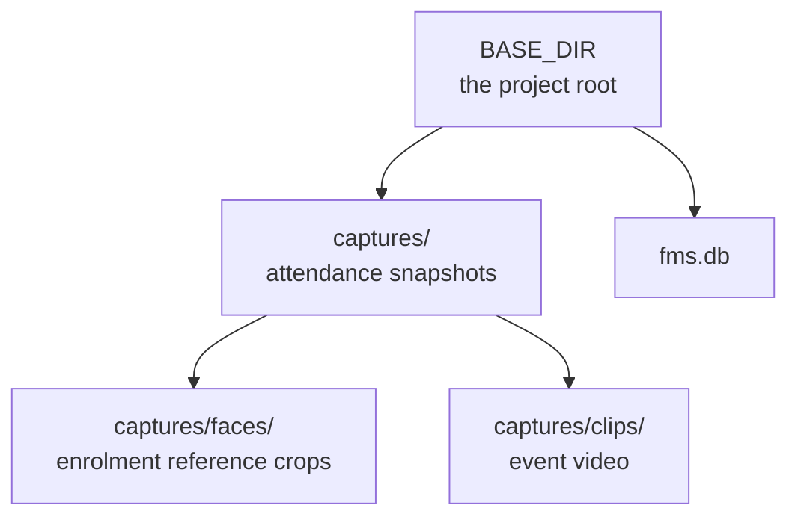
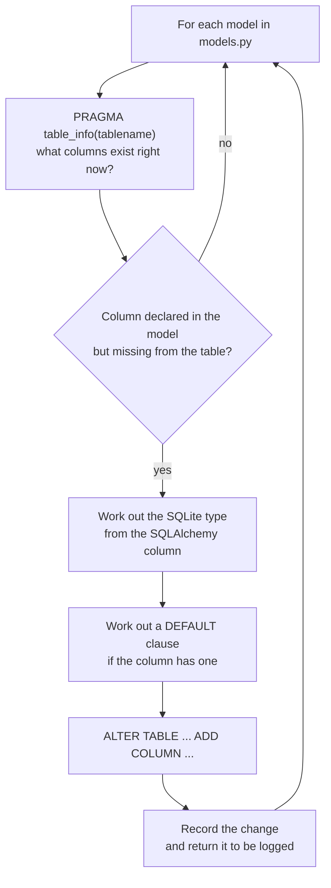

# `database.py`, `paths.py`, `migrations.py`

← [Module index](README.md) · [Wiki index](../README.md)

---

Three small files that everything else depends on.

## `database.py` — three lines

```python
from flask_sqlalchemy import SQLAlchemy

db = SQLAlchemy()
```

That is the entire file, and it exists to solve a specific problem: **circular
imports**.

`models.py` needs `db` to define tables. `app.py` needs `models` to query them.
If `db` lived in `app.py`, then `models` would import `app` and `app` would
import `models`, and Python would refuse.

Putting `db` in a module that imports nothing from the project breaks the cycle.
Everyone imports from here:

```python
from database import db
```

`db` is created empty and bound to the application later, inside `create_app()`,
with `db.init_app(app)`. That is the standard Flask application-factory pattern.

## `paths.py` — where things live on disk

```python
BASE_DIR      = os.path.abspath(os.path.dirname(__file__))
CAPTURES_DIR  = os.path.join(BASE_DIR, "captures")
FACES_DIR     = os.path.join(CAPTURES_DIR, "faces")
CLIPS_DIR     = os.path.join(CAPTURES_DIR, "clips")

def ensure_dirs():
    ...
```

**One definition of every location, imported everywhere.** If paths were built
ad hoc in each module, a change would mean finding every construction of it, and
one would be missed.



**Reading this diagram:** where things sit on disk. One project folder at the
top, with the database file beside a `captures` folder, which itself holds the
enrolment reference images and the event video clips.

`ensure_dirs()` is called during start-up, so a fresh clone with no `captures/`
directory works without anyone creating it by hand.

**The convention that matters:** file paths are stored in the database as
**relative** paths (`captures/faces/0001_1.jpg`), not absolute ones. Absolute
paths would break the moment the project moved directory or ran in a container,
and would break *every stored reference at once*. The absolute path is
reconstructed at the point of use with `os.path.join(BASE_DIR, relative_path)`.

## `migrations.py` — additive schema upgrades

The problem: a student project usually deletes its database when the schema
changes. Unacceptable once a farm has a year of attendance in it.

`apply_migrations()` runs on every start-up:



**Reading this diagram:** a loop over every table the code knows about. Ask the
database what columns it actually has, compare, and add any that are missing. It
never removes anything — which is exactly why it is safe to run on a database
full of real attendance records.

Two helpers do the translation:

- `_column_sql_type(column)` maps a SQLAlchemy type to a SQLite one via
  `_SQLITE_TYPES` — `Integer` → `INTEGER`, `Float` → `REAL`, `LargeBinary` →
  `BLOB`, and so on.
- `_default_clause(column)` turns a Python default into SQL. Callable defaults
  such as `datetime.utcnow` cannot be expressed in SQL, so they are skipped —
  the column is added nullable and Python fills it on the next write.

It returns a list of the changes it made, which `create_app()` logs:

```
Schema migrations applied: workers.shirt_size, attendance.distance_from_farm_m
```

### What it will and will not do

| | |
| --- | --- |
| ✅ Add a missing column | The whole purpose |
| ✅ Create a missing table | Handled by `db.create_all()` just before it |
| ✅ Run twice safely | The second run finds nothing missing |
| ❌ Drop a column | Never. Deliberately |
| ❌ Rename a column | Would be a drop plus an add. Not supported |
| ❌ Change a column's type | Not supported |
| ❌ Backfill data | Add the column, then backfill in application code |

**Additive-only is the safety property.** An existing installation keeps its
data, and a failed upgrade leaves the database readable by the previous version.

### The rule this imposes on you

**New columns must be `nullable=True`.** Existing rows have no value for a column
that has just appeared, so `NOT NULL` without a default cannot be added to a
populated table. If you need the column to be effectively required, enforce it in
application code rather than in the schema.

To rename: add the new column, backfill it in code, leave the old one in place.
Removing it is a manual, deliberate operation — not something a start-up
migration should ever do on its own.
