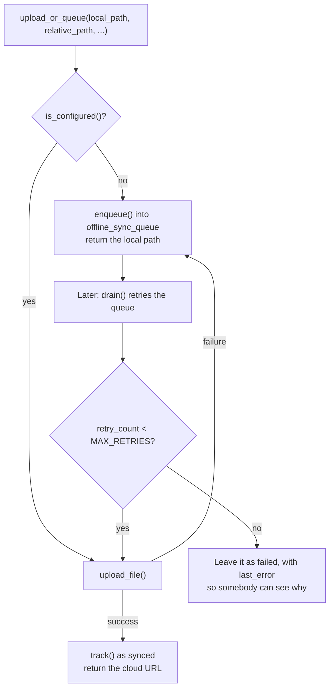

# `sync_engine.py`

← [Module index](README.md) · [Wiki index](../README.md)

**~195 lines. Cloud upload that is allowed to fail.**

---

## The premise

The farm may have no internet. Not "slow internet" — none, for days.

So the rule this module exists to uphold: **nothing on the attendance path may
depend on the network.** Attendance is recorded locally, always. Cloud upload is
a convenience layered on top, and when it fails, the work is queued rather than
lost.

| | |
| --- | --- |
| **Owns** | Firebase upload, the offline queue, retry accounting, sync state |
| **Called by** | `attendance_service` (after each punch), `app.py`, `api.py` |
| **Depends on** | `firebase-admin` — **optionally**. The module imports defensively and works without it |

## The flow

**Reading this diagram:** the first question is simply whether cloud upload is set
up at all. If it is not — which is the normal state for a farm with no internet
account — the item goes straight into a queue and the caller carries on. If it is
set up, try the upload; and if that fails, the item goes into the same queue. The
loop at the bottom is a later retry, which gives up after five attempts rather
than retrying forever.

> **Analogy: posting a letter during a postal strike.** You do not cancel your
> correspondence. You put the letters in a drawer, and post them when the strike
> ends. The drawer is a real drawer, not something you have to remember — which
> is why the queue is a database table and not a list in memory.

## The functions

### `is_configured()`

Are the Firebase bucket, project and credentials all present in settings, and is
the library importable? If any part is missing, the answer is no and everything
queues locally. **Not an error state** — it is the expected state for a farm
with no cloud account.

### `enqueue(operation_type, payload, worker_id=None)`

Writes a row to `offline_sync_queue`: what to do, a JSON payload, a retry count,
and room for the last error.

**A database table, not an in-memory list.** The deployment context assumes the
power will fail; a queue in memory dies with the process, a queue in the
database is still there when the machine comes back.

### `upload_file(local_path)`

Uploads one file to Firebase Storage, returning `(cloud_url, status)`. Every
failure path returns a status string rather than raising, because the caller's
correct response to any failure is the same: queue it.

### `upload_or_queue(local_path, relative_path, snapshot_id=None, worker_id=None)`

The one `attendance_service` calls. Tries to upload; queues on any failure.
Returns the path to store — the cloud URL if it worked, the local relative path
if it did not.

**The caller does not branch on the outcome.** It stores whatever came back and
carries on. That is the point: the attendance transaction cannot be affected by
the state of the internet.

### `drain(base_dir, limit=25)`

Walks pending queue items and retries each, incrementing `retry_count` and
recording `last_error` on failure. Stops at `MAX_RETRIES = 5`.

Called from the Cloud Sync page, from `POST /api/v1/sync/drain`, or on a
schedule. `limit=25` keeps one drain bounded so a large backlog cannot tie up a
request for minutes.

**Five retries then stop, rather than retrying forever.** An item failing for a
permanent reason — deleted file, revoked credentials — should stop consuming
bandwidth and become *visible* as a failure with a recorded reason.

### `track(table_name, record_id, status, cloud_record_id=None)`

Maintains `cloud_sync_metadata`: the per-record sync state, so the Cloud Sync
page can report what has and has not made it.

### `queue_stats()`

Pending, failed and synced counts for the dashboard.

## Gotchas

- **`firebase-admin` is optional.** The import is defensive. Do not add a
  top-level hard import.
- **Nothing here may raise into the attendance path.** If you add a failure mode,
  return a status; do not propagate an exception.
- **The queue is not automatically drained.** Somebody or something must call
  `drain()`. A cron job or a systemd timer is the sensible production answer.
- **Queue rows are never deleted on failure**, only marked. That is deliberate —
  a silently vanishing failure is worse than a visible one.

## Where to look next

- [models.md](models.md) — `offline_sync_queue`, `cloud_sync_metadata`
- `tests/test_cctv_and_sync.py` — four sync tests
